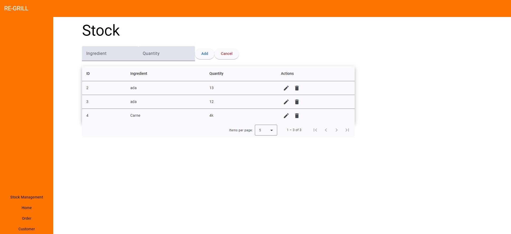
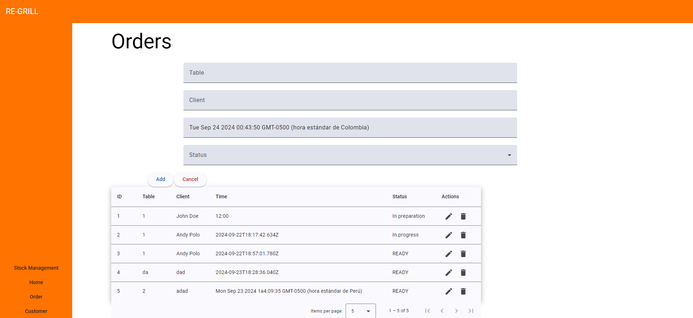
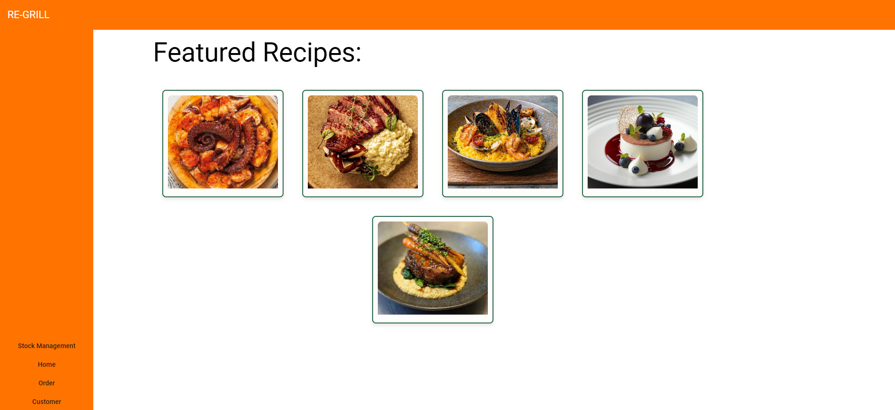

    <strong>Universidad Peruana de Ciencias Aplicadas</strong> 
 
</img> 
 
    <strong>Ingeniería de Software - 5to Ciclo</strong> 
 
    <strong>Desarrollo de Aplicaciones Open Source - WX55</strong>   
 
    <strong>Profesor: Angel Augusto Velasquez Nuñez</strong> 
      <strong>INFORME DE TRABAJO FINAL - TB1 </strong> 

    <strong>Startup: </strong> 
    <strong>Producto: </strong>

<h3 align="center" >Team Members:</h3>

    <table align="center">
        <tr>
            <th style="text-aling:center;">Member</th>
            <th style="text-align:center;">Code</th>
        </tr>
        <tr>
                <td>Gabriel Anthony Braithuaite Toledo</td>
            <td>U20201e889</td>
        </tr>
        <tr>
            <td>Adrian Alonso Calle Huayanca</td>
            <td>U202011657</td>
        </tr>
        <tr>
                <td>Hardie Alfonso Holguín Gamarra</td>
            <td>U202220250</td>
        </tr>
        <tr>
            <td>Mateo Italo Loechle Arias</td>
            <td>U202215004</td>
        </tr>
        <tr>
            <td>David Bryan Rodriguez Santos</td>
            <td>u202212236</td>
        </tr>
    </table>

<tr>
    <td><b>Mes y año: </b> 05/09/2024</td>
</tr>

 

# Informe del proyecto

## Registro de Versiones del Informe

| Versión |   Fecha    | Autor | Descripción de modificación                                                                                                                                                                                                                                                                                                                                                                                                                                                                                                                                                                                                                                                                                                                                                                                                                                                                                                                                                        | 
|:-------:|:----------:|:-----:|:-----------------------------------------------------------------------------------------------------------------------------------------------------------------------------------------------------------------------------------------------------------------------------------------------------------------------------------------------------------------------------------------------------------------------------------------------------------------------------------------------------------------------------------------------------------------------------------------------------------------------------------------------------------------------------------------------------------------------------------------------------------------------------------------------------------------------------------------------------------------------------------------------------------------------------------------------------------------------------------| 
|   TB1   | 05/09/2024 |Todos los integrantes |                                                                                                                                                                                                                                                                                                                                     |

## Project Report Collaboration Insights
## Contenido
### Tabla de contenidos:

- [Student Outcome](#student-outcome)
- [Capítulo I: Introducción](#chapter-1)
  - [1.1. Startup Profile](#startup-profile)
    - [1.1.1. Descripción de la Startup](#startup-description)
    - [1.1.2. Perfiles de integrantes del equipo](#profile-members)
  - [1.2. Solution Profile](#solution-profile)
    - [1.2.1. Antecedentes y problemática](#background-and-problems)
    - [1.2.2. Lean UX Process](#lean-ux)
      - [1.2.2.1. Lean UX Problem Statements](#lean-ux-problem)
      - [1.2.2.2. Lean UX Assumptions](#lean-ux-assumptions)
      - [1.2.2.3. Lean UX Hypothesis Statements](#lean-ux-hypothesis)
      - [1.2.2.4. Lean UX Canvas](#lean-ux-canvas)
  - [1.3. Segmentos objetivo](#target-segments)
- [Capítulo II: Requirements Elicitation & Analysis](#chapter-2)
  - [2.1. Competidores](#competitors)
    - [2.1.1. Análisis competitivo](#competitive-analysis)
    - [2.1.2. Estrategias y tácticas frente a competidores](#strategy-tactics)
  - [2.2. Entrevistas](#interviews)
    - [2.2.1. Diseño de entrevistas](#interviews-design)
    - [2.2.2. Registro de entrevistas](#interviews-registry)
    - [2.2.3. Análisis de entrevistas](#interviews-analysis)
  - [2.3. Needfinding](#needfinding)
    - [2.3.1. User Personas](#user-personas)
    - [2.3.2. User Task Matrix](#user-task-matrix)
    - [2.3.3. User Journey Mapping](#user-journey-mapping)
    - [2.3.4. Empathy Mapping](#empathy-mapping)
    - [2.3.5. As-is Scenario Mapping](#as-is-scenario-mapping)
  - [2.4. Ubiquitous Language](#ubiquitous-language)
- [Capítulo III: Requirements Specification](#chapter-3)
  - [3.1. To-Be Scenario Mapping](#to-be-scenario-mapping)
  - [3.2. User Stories](#user-stories)
  - [3.3. Impact Mapping](#impact-mapping)
  - [3.4. Product Backlog](#product-backlog)
- [Capítulo IV: Product Design](#chapter-4)
  - [4.1. Style Guidelines](#style-guidelines)
    - [4.1.1. General Style Guidelines](#general-style-guidelines)
    - [4.1.2. Web Style Guidelines](#web-style-guidelines)
  - [4.2. Information Architecture](#information-architecture)
    - [4.2.1. Organization Systems](#organization-systems)
    - [4.2.2. Labeling Systems](#labeling-systems)
    - [4.2.3. SEO Tags and Meta Tags](#seo-tags-and-meta-tags)
    - [4.2.4. Searching Systems](#searching-systems)
    - [4.2.5. Navigation Systems](#navigation-systems)
  - [4.3. Landing Page UI Design](#landing-page-ui)
    - [4.3.1. Landing Page Wireframe](#landing-page-wireframe)
    - [4.3.2. Landing Page Mock-up](#landing-page-mockup)
  - [4.4. Web Applications UX/UI Design](#web-application-ux-ui)
    - [4.4.1. Web Applications Wireframes](#web-application-wireframes)
    - [4.4.2. Web Applications Wireflow Diagrams](#web-application-wireflow)
    - [4.4.2. Web Applications Mock-ups](#web-appliaction-mockups)
    - [4.4.3. Web Applications User Flow Diagrams](#user-flow-diagrams)
  - [4.5. Web Applications Prototyping](#web-applications-prototyping)
  - [4.6. Domain-Driven Software Architecture](#domain-driven-software-architecture)
    - [4.6.1. Software Architecture Context Diagram](#software-architecture-context-diagram)
    - [4.6.2. Software Architecture Container Diagrams](#software-architecture-container-diagrams)
    - [4.6.3. Software Architecture Components Diagrams](#software-architecture-components-diagrams)
  - [4.7. Software Object-Oriented Design](#software-object-oriented-design)
    - [4.7.1. Class Diagrams](#class-diagrams)
    - [4.7.2. Class Dictionary](#class-dictionary)
  - [4.8. Database Design](#database-design)
    - [4.8.1. Database Diagram](#database-diagram)
- [Capítulo V: Product Implementation, Validation & Deployment](#chapter-5)
  - [5.1. Software Configuration Management](#software-configuration)
    - [5.1.1. Software Development Environment Configuration](#software-development)
    - [5.1.2. Source Code Management](#source-code)
    - [5.1.3. Source Code Style Guide & Conventions](#source-code-style-guide-and-conventions)
    - [5.1.4. Software Deployment Configuration](#software-deployment-configuration)
  - [5.2. Landing Page, Services & Applications Implementation](#landing-page-services-applications-implementation)
    - [5.2.X. Sprint n](#sprint-x)
      - [5.2.X.1. Sprint Planning n](#sprint-planning-x)
      - [5.2.X.2. Sprint Backlog n](#spring-backlog-x)
      - [5.2.X.3. Development Evidence for Sprint Review](#development-evidence-for-sprint-review-x)
      - [5.2.X.4. Testing Suite Evidence for Sprint Review](#testing-suite-evidence-for-sprint-review)
      - [5.2.X.5. Execution Evidence for Sprint Review](#execution-evidence-for-sprint-review)
      - [5.2.X.6. Services Documentation Evidence for Sprint Review](#services-documentation-evidence-for-sprint-review)
      - [5.2.X.7. Software Deployment Evidence for Sprint Review](#software-deployment-evidence-for-sprint-review)
      - [5.2.X.8. Team Collaboration Insights during Sprint](#team-collaboration-insights-during-sprint)
  - [5.3. Validation Interviews](#validation-interviews)
    - [5.3.1. Diseño de Entrevistas](#interview-design-2)
    - [5.3.2. Registro de Entrevistas](#interview-registry-2)
    - [5.3.3. Evaluaciones según heurísticas](#heuristic-exam)
  - [5.4. Video About-the-Product](#about-the-productions)
- [Conclusiones](#conclusions)
- [Conclusiones y recomendaciones](#recomendations)
- [Video About-the-Team](#about-the-team)
- [Bibliografía](#bibliography)
- [Anexos](#links)

<h4 id="student-outcome"> Student Outcome</h4>
<h3 id="chapter-1">Capítulo I: Introducción</h3>
<h4 id="startup-profile">1.1. Startup Profile</h4>
<h4 id="startup-description"> 1.1.1. Descripción de la Startup</h4>
<h4 id="profile-members">1.1.2. Perfiles de integrantes del equipo</h4>
<h4 id="solution-profile">1.2. Solution Profile</h4>
<h4 id="background-and-problems">1.2.1 Antecedentes y problemática</h4>
<h4 id="lean-ux">1.2.2 Lean UX Process.</h4>
<h4 id="lean-ux-problem">1.2.2.1. Lean UX Problem Statements.</h4>
<h4 id="lean-ux-assumptions">1.2.2.2. Lean UX Assumptions.</h4>
<h4 id="lean-ux-hypothesis">1.2.2.3. Lean UX Hypothesis Statements.</h4>
<h4 id="lean-ux-canvas">1.2.2.4. Lean UX Canvas.</h4>
<h4 id="target-segments">1.3. Segmentos objetivo.</h4>
<h3 id="chapter-2">Capítulo II: Requirements Elicitation & Analysis</h3>
<h4 id="competitors">2.1. Competidores.</h4>
<h4 id="competitive-analysis">2.1.1. Análisis competitivo.</h4>
<h4 id="strategy-tactics">2.1.2. Estrategias y tácticas frente a competidores.</h4>
<h4 id="interviews">2.2. Entrevistas.</h4>
<h4 id="interviews-design">2.2.1. Diseño de entrevistas.</h4>
<h4 id="interviews-registry">2.2.2. Registro de entrevistas.</h4>
<h4 id="interviews-analysis">2.2.3. Análisis de entrevistas.</h4>
<h4 id="needfinding">2.3. Needfinding.</h4>
<h4 id="user-personas">2.3.1. User Personas.</h4>
<h4 id="user-task-matrix">2.3.2. User Task Matrix.</h4>
<h4 id="user-journey-mapping">2.3.3. User Journey Mapping.</h4>
<h4 id="empathy-mapping">2.3.4. Empathy Mapping.</h4>
<h4 id="as-is-scenario-mapping">2.3.5. As-is Scenario Mapping.</h4>
<h4 id="ubiquitous-language">2.4. Ubiquitous Language.</h4>
<h3 id="chapter-3">Capítulo III: Requirements Specification</h3>
<h4 id="to-be-scenario-mapping">3.1. To-Be Scenario Mapping.</h4>
<h4 id="user-stories">3.2. User Stories.</h4>
<h4 id="impact-mapping">3.3. Impact Mapping.</h4>
<h4 id="product-backlog">3.4. Product Backlog.</h4>
<h3 id="chapter-4">Capítulo IV: Product Design</h3>
<h4 id="style-guidelines">4.1. Style Guidelines.</h4>

  En este capítulo se desarrollará las bases para contar con un repositorio central y organizado de uso común que incluye assets, fonts. Esto con el fin de mantener una presentación consistente y enfocada.

<h4 id="general-style-guidelines">4.1.1. General Style Guidelines.</h4>
<h4 id="web-style-guidelines">4.1.2. Web Style Guidelines.</h4>
<h4 id="information-architecture">4.2. Information Architecture.</h4>
<h4 id="organization-systems">4.2.1. Organization Systems.</h4>
<h4 id="labeling-systems">4.2.2. Labeling Systems.</h4>
<h4 id="seo-tags-and-meta-tags">4.2.3. SEO Tags and Meta Tags</h4>
<h4 id="searching-systems">4.2.4. Searching Systems.</h4>
<h4 id="navigation-systems">4.2.5. Navigation Systems.</h4>
<h4 id="landing-page-ui">4.3. Landing Page UI Design.</h4>
<h4 id="landing-page-wireframe">4.3.1. Landing Page Wireframe.</h4>
<h4 id="landing-page-mockup">4.3.2. Landing Page Mock-up.</h4>
<h4 id="web-application-ux-ui">4.4. Web Applications UX/UI Design.</h4>
<h4 id="web-application-wireframes">4.4.1. Web Applications Wireframes.</h4>
<h4 id="web-application-wireflow">4.4.2. Web Applications Wireflow Diagrams.</h4>
<h4 id="web-appliaction-mockups">4.4.2. Web Applications Mock-ups.</h4>
<h4 id="user-flow-diagrams">4.4.3. Web Applications User Flow Diagrams.</h4>
<h4 id="web-applications-prototyping">4.5. Web Applications Prototyping.</h4>
<h4 id="domain-driven-software-architecture">4.6. Domain-Driven Software Architecture.</h4>
<h4 id="software-architecture-context-diagram">4.6.1. Software Architecture Context Diagram.</h4>
<h4 id="software-architecture-container-diagrams">4.6.2. Software Architecture Container Diagrams.</h4>
<h4 id="software-architecture-components-diagrams">4.6.3. Software Architecture Components Diagrams.</h4>
<h4 id="software-object-oriented-design">4.7. Software Object-Oriented Design.</h4>
<h4 id="class-diagrams">4.7.1. Class Diagrams.</h4>
<h4 id="class-dictionary">4.7.2. Class Dictionary.</h4>
<h4 id="database-design">4.8. Database Design.</h4>
<h4 id="database-diagram">4.8.1. Database Diagram.</h4>
<h3 id="chapter-5">Capítulo V: Product Implementation, Validation & Deployment</h3>

En este capítulo se detallará la implementación del producto, la validación y la 
configuración de despliegue del software.

<h4 id="software-configuration">5.1. Software Configuration Management.</h4>

    En este apartado, se detallan las herramientas y configuraciones empleadas para mantener la consistencia y organización del entorno de desarrollo durante el ciclo de vida del proyecto. La gestión de la configuración del software es crucial para asegurar que todos los miembros del equipo trabajan de manera coordinada, utilizando las mismas versiones de herramientas y respetando las convenciones establecidas. Esta sección abarca desde la configuración del entorno de desarrollo hasta la gestión del código fuente y el despliegue de la solución.

<h4>5.1.1 Software Development Environment Configuration</h4>

<h4>Project Management</h4>

<strong>Discord:</strong> 
Discord ha sido la herramienta principal de comunicación y coordinación del equipo. Se ha utilizado para realizar reuniones virtuales, mantener discusiones continuas sobre el progreso del proyecto, y para compartir recursos y actualizaciones de forma eficiente. 
<strong>Ruta de referencia:</strong> <a href="https://discord.com/">discord.com/</a>

<strong>Trello:</strong> 
Trello se ha para la gestión del proyecto, permitiendo la visualización y actualización del estado de tareas y sprints en los que trabaja el equipo. Aunque su uso ha sido ocasional, ha proporcionado una estructura básica para el seguimiento de actividades. 
<strong>Ruta de referencia:</strong> <a href="https://trello.com/">trello.com/</a>

<h4>Product UX/UI Design</h4>

Para la elaboración de la interfaz de usuario y la experiencia de usuario, se emplearán las siguientes herramientas:

<ul>
    <li><strong>Figma:</strong> Una plataforma colaborativa de diseño que permite la creación de wireframes, mock-ups y prototipos interactivos. Será utilizada para diseñar tanto las interfaces de usuario como los flujos de interacción de la aplicación.</li>
    <li><strong>LucidChart:</strong> Herramienta de diagramación en línea que será utilizada para la elaboración de wireflows y user flows, facilitando la visualización y planificación de las interacciones y navegaciones dentro de la aplicación.</li>
</ul>

<strong>Rutas de referencia:</strong>

<ul>
    <li><a href="https://www.figma.com/login" target="_blank">www.figma.com/login</a></li>
    <li><a href="https://www.lucidchart.com/" target="_blank">www.lucidchart.com/</a></li>
</ul>

<h4>Software Development</h4>

Para el desarrollo del software, se han seleccionado las siguientes herramientas y tecnologías, con el fin de proporcionar un entorno robusto y eficiente para el desarrollo del proyecto:

<ul>
    <li><strong>WebStorm</strong> Un entorno de desarrollo integrado (IDE) potente y completo, que ofrece herramientas avanzadas para el desarrollo de aplicaciones. Será utilizado para escribir, depurar y gestionar el código del proyecto, aprovechando sus características de soporte para múltiples lenguajes y sistemas de control de versiones.</li>
    <li><strong>HTML5:</strong> El lenguaje estándar de marcado para la creación de páginas web. Será empleado en el desarrollo del frontend de la aplicación, estructurando el contenido de manera semántica y accesible.</li>
    <li><strong>CSS:</strong> Hojas de estilo en cascada utilizadas para diseñar y estilizar la presentación visual de la aplicación web. Permitirá definir el diseño responsivo y adaptativo del frontend.</li>
    <li><strong>TypeScript:</strong> Un superconjunto tipado de JavaScript que proporciona una mayor seguridad y productividad en el desarrollo de aplicaciones web. Será utilizado en el frontend para mejorar la calidad y mantenibilidad del código.</li>
    <li><strong>Angular:</strong> Un framework de desarrollo de aplicaciones web de código abierto, mantenido por Google. Será utilizado para la creación del frontend de la aplicación, aprovechando su estructura modular y su capacidad de creación de componentes reutilizables.</li>
</ul>

<strong>Rutas de referencia:</strong>

<ul>
    <li><a href="https://www.jetbrains.com/webstorm/" target="_blank">www.jetbrains.com/webstorm/</a></li>
    <li><a href="https://lenguajehtml.com/html/" target="_blank">lenguajehtml.com/html/</a></li>
    <li><a href="https://google.github.io/styleguide/htmlcssguide.html" target="_blank">google.github.io/styleguide/htmlcssguide.html</a></li>
    <li><a href="https://www.typescriptlang.org/" target="_blank">www.typescriptlang.org/</a></li>
    <li><a href="https://angular.io/" target="_blank">angular.io/</a></li>
</ul>

<h4>Software Deployment</h4>

En esta sección, se detallan las herramientas y plataformas utilizadas para el despliegue de las aplicaciones desarrolladas, garantizando que estén accesibles y operativas en el entorno de producción.

<ul>
    <li><strong>GitHub Pages:</strong> Un servicio de alojamiento web estático que se integra con los repositorios de GitHub. Será utilizado para desplegar la landing page del proyecto, proporcionando un enlace accesible para los usuarios finales.
    
</ul>

<strong>Rutas de referencia:</strong>

<ul>
    <li><a href="https://github.com/" target="_blank">github.com/</a></li>
</ul>

<h4>Software Documentation</h4>

En esta sección, se especifican las herramientas utilizadas para la documentación del software, proporcionando un registro detallado de los aspectos técnicos y funcionales del proyecto.

<ul>
    <li><strong>GitHub:</strong> Además de servir como plataforma para el control de versiones y la colaboración en el código, GitHub también se utiliza para alojar la documentación del proyecto. Los miembros del equipo pueden acceder y actualizar la documentación a través de los repositorios del proyecto.</li>
</ul>

<strong>Ruta de referencia:</strong>

<ul>
    <li><a href="https://github.com/" target="_blank">github.com</a></li>
</ul>

<h4 id="source-code">5.1.2. Source Code Management.</h4>

El equipo utilizará GitHub como plataforma principal para el control de versiones, implementando el modelo <strong>GitFlow</strong>. A continuación, se describen los medios y el esquema de organización que se aplicarán para el seguimiento de modificaciones:

<h4>Repositorios de GitHub</h4>
<ul>
    <li><strong>Landing Page</strong>: <a href="https://github.com/grupo3-upc202402-wx55/landing-page">github.com/grupo3-upc202402-wx55/landing-page</a></li>
    <li><strong>Project Report</strong>: <a href="https://github.com/grupo3-upc202402-wx55/project_report">github.com/grupo3-upc202402-wx55/project_report</a></li>
    <li><strong>Front-end</strong>: <a href="https://github.com/grupo3-upc202402-wx55/front-end">github.com/grupo3-upc202402-wx55/front-end</a></li>

</ul>

Cada repositorio alojará el código fuente correspondiente a su respectivo producto, además de incluir archivos de pruebas unitarias e integración en el caso de los Web Services.

<h4>Implementación de GitFlow</h4>

Se implementará el modelo <strong>GitFlow</strong> para el control de versiones, siguiendo las convenciones establecidas por Vincent Driessen en su artículo "A successful Git branching model". El esquema de ramas incluirá:

<ul>
    <li><strong>Main branch</strong>: La rama principal donde se alojarán las versiones estables del proyecto.</li>
    <li><strong>Develop branch</strong>: Rama de desarrollo donde se integran las nuevas funcionalidades antes de pasar a la rama principal.</li>
    <li><strong>Feature branches</strong>: Cada nueva característica o capítulo desarrollado por el equipo se trabajará en una rama específica. Las convenciones para nombrar estas ramas seguirán un patrón descriptivo, por ejemplo, <code>feat/chapter-5</code>.</li>
    <li><strong>Release branches</strong>: Ramas destinadas a preparar una nueva versión para el lanzamiento, siguiendo el esquema de versionado semántico.</li>
    <li><strong>Hotfix branches</strong>: Ramas para corregir errores críticos en versiones ya lanzadas, aplicando convenciones similares a las usadas en las Release branches.</li>
</ul>
<h4>Conventional Commits</h4>

El equipo aplicará las convenciones de <strong>Conventional Commits</strong> para los mensajes de commit, asegurando que cada cambio en el código sea fácilmente comprensible y rastreable. Los mensajes seguirán la estructura:

<ul>
    <li><code>tipo(scope): mensaje</code></li>
    <li><strong>Tipo:</strong> indica la naturaleza del cambio (e.g., feat, fix, chore).</li>
    <li><strong>Scope:</strong> define la sección del código afectada (e.g., ui, backend).</li>
    <li><strong>Mensaje:</strong> descripción concisa del cambio realizado.</li>
</ul>

<h4 id="source-code-style-guide-and-conventions">5.1.3. Source Code Style Guide & Conventions.</h4>

<h4>HTML</h4>
<ul>
    <li><strong>Estructura del Documento:</strong> Declara el tipo de documento en la primera línea: &lt;!DOCTYPE html&gt;. Usa una estructura de etiqueta HTML válida: &lt;html&gt;, &lt;head&gt;, &lt;body&gt;. Cierra todos los elementos HTML: &lt;p&gt;Texto&lt;/p&gt;.</li>
    <li><strong>Comentarios:</strong> Escribe comentarios en una sola línea cuando sean cortos. Usa comentarios para secciones importantes: &lt;!-- Inicio de la sección de navegación --&gt;.</li>
    <li><strong>Atributos:</strong> Usa comillas dobles para los valores de los atributos: &lt;img src="imagen.jpg" alt="Descripción"&gt;. Especifica siempre los atributos alt y las dimensiones width y height en las imágenes.</li>
    <li><strong>Indentación y Espaciado:</strong> Usa dos espacios para la indentación. No uses espacios alrededor de los signos de igual en los atributos.</li>
</ul>

<a href="https://html.spec.whatwg.org/">html.spec.whatwg.org</a>

<h4>CSS</h4>
<ul>
    <li><strong>Indentación y Espaciado:</strong> Usa dos espacios para la indentación; no uses tabulaciones. El código CSS debe estar en minúsculas.</li>
    <li><strong>Comentarios:</strong> Usa comentarios para explicar secciones complejas del código.</li>
    <li><strong>Nombres de Clases:</strong> Utiliza nombres de clase significativos que reflejen el propósito del elemento. Evita los nombres de clases genéricos como .box o .container.</li>
    <li><strong>Organización:</strong> Agrupa las reglas CSS relacionadas en un solo bloque.</li>
</ul>

<a href="https://google.github.io/styleguide/htmlcssguide.html">google.github.io/styleguide/htmlcssguide.html</a>

<h4>JavaScript</h4>
<ul>
    <li><strong>Indentación y Espaciado:</strong> Usa dos espacios para la indentación. Mantén un espacio después de las comas y antes de los corchetes de apertura.</li>
    <li><strong>Comentarios:</strong> Usa comentarios para explicar la lógica del código, especialmente en bloques complejos.</li>
    <li><strong>Nombres de Variables y Funciones:</strong> Usa nombres descriptivos y en camelCase para variables y funciones. Por ejemplo, getUserInfo en lugar de getuserinfo.</li>
    <li><strong>Estructura del Código:</strong> Usa funciones y módulos para mantener el código organizado y reutilizable. Evita el uso de código no utilizado y realiza limpieza regularmente.</li>
</ul>

<a href="https://google.github.io/styleguide/jsguide.html">google.github.io/styleguide/jsguide.html</a>

<h4>TypeScript</h4>
<ul>
    <li><strong>Indentación y Espaciado:</strong> Usa dos espacios para la indentación. Sigue el formato recomendado por el estándar TypeScript.</li>
    <li><strong>Comentarios:</strong> Usa comentarios para describir el propósito de las funciones y las interfaces.</li>
    <li><strong>Nombres de Variables y Funciones:</strong> Usa camelCase para variables y funciones. Usa PascalCase para nombres de clases e interfaces.</li>
    <li><strong>Tipos:</strong> Especifica tipos explícitos en las variables y las funciones para mayor claridad y seguridad de tipo.</li>
</ul>

<a href="https://google.github.io/styleguide/tsguide.html">google.github.io/styleguide/tsguide.html</a>

<h4>Java</h4>
<ul>
    <li><strong>Indentación y Espaciado:</strong> Usa cuatro espacios para la indentación. Sigue las convenciones de espaciado estándar en el código Java.</li>
    <li><strong>Comentarios:</strong> Usa comentarios Javadoc para documentar clases y métodos.</li>
    <li><strong>Nombres de Variables y Funciones:</strong> Usa camelCase para nombres de variables y métodos. Usa PascalCase para nombres de clases.</li>
    <li><strong>Organización del Código:</strong> Sigue la estructura de paquetes recomendada y organiza el código en clases y métodos claros.</li>
</ul>

<a href="https://google.github.io/styleguide/javaguide.html">google.github.io/styleguide/javaguide.html</a>

<h4>Gherkin (para archivos .feature)</h4>
<ul>
    <li><strong>Estructura de las Características:</strong> Usa Feature, Scenario, Given, When, Then para estructurar los archivos .feature.</li>
    <li><strong>Nombres y Descripciones:</strong> Usa descripciones claras y concisas en inglés. Usa un formato de verbo en presente para los pasos del escenario.</li>
</ul>

<a href="https://cucumber.io/docs/gherkin/reference/">cucumber.io/docs/gherkin/reference/</a>

<h4 id="software-deployment-configuration">5.1.4. Software Deployment Configuration.</h4>

<h4>Landing Page Deployment</h4>

Para desplegar la landing page del proyecto, se utilizará GitHub Pages. A continuación se detallan los pasos necesarios para configurar y realizar el despliegue:

   <ol>
      <li><strong>Crear una carpeta para el despliegue:</strong> Creamos una carpeta llamada <code>"docs"</code> en el repositorio. Esta carpeta alojará todos los archivos necesarios para la landing page.</li>
      <li><strong>Organizar los archivos:</strong> Aseguramos que los archivos de la landing page sigan las siguientes nomenclaturas:
          <ul>
              <li><code>"index.html"</code> para la página principal.</li>
              <li><code>"styles.css"</code> para los estilos de la página.</li>
              <li>Una carpeta llamada <code>"img"</code> que contenga todas las imágenes utilizadas.</li>
          </ul>
      </li>
      <li><strong>Subir los archivos al repositorio:</strong> Cargamos los archivos en la carpeta <code>"docs"</code> mediante un commit al repositorio en GitHub.</li>
      <li><strong>Configurar GitHub Pages:</strong> En GitHub, nos dirigimos a la pestaña <code>Settings</code> del repositorio, luego a <code>Pages</code>. Seleccionamos el branch <code>"main"</code> y especificamos la carpeta <code>"docs"</code> como la fuente de la página.</li>
      <li><strong>Esperar la publicación:</strong> Esperamos a que GitHub realice las comprobaciones necesarias. Una vez finalizado el proceso, obtendremos un enlace que llevará a la landing page desplegada.</li>
   </ol>

<h4>Frontend Web Application Deployment</h4>

  Para el despliegue de la aplicación frontend desarrollada en Angular, se utilizó
  GitHub Pages como plataforma de hosting estático. Los pasos seguidos para desplegar
  fueron los siguientes:

<ol>
  <li>
    <strong>Construcción del Proyecto</strong>: Se utilizó el comando
    <code>ng build --prod</code> para generar los archivos de producción del
    proyecto Angular. Este proceso optimiza los archivos estáticos y genera la
    carpeta <code>dist/</code>.
  </li>

  <li>
    <strong>Configuración de GitHub Pages</strong>: Se empleó la herramienta
    <code>angular-cli-ghpages</code> para realizar el despliegue en la rama
    <code>gh-pages</code> del repositorio. El comando <code>ng deploy</code>
    ejecuta el proceso de construcción y despliegue de manera automática.
  </li>
</ol>

<h4>Web Services Deployment</h4>

Se ha utilizado una <em>FakeAPI</em> para simular los Web Services que interactúan con nuestra aplicación. Esto nos ha permitido avanzar con el desarrollo y las pruebas de las funcionalidades del Frontend, sin necesidad de implementar servicios en tiempo real. Sin embargo, para futuros Sprints, se tiene planificada la implementación de Web Services reales, y su configuración será detallada en los siguientes ciclos de desarrollo.

A medida que los Web Services sean desarrollados e implementados, se incluirá la documentación relacionada con los endpoints y su despliegue, así como la configuración necesaria para integrarlos en el entorno de producción.

<h4 id="landing-page-services-applications-implementation">5.2. Landing Page, Services & Applications Implementation.</h4>

    En esta sección, explicamos y documentamos el proceso de implementación, pruebas, documentación y despliegue de la Landing Page, Web Services y Frontend Web Applications. A medida que avanzamos en el desarrollo, desglosamos el trabajo en secciones específicas para cada Sprint, comenzando con el Sprint 1, donde detallamos la planificación y ejecución de las tareas.

<h4 id="sprint-x">5.2.1. Sprint 1</h4>

Es fundamental que el equipo dedique especial atención a la identificación del Sprint Goal, siguiendo las guías establecidas por el Scrum Guide. El Sprint Goal debe enfocarse en el negocio o en la perspectiva de los usuarios, buscando la entrega de un nuevo feature o un set de features.

Para nuestro Sprint, utilizamos la estructura sugerida por Scrum.org para redactar el Sprint Goal:

<h4 id="sprint-planning-x">5.2.1.1. Sprint Planning 1.</h4>

En el Sprint #1, que comienza el 29/08/2024, nos enfocaremos en desarrollar una landing page  para Re-Grill. El objetivo es crear una página que no solo capte la atención de los visitantes, sino que también transmita claramente los beneficios de nuestro producto. Este sprint estará dedicado al diseño y desarrollo de la landing page para cumplir con nuestros objetivos estratégicos.

<table>
    <tr>
        <td>Sprint #</td>
        <td>Sprint 1</td>
    </tr>
    <tr>
        <td>Sprint Planning Background  </td>
    </tr>
    <tr>
        <td>Date</td>
        <td>2024-08-29</td>
    </tr>
    <tr>
        <td>Time</td>
        <td>16:00 PM</td>
    </tr>
    <tr>
        <td>Location</td>
        <td>Virtual via discord</td>
    </tr>
    <tr>
        <td>Prepared By </td>
        <td>Gabriel Anthony Braithuaite Toledo, Hardie Alfonso Holguín Gamarra</td>
    </tr>
    <tr>
        <td>Attendees (to planning  meeting) </td>
        <td>Gabriel Anthony Braithuaite Toledo, Adrian Alonso Calle Huayanca, Hardie Alfonso Holguín Gamarra, Mateo Italo Loechle Arias, David Bryan Rodriguez Santos</td>
    </tr>
    <tr>
        <td>Sprint Goal &amp; User Stories </td>
    </tr>
    <tr>
        <td>Sprint 1 Goal </td>
        <td>Our focus is on developing an attractive landing page for Re-Grill. We believe it delivers increased engagement and awareness of the product to potential customers. This will be confirmed when the landing page is live and visitor analytics show an increase in page interactions.</td>
    </tr>
    <tr>
        <td>Sprint 1 Velocity </td>
        <td>El equipo ha establecido una capacidad de 30 Story Points para el Sprint 1, enfocándose en completar todas las tareas necesarias para el desarrollo de la landing page de Re-Grill.  </td>
    </tr>
    <tr>
        <td>Sum of Story Points </td>
        <td>30</td>
    </tr>
</table>
<h4 id="spring-backlog-x">5.2.1.2. Sprint Backlog 1.</h4>

El Sprint Backlog para el Sprint #1 tiene como objetivo principal el desarrollo de una landing page para Re-Grill. Este sprint se centrará en la creación y despliegue de una página web atractiva que comunique de manera efectiva los beneficios del producto. La lista de tareas y user stories asociadas a este sprint se ha diseñado para garantizar que se cumpla este objetivo de manera eficiente.

<a href="https://trello.com/b/LSbTHu4A/open-source">trello.com/b/LSbTHu4A/open-source</a>

<table>
    <tr>
        <td>Sprint # </td>
        <td>Sprint 1 </td>
    </tr>
    <tr>
        <td>User Story  </td>
        <td></td>        
        <td>Work-Item / Task </td>
        <td></td>
    </tr>
    <tr>
        <td>Id</td>
        <td>Title</td>
        <td>Id</td>
        <td>Title</td>
        <td>Description</td>
        <td>Estimation (Hours) </td>
        <td>Assigned To</td>
        <td>Status (To-do/In Process / To Review / Done)</td>
    </tr>
<!--US06 -->  
    <tr>
        <td>US06</td>
        <td>Landing page - Estructuración</td>
        <td>WI01</td>
        <td>Implementar navegación entre secciones de la landing page</td>
        <td>Implementar mecanismos de navegación (enlaces, menús) que permitan al visitante moverse fácilmente entre las diferentes secciones de la landing page.</td>
        <td>5</td>
        <td>Adrian Alonso Calle Huayanca</td>
        <td>Done</td>
    </tr>
<!--US07 --> 
    <tr>
        <td>US07</td>
        <td>Landing page – Contenido informativo</td>
        <td>WI02</td>
        <td>Desarrollar contenido informativo claro y accesible</td>
        <td>Redactar y estructurar el contenido informativo sobre las funcionalidades y beneficios de la aplicación para garantizar que los visitantes puedan tomar decisiones informadas.</td>
        <td>13</td>
        <td>Mateo Italo Loechle Arias </td>
        <td>Done</td>
    </tr>
<!--US08 --> 
    <tr>
        <td>US08</td>
        <td>Landing page - Compatibilidad móvil</td>
        <td>WI03</td>
        <td>Implementar diseño responsivo en la landing page</td>
        <td>Desarrollar y probar el diseño responsivo de la landing page para garantizar que se visualice y funcione correctamente en dispositivos móviles.</td>
        <td>8</td>
        <td>Gabriel Anthony Braithuaite Toledo </td>
        <td>Done</td>
    </tr> 
<!--US09 -->
    <tr>
        <td>US09</td>
        <td>Landing page - Formulario de contacto</td>
        <td>WI04</td>
        <td>Desarrollar formulario de contacto en la landing pagee</td>
        <td>Implementar un formulario de contacto que permita a los visitantes enviar sus consultas y comentarios.</td>
        <td>8</td>
        <td>Hardie Alfonso Holguín Gamarra </td>
        <td>Done</td>
    </tr>
<!--US10 -->
    <tr>
        <td>US10</td>
        <td>Landing page - Contenido multimedia</td>
        <td>WI05</td>
        <td>Incluir contenido multimedia en la landing page</td>
        <td> Implementar imágenes y videos relevantes en la landing page para enriquecer la experiencia del visitante.</td>
        <td>3</td>
        <td>David Bryan Rodriguez Santos</td>
        <td>Done</td>
    </tr>
<!--US11 -->
    <tr>
        <td>US11</td>
        <td>Landing page - Call-to-action</td>
        <td>WI06</td>
        <td>Implementar botones de call-to-action en la landing page.</td>
        <td>Crear botones claros y visibles para solicitar una demo en la landing page.</td>
        <td>5</td>
        <td>Hardie Alfonso Holguín Gamarra</td>
        <td>Done</td>
    </tr>
<!--US12 -->
    <tr>
        <td>US12</td>
        <td>Landing page - Testimonios</td>
        <td>WI07</td>
        <td>Implementar sección de testimonios en la landing page</td>
        <td>Crear una sección dedicada para mostrar testimonios de usuarios satisfechos.</td>
        <td>3</td>
        <td>Mateo Italo Loechle Arias</td>
        <td>Done</td>
    </tr>
</table>
<h4 id="development-evidence-for-sprint-review-x">5.2.1.3. Development Evidence for Sprint Review.</h4>

Durante el Sprint #1, se lograron avances significativos en la implementación de los componentes clave del proyecto Re-Grill, centrados principalmente en el desarrollo de la Landing Page. Estos avances se alinean con el objetivo principal del sprint, que es diseñar y desplegar una página web atractiva y funcional para captar la atención de los usuarios y comunicar los beneficios del producto de manera efectiva.

<table>
    <tr>
        <td>Repository</td>
        <td>Branch</td>
        <td>Commit Id </td>
        <td>Commit Message </td>
        <td>Commit Message Body</td>
        <td>Commited on (Date) </td>
    </tr>
    <tr>
        <td>Gaboo04/landing-page </td>
        <td>feature/landing-page</td>
        <td>557bf8a</td>
        <td>feat: add links to the head, header, main section, about us section and features section.</td>
        <td>Add images for landing page, add html file for english page.</td>
        <td>05/09/2024</td>
    </tr>
    <tr>
        <td>HOLGUINUPC/landing-page </td>
        <td>main</td>
        <td>e2a6afe</td>
        <td>feat: css 50% completed</td>
        <td>add benefits style, hero style, added logo img nav nav ul styles, added .container adn section style</td>
        <td>05/09/2024</td>
    </tr>
    <tr>
        <td>LowMathzzz/landing-page </td>
        <td>main</td>
        <td>6d41e03</td>
        <td>feat(styles): added features and footer on styles layer.</td>
        <td>added mobile responsive config on styles layer,  added tables responsive config on styles layer.</td>
        <td>05/09/2024</td>
    </tr>
    <tr>
        <td>DavidBryanRodriguezSantos/landing-page </td>
        <td>main</td>
        <td>f778cda</td>
        <td>feat(es-page): create spanish page</td>
        <td>create spanish page</td>
        <td>05/09/2024</td>
    </tr>    
    <tr>
        <td>U202011657/landing-page </td>
        <td>main</td>
        <td>bdf0608</td>
        <td>feat:Update index.html</td>
        <td>report-1</td>
        <td>05/09/2024</td>
    </tr>
    <tr><td>https://github.com/grupo3-upc202402-wx55/landing-page</td></tr>
    

</table>
<h4 id="testing-suite-evidence-for-sprint-review">5.2.1.4. Testing Suite Evidence for Sprint Review.</h4>

En esta sección, presentamos las evidencias relacionadas con las pruebas de aceptación automatizadas realizadas para la landing page de Re-Grill, desarrollada en el Sprint 1. A lo largo de este sprint, se lograron los objetivos planteados: planificación, desarrollo y despliegue de la landing page. Las pruebas de aceptación se diseñaron para garantizar que la landing page cumpla con los requisitos y expectativas definidos en los User Stories correspondientes. 

<table>
    <tr>
        <td>Repository</td>
        <td>Branch</td>
        <td>Commit Id </td>
        <td>Commit Message </td>
        <td>Commit Message Body</td>
        <td>Commited on (Date) </td>
    </tr>
    <tr>
        <td>Gaboo04/landing-page</td>
        <td>feat/testing</td>
        <td>ee1b2de</td>
        <td>feat:Update landing_page_acceptance_tests.feature.</td>
        <td>acceptance tests based on user stories designed for landing page development</td>
        <td>18/09/2024</td>
    </tr>
</table>
<h4 id="execution-evidence-for-sprint-review">5.2.1.5. Execution Evidence for Sprint Review.</h4>

En este Sprint, se logró desarrollar y desplegar exitosamente la landing page para Re-Grill. Se completaron todas las tareas planificadas, incluyendo la creación del wireframe, el desarrollo de la página, su revisión y ajuste, así como el despliegue en el entorno de producción. La landing page refleja fielmente el diseño y la funcionalidad esperados, proporcionando una interfaz atractiva y funcional para los usuarios.  

<h5>Screenshots de las Principales Vistas Implementadas</h5>

Se adjuntan capturas de pantalla de las principales vistas de la landing page desarrollada en el Sprint 1, mostrando el diseño y la estructura de la página.

<h5>Se implementó el Header</h5>

En esta sección se pueden observar las principales opciones de la página, un call to action y una descripción sobre nuestra compañía y nuestros valores. 

<h5>Se implementó la sección de features y plans.</h5>

En estas secciones se describen las principales características que tiene Re-grill, así como los diferentes planes de suscripción ques se ofrece.

<h5>Se implementó la sección de Benefits y Questions & Answers </h5>

En esta sección se describen los beneficios de Re-Grill y se resuelven las preguntas más frecuentes que los usuarios puedan tener.

<h5>Se implementó el footer con la opción de contacto</h5>

En esta sección se muestra la información de contacto de la empresa, así como un formulario para que los usuarios puedan enviar sus consultas.

<h4 id="services-documentation-evidence-for-sprint-review">5.2.1.6. Services Documentation Evidence for Sprint Review.</h4>

En este Sprint, el enfoque principal fue el desarrollo y despliegue de la landing page de Re-Grill. No se implementaron Web Services en esta etapa, por lo que no se incluye documentación relacionada con endpoints o servicios web. La implementación y documentación de Web Services será abordada en Sprints futuros, conforme se expanda la funcionalidad del producto.

<h4 id="software-deployment-evidence-for-sprint-review">5.2.1.7. Software Deployment Evidence for Sprint Review.</h4>

    Durante el Sprint 1, nos enfocamos en el despliegue de la landing page de Re-Grill. El objetivo fue asegurar que la página esté accesible para los usuarios finales a través de un entorno de producción confiable. A continuación, se detalla el proceso de despliegue, incluyendo la creación de cuentas necesarias, la configuración de recursos en GitHub Pages, y la automatización de ciertas tareas para facilitar futuros despliegues.

<h5>Creación y Configuración de Repositorio en GitHub</h5>
        <ul>
            <li>Se creó un repositorio en GitHub dentro de la organización, donde se alojó el código fuente de la landing page.</li>
            <li>Se configuró la rama <code>main</code> como la principal para el despliegue, y la rama <code>feat/testing</code> para pruebas de aceptación.</li>
            <li>Se habilitó GitHub Pages en la rama <code>main</code> para facilitar el despliegue automático de la landing page.</li>
        </ul>
<h5>Evidencias Gráficas del Despliegue</h5>

A continuación, se muestran capturas de pantalla que ilustran el proceso despliegue:

<h4 id="team-collaboration-insights-during-sprint">5.2.1.8. Team Collaboration Insights during Sprint.</h4>

    Durante el Sprint 1, nos aseguramos de que todas las actividades de implementación fueran realizadas con la colaboración de todos los miembros del equipo. Cada integrante contribuyó a la creación y desarrollo de la landing page de Re-Grill, utilizando diversas herramientas de colaboración. A continuación, se presentan los detalles sobre las actividades del equipo y las evidencias gráficas que reflejan la colaboración y los commits en GitHub.

<table>
    <tr>
        <td>Team Member</td>
        <td>Activity </td>
    </tr>
    <tr>
        <td>Gabriel Anthony Braithuaite Toledo</td>
        <td>Implementación de las secciones header, implementación de parte del main section en el index.html.</td>
    </tr>
    <tr>
        <td>Adrian Alonso Calle Huayanca</td>
        <td>Desarrollo del wireframe, mock up y completar sección del main en el index.html.</td>
    </tr>
    <tr>
        <td>Hardie Alfonso Holguín Gamarra	</td>
        <td>Implementación de los estilos para parte del body y containers en el styles.css</td>
    </tr>
    <tr>
        <td>Mateo Italo Loechle Arias</td>
        <td>Implementación de los estilos para completar el body y configuración del responsive en el styles.css</td>
    </tr>
    <tr>
        <td>David Bryan Rodriguez Santos</td>
        <td>Implementación del switching de idioma realizando una versión en español del landing page en el index-es.html.</td>
    </tr>
</table>

<!-- 5.2.2. Sprint 2 -->

<h4 id="sprint-2">5.2.2. Sprint 2</h4>

<h4 id="sprint-planning-x">5.2.2.1. Sprint Planning 2.</h4>

En el Sprint #2, que comienza el 17/09/2024, nos enfocaremos en el desarrollo de la parte frontend de la aplicación web de Re-Grill. El objetivo es crear una interfaz interactiva y amigable para los usuarios, que les permita acceder a las funcionalidades del producto de manera intuitiva y eficiente. Este sprint estará dedicado al diseño y desarrollo de las páginas y componentes necesarios para cumplir con nuestros objetivos estratégicos.

<table>
    <tr>
        <td>Sprint #</td>
        <td>Sprint 2</td>
    </tr>
    <tr>
        <td>Sprint Planning Background  </td>
    </tr>
    <tr>
        <td>Date</td>
        <td>2024-09-17</td>
    </tr>
    <tr>
        <td>Time</td>
        <td>16:00 PM</td>
    </tr>
    <tr>
        <td>Location</td>
        <td>Virtual via discord</td>
    </tr>
    <tr>
        <td>Prepared By </td>
        <td>Gabriel Anthony Braithuaite Toledo, Hardie Alfonso Holguín Gamarra</td>
    </tr>
    <tr>
        <td>Attendees (to planning  meeting) </td>
        <td>Gabriel Anthony Braithuaite Toledo, Adrian Alonso Calle Huayanca, Hardie Alfonso Holguín Gamarra, Mateo Italo Loechle Arias, David Bryan Rodriguez Santos</td>
    </tr>
    <tr>
        <td>Sprint Goal &amp; User Stories </td>
    </tr>
    <tr>
        <td>Sprint 2 Goal </td>
        <td>Our focus is on developing a first version of our interactive and user-friendly frontend interface for Re-Grill, this version will integrate a fake API, and will allow the admin to add ingredients to the inventory, the admin could register orders and add recipes . We believe it delivers a seamless experience and improved accessibility to product features for our users. This will be confirmed when the frontend components are live and user feedback indicates increased satisfaction and ease of use.</td>
    </tr>
    <tr>
        <td>Sprint 1 Velocity </td>
        <td>El equipo ha establecido una capacidad de 50 Story Points para el Sprint 2, enfocándose en completar todas las tareas necesarias para el desarrollo de la interfaz frontend de Re-Grill.  </td>
    </tr>
    <tr>
        <td>Sum of Story Points </td>
        <td>50</td>
    </tr>
</table>

<h4 id="spring-backlog-x">5.2.2.2. Sprint Backlog 2.</h4>

El Sprint Backlog para el Sprint #2 tiene como objetivo principal el desarrollo de la parte frontend de la aplicación web de Re-Grill. Este sprint se centrará en la creación de las páginas y componentes necesarios para permitir a los usuarios acceder a las funcionalidades del producto de manera intuitiva y eficiente. La lista de tareas y user stories asociadas a este sprint se ha diseñado para garantizar que se cumpla este objetivo de manera eficiente. En esta primera versión del desarrollo de la parte frontend se espera que el admin pueda agregar ingredientes para el stock del bounded context "inventory", en el mismo bounded context se espera que el admin pueda registrar órdenes y recetas.

<a href="https://trello.com/b/LSbTHu4A/open-source">trello.com/b/LSbTHu4A/open-source</a>

<table>
    <tr>
        <td>Sprint # </td>
        <td>Sprint 2 </td>
    </tr>
    <tr>
        <td>User Story  </td>
        <td></td>        
        <td>Work-Item / Task </td>
        <td></td>
    </tr>
    <tr>
        <td>Id</td>
        <td>Title</td>
        <td>Id</td>
        <td>Title</td>
        <td>Description</td>
        <td>Estimation (Hours) </td>
        <td>Assigned To</td>
        <td>Status (To-do/In Process / To Review / Done)</td>
    </tr>
<!--US01 -->  
    <tr>
        <td>US01</td>
        <td>Acceso a Cantidades de Stock</td>
        <td>WI01</td>
        <td>Visualización de cantidades de stock</td>
        <td>Desarrollar la funcionalidad que permita al administrador visualizar las cantidades actuales de cada ingrediente en stock, así como recibir alertas cuando el stock esté bajo niveles predefinidos.</td>
        <td>8</td>
        <td>Adrian Alonso Calle Huayanca</td>
        <td>In Process</td>
    </tr>
<!--US02 --> 
    <tr>
        <td>US02</td>
        <td>Ingreso de Stock</td>
        <td>WI02</td>
        <td>Registro de nuevas entradas de inventario</td>
        <td>Desarrollar la funcionalidad que permita al proveedor registrar nuevas entradas de ingredientes, incluyendo cantidad y fecha de ingreso, y actualizar automáticamente el stock disponible.</td>
        <td>8</td>
        <td>Mateo Italo Loechle Arias</td>  
        <td>In Process</td>
    </tr>
<!--US03 -->
    <tr>
        <td>US03</td>
        <td>Tomar Pedidos desde la Mesa</td>
        <td>WI04</td>
        <td>Introducción de pedidos desde la mesa</td>
        <td>Desarrollar la funcionalidad que permita al administrador introducir pedidos directamente en la aplicación desde la mesa, enviándolos automáticamente al sistema de cocina.</td>
        <td>8</td>
        <td>Hardie Alfonso Holguín Gamarra</td>
        <td>In Process</td>
    </tr>
<!--US04 --> 
    <tr>
        <td>US04</td>
        <td>Cálculo del Costo de Producción</td>
        <td>WI03</td>
        <td>Consulta de costos de producción por plato</td>
        <td>Desarrollar la funcionalidad que permita al administrador consultar los costos detallados de los ingredientes y el costo total de producción de un plato específico.</td>
        <td>8</td>
        <td>David Bryan Rodriguez Santos</td>
        <td>In Process</td>
    </tr> 
<!--US13 -->
    <tr>
        <td>US13</td>
        <td>Asignación de Mesas</td>
        <td>WI05</td>
        <td>Gestión de la asignación de mesas</td>
        <td>Desarrollar la funcionalidad que permita a los meseros actualizar el estado de una mesa a "ocupada" cuando se asigne un cliente a la misma, asegurando que el estado se refleje correctamente en el sistema.</td>
        <td>8</td>
        <td>Gabriel Anthony Braithuaite Toledo</td>
        <td>In Process</td>
    </tr>
</table>
<h4 id="development-evidence-for-sprint-review-x">5.2.2.3. Development Evidence for Sprint Review.</h4>

Durante el Sprint #2, se lograron avances significativos en el desarrollo de la parte frontend de la aplicación web de Re-Grill. Estos avances se alinean con el objetivo principal del sprint, que es diseñar e implementar una interfaz interactiva y amigable para los usuarios, que les permita acceder a las funcionalidades del producto de manera intuitiva y eficiente.

<table>
    <tr>
        <td>Repository</td>
        <td>Branch</td>
        <td>Commit Id </td>
        <td>Commit Message </td>
        <td>Commit Message Body</td>
        <td>Commited on (Date) </td>
    </tr>
    <tr>
        <td>Gaboo04/front-end </td>
        <td>x</td>
        <td>x</td>
        <td>x</td>
        <td>x</td>
        <td>x</td>
    </tr>
    <tr>
        <td>HOLGUINUPC/front-end </td>
        <td>x</td>
        <td>x</td>
        <td>x</td>
        <td>x</td>
        <td>x</td>
    </tr>
    <tr>
        <td>LowMathzzz/front-end </td>
        <td>x</td>
        <td>x</td>
        <td>x</td>
        <td>x</td>
        <td>x</td>
    </tr>
    <tr>
        <td>DavidBryanRodriguezSantos/front-end </td>
        <td>x</td>
        <td>x</td>
        <td>x</td>
        <td>x</td>
        <td>x</td>
    </tr>    
    <tr>
        <td>U202011657/front-end </td>
        <td>x</td>
        <td>x</td>
        <td>x</td>
        <td>x</td>
        <td>x</td>
    </tr>
    <tr><td><a href="https://github.com/grupo3-upc202402-wx55/front-end">https://github.com/grupo3-upc202402-wx55/front-end</a> </td></tr>

</table>
<h4 id="testing-suite-evidence-for-sprint-review">5.2.2.4. Testing Suite Evidence for Sprint Review.</h4>

En esta sección, presentamos las evidencias relacionadas con las pruebas de aceptación automatizadas para la parte frontend de la aplicación web de Re-Grill, desarrollada en el Sprint 2. A lo largo de este sprint, se lograron los objetivos planteados: planificación, desarrollo y despliegue de la interfaz frontend. Las pruebas de aceptación se diseñaron para garantizar que la interfaz cumpla con los requisitos y expectativas definidos en los User Stories correspondientes. 

<table>
    <tr>
        <td>Repository</td>
        <td>Branch</td>
        <td>Commit Id </td>
        <td>Commit Message </td>
        <td>Commit Message Body</td>
        <td>Commited on (Date) </td>
    </tr>
    <tr>
        <td>x</td>
        <td>x</td>
        <td>x</td>
        <td>X</td>
        <td>X</td>
        <td>X</td>
    </tr>
</table>

<h4 id="execution-evidence-for-sprint-review"> 5.2.2.5 Execution Evidence for Sprint Review.</h4>

En este Sprint, se logró desarrollar y desplegar exitosamente la primera versión del frontend de la aplicación web de Re-Grill. Se completaron todas las tareas planificadas, incluyendo la creación de las páginas y componentes necesarios para permitir a los usuarios acceder a las funcionalidades del producto de manera intuitiva y eficiente. La interfaz frontend refleja fielmente el diseño y la funcionalidad esperados, proporcionando una experiencia interactiva y amigable para los usuarios. Las primeras funcionalidades añadidas en este sprint fueron la de agregar ingredientes en la sección "Stock", agregar un registro de órdenes en la sección "Orders" y visualizar la primera versión de la sección "Home".

<h5>Screenshots de las Principales Vistas Implementadas</h5>

Se adjuntan capturas de pantalla de las principales vistas de la aplicación web de Re-Grill desarrollada en el Sprint 2, mostrando el diseño y la estructura de la página.

Se implementó la sección de Stock

En esta sección se pueden observar las cantidades de stock de los ingredientes, así como la posibilidad de agregar nuevos ingredientes al stock.

Se implementó la sección de Orders

En esta sección se pueden observar las órdenes registradas por el administrador, así como la posibilidad de agregar nuevas órdenes. Las órdenes tienen ID, Table, Client, Time y Status.

Se implementó la sección de Home

En esta sección se puede observar la primera versión de la página principal de la aplicación web de Re-Grill, mostrando los platillos disponibles.

<h4 id="services-documentation-evidence-for-sprint-review"> 5.2.1.6. Services Documentation Evidence for Sprint Review.</h4>

En este Sprint, el enfoque principal fue el desarrollo y despliegue de la parte frontend de la aplicación web de Re-Grill. No se implementaron Web Services en esta etapa, por lo que no se incluye documentación relacionada con endpoints o servicios web. La implementación y documentación de Web Services será abordada en Sprints futuros, conforme se expanda la funcionalidad del producto.

<h4 id="validation-interviews">5.3. Validation Interviews.</h4>
<h4 id="interview-design-2">5.3.1. Diseño de Entrevistas.</h4>
<h4 id="interview-registry-2">5.3.2. Registro de Entrevistas.</h4>
<h4 id="heuristic-exam">5.3.3. Evaluaciones según heurísticas.</h4> 
<h4 id="about-the-productions">5.4. Video About-the-Product.</h4>
<h4 id="conclusions">Conclusiones</h4>
<h4 id="recomendations">Conclusiones y recomendaciones.</h4>
<h4 id="about-the-team">Video About-the-Team.</h4>
<h4 id="bibliography">Bibliografía</h4>
<h4 id="links">Anexos</h4>

