

    <strong>Universidad Peruana de Ciencias Aplicadas</strong> 
 
</img> 
 
    <strong>Ingeniería de Software - 5to Ciclo</strong> 
 
    <strong>Desarrollo de Aplicaciones Open Source - WX55</strong>   
 
    <strong>Profesor: Angel Augusto Velasquez Nuñez</strong> 
      <strong>INFORME DE TRABAJO FINAL - TB1 </strong> 

    <strong>Startup: Re’Grill</strong> 
    <strong>Producto: Re’Grill </strong>

<h3 align="center" >Team Members:</h3>

    <table align="center">
        <tr>
            <th style="text-aling:center;">Member</th>
            <th style="text-align:center;">Code</th>
        </tr>
        <tr>
                <td>Gabriel Anthony Braithuaite Toledo</td>
            <td>U20201e889</td>
        </tr>
        <tr>
            <td>Adrian Alonso Calle Huayanca</td>
            <td>U202011657</td>
        </tr>
        <tr>
                <td>Hardie Alfonso Holguín Gamarra</td>
            <td>U202220250</td>
        </tr>
        <tr>
            <td>Mateo Italo Loechle Arias</td>
            <td>U202215004</td>
        </tr>
        <tr>
            <td>David Bryan Rodriguez Santos</td>
            <td>u202212236</td>
        </tr>
    </table>

<tr>
    <td><b>Mes y año: </b> 05/09/2024</td>
</tr>

 

# Informe del proyecto

## Registro de Versiones del Informe

| Versión |   Fecha    | Autor | Descripción de modificación                                                                                                                                                                                                                                                                                                                                                                                                                                                                                                                                                                                                                                                                                                                                                                                                                                                                                                                                                        | 
|:-------:|:----------:|:-----:|:-----------------------------------------------------------------------------------------------------------------------------------------------------------------------------------------------------------------------------------------------------------------------------------------------------------------------------------------------------------------------------------------------------------------------------------------------------------------------------------------------------------------------------------------------------------------------------------------------------------------------------------------------------------------------------------------------------------------------------------------------------------------------------------------------------------------------------------------------------------------------------------------------------------------------------------------------------------------------------------| 
|   TB1   | 05/09/2024 |Todos los integrantes |      Todo el equipo participó en la definición de la solución propuesta, realizando un análisis de Lean UX y determinando el segmento objetivo. Se recopilaron todos los requisitos necesarios para desarrollar las herramientas requeridas, como User Personas, User Stories, Product Backlog e Impact Mapping, entre otros. Luego, se diseñaron los mockups y prototipos de la página de inicio utilizando la información recopilada. Finalmente, se completó la creación de la página de inicio con la ayuda del sprint backlog, lo que permitió un control eficaz del progreso realizado.                                                                                                                                                                                                                                                                                                                               |

## Project Report Collaboration Insights

Link del repositorio de git-hub: https://github.com/grupo3-upc202402-wx55/project_report 

  <td rowspan="3"></td>

## Contenido
### Tabla de contenidos:

- [Student Outcome](#student-outcome)
- [Capítulo I: Introducción](#chapter-1)
  - [1.1. Startup Profile](#startup-profile)
    - [1.1.1. Descripción de la Startup](#startup-description)
    - [1.1.2. Perfiles de integrantes del equipo](#profile-members)
  - [1.2. Solution Profile](#solution-profile)
    - [1.2.1. Antecedentes y problemática](#background-and-problems)
    - [1.2.2. Lean UX Process](#lean-ux)
      - [1.2.2.1. Lean UX Problem Statements](#lean-ux-problem)
      - [1.2.2.2. Lean UX Assumptions](#lean-ux-assumptions)
      - [1.2.2.3. Lean UX Hypothesis Statements](#lean-ux-hypothesis)
      - [1.2.2.4. Lean UX Canvas](#lean-ux-canvas)
  - [1.3. Segmentos objetivo](#target-segments)
- [Capítulo II: Requirements Elicitation & Analysis](#chapter-2)
  - [2.1. Competidores](#competitors)
    - [2.1.1. Análisis competitivo](#competitive-analysis)
    - [2.1.2. Estrategias y tácticas frente a competidores](#strategy-tactics)
  - [2.2. Entrevistas](#interviews)
    - [2.2.1. Diseño de entrevistas](#interviews-design)
    - [2.2.2. Registro de entrevistas](#interviews-registry)
    - [2.2.3. Análisis de entrevistas](#interviews-analysis)
  - [2.3. Needfinding](#needfinding)
    - [2.3.1. User Personas](#user-personas)
    - [2.3.2. User Task Matrix](#user-task-matrix)
    - [2.3.3. User Journey Mapping](#user-journey-mapping)
    - [2.3.4. Empathy Mapping](#empathy-mapping)
    - [2.3.5. As-is Scenario Mapping](#as-is-scenario-mapping)
  - [2.4. Ubiquitous Language](#ubiquitous-language)
- [Capítulo III: Requirements Specification](#chapter-3)
  - [3.1. To-Be Scenario Mapping](#to-be-scenario-mapping)
  - [3.2. User Stories](#user-stories)
  - [3.3. Impact Mapping](#impact-mapping)
  - [3.4. Product Backlog](#product-backlog)
- [Capítulo IV: Product Design](#chapter-4)
  - [4.1. Style Guidelines](#style-guidelines)
    - [4.1.1. General Style Guidelines](#general-style-guidelines)
    - [4.1.2. Web Style Guidelines](#web-style-guidelines)
  - [4.2. Information Architecture](#information-architecture)
    - [4.2.1. Organization Systems](#organization-systems)
    - [4.2.2. Labeling Systems](#labeling-systems)
    - [4.2.3. SEO Tags and Meta Tags](#seo-tags-and-meta-tags)
    - [4.2.4. Searching Systems](#searching-systems)
    - [4.2.5. Navigation Systems](#navigation-systems)
  - [4.3. Landing Page UI Design](#landing-page-ui)
    - [4.3.1. Landing Page Wireframe](#landing-page-wireframe)
    - [4.3.2. Landing Page Mock-up](#landing-page-mockup)
  - [4.4. Web Applications UX/UI Design](#web-application-ux-ui)
    - [4.4.1. Web Applications Wireframes](#web-application-wireframes)
    - [4.4.2. Web Applications Wireflow Diagrams](#web-application-wireflow)
    - [4.4.2. Web Applications Mock-ups](#web-appliaction-mockups)
    - [4.4.3. Web Applications User Flow Diagrams](#user-flow-diagrams)
  - [4.5. Web Applications Prototyping](#web-applications-prototyping)
  - [4.6. Domain-Driven Software Architecture](#domain-driven-software-architecture)
    - [4.6.1. Software Architecture Context Diagram](#software-architecture-context-diagram)
    - [4.6.2. Software Architecture Container Diagrams](#software-architecture-container-diagrams)
    - [4.6.3. Software Architecture Components Diagrams](#software-architecture-components-diagrams)
  - [4.7. Software Object-Oriented Design](#software-object-oriented-design)
    - [4.7.1. Class Diagrams](#class-diagrams)
    - [4.7.2. Class Dictionary](#class-dictionary)
  - [4.8. Database Design](#database-design)
    - [4.8.1. Database Diagram](#database-diagram)
- [Capítulo V: Product Implementation, Validation & Deployment](#chapter-5)
  - [5.1. Software Configuration Management](#software-configuration)
    - [5.1.1. Software Development Environment Configuration](#software-development)
    - [5.1.2. Source Code Management](#source-code)
    - [5.1.3. Source Code Style Guide & Conventions](#source-code-style-guide-and-conventions)
    - [5.1.4. Software Deployment Configuration](#software-deployment-configuration)
  - [5.2. Landing Page, Services & Applications Implementation](#landing-page-services-applications-implementation)
    - [5.2.X. Sprint n](#sprint-x)
      - [5.2.X.1. Sprint Planning n](#sprint-planning-x)
      - [5.2.X.2. Sprint Backlog n](#spring-backlog-x)
      - [5.2.X.3. Development Evidence for Sprint Review](#development-evidence-for-sprint-review-x)
      - [5.2.X.4. Testing Suite Evidence for Sprint Review](#testing-suite-evidence-for-sprint-review)
      - [5.2.X.5. Execution Evidence for Sprint Review](#execution-evidence-for-sprint-review)
      - [5.2.X.6. Services Documentation Evidence for Sprint Review](#services-documentation-evidence-for-sprint-review)
      - [5.2.X.7. Software Deployment Evidence for Sprint Review](#software-deployment-evidence-for-sprint-review)
      - [5.2.X.8. Team Collaboration Insights during Sprint](#team-collaboration-insights-during-sprint)
  - [5.3. Validation Interviews](#validation-interviews)
    - [5.3.1. Diseño de Entrevistas](#interview-design-2)
    - [5.3.2. Registro de Entrevistas](#interview-registry-2)
    - [5.3.3. Evaluaciones según heurísticas](#heuristic-exam)
  - [5.4. Video About-the-Product](#about-the-productions)
- [Conclusiones](#conclusions)
- [Conclusiones y recomendaciones](#recomendations)
- [Video About-the-Team](#about-the-team)
- [Bibliografía](#bibliography)
- [Anexos](#links)

<h4 id="student-outcome"> Student Outcome</h4>
Criterio: Demuestra capacidad de comunicarse efectivamente con un rango de audiencias

En el siguiente cuadro se describe las acciones realizadas y enunciados de 
conclusiones cual por parte del grupo, que permiten sustentar el haber 
alcanzado el logro del ABET – EAC - Student Outcome 3.

<table><thead>
  <tr>
    <th>Criterio específico</th>
    <th>Acciones realizadas</th>
    <th>Conclusiones</th>
  </tr></thead>
<tbody>
  <tr>
    <td>Demuestra capacidad de comunicarse efectivamente con un rango de audiencias</td>
    <td><b> Gabriel Anthony Braithuaite Toledo:</b> 
TB1: En este caso yo realize todo el capitulo numero 5 , el cual incluye Software Configuration Management, Landing Page, Services & Applications Implementation y Validation Interviews.

 <b> Adrian Alonso Calle Huayanca</b>    
TB1: Para esta entrega yo realize el punto 4, el cual incluye Product design,Styles guidelines,Information architecture,Landing page and  UI design

 <b> Hardie Alfonso Holguín Gamarra</b> 
TB1: Yo me encargue de el capitulo 3 , el cual incluye Requirements Specification, To-Be Scenario Mapping, User Stories, Impact Mapping y Product Backlog.

 <b> Mateo Italo Loechle Arias:</b>  

TB1: En esta entrega , se implemento todo el capitulo 1 , en este caso el startup profile , el solution profile , los antecedentes y problematica y todos los puntos del Lean UX Process.
  <b> David Bryan Rodriguez Santos</b>
TB1: Yo realize todo el capitulo 2 para esta entrega , incluyendo los competidores , las entrevistas , el needfinding y el ubiquitous language.
</td>
    <td>Se lograron los objetivos establecidos gracias a la constante comunicación y organización de nuestro equipo para la correcta elaboración e implementación del presente proyecto</td>
  </tr>
  <tr>
  </tr>
</tbody>
</table>

<h3 id="chapter-1">Capítulo I: Introducción</h3>

<h4 id="startup-profile">1.1. Startup Profile</h4>
Seccion designada a la descripción de la startup y los perfiles de los integrantes del equipo.

<h4 id="startup-description"> 1.1.1. Descripción de la Startup</h4>
Nuestra startup “NoNucleus”, fundada por un grupo de estudiantes de Ingeniería de Software en la Universidad Peruana de Ciencias Aplicadas, es una plataforma con el objetivo de revolucionar la gestión de restaurantes de forma integral, tomando cada aspecto del rubro para optimizar y mejorar estos mismos.

La idea detrás de nuestra aplicación, la cual lleva el nombre de “Re’Grill”, es básicamente darle al cliente lo que quiere, lo que necesita, o lo que optimice de cierta forma todos los procesos posibles. En este caso, contamos con diversas funcionalidades que buscan ser más eficientes que sus contrapartes o agregar una función completamente nueva.

<h4 id="profile-members">1.1.2. Perfiles de integrantes del equipo</h4>

<table><thead>
  <tr>
    <td rowspan="3">  </td>
    <td>Nombres y Apellidos:Gabriel Anthony Braithuaite Toledo</td>
  </tr>
  <tr>
    <td>Carrera: Ingenieria de Software</td>
  </tr>
  <tr>
    <td>Sobre ti:Mi nombre es Gabriel Anthony Braithuaite Toledo, codigo U20201e889, soy estudiante de la carrera de Ingeniería de Software, tengo conocimientos y experiencia básica en la creación de páginas usando html y css por lo cual creo que podría ser útil al equipo. Además soy responsable con los trabajos en equipo.</td>
  </tr></thead>
<tbody>
  <tr>
    <td rowspan="3"></td>
    <td>Nombres y Apellidos:Hardie Alfonso Holguín Gamarra</td>
  </tr>
  <tr>
    <td>Carrera: Ingenieria de Software</td>
  </tr>
  <tr>
    <td>Sobre ti: Soy Hardie Holguín, Estudio la carrera de ingeniería de software en la Universidad Peruana de Ciencias Aplicadas (UPC). Soy una persona disciplinada y organizada. En mi tiempo libre me gusta entrenar en el gimnasio y jugar futbol.</td>
  </tr>
  <tr>
    <td rowspan="3"></td>
    <td>Nombres y Apellidos:Mateo Italo Loechle Arias</td>
  </tr>
  <tr>
    <td>Carrera: Ingenieria de Software</td>
  </tr>
  <tr>
    <td>Sobre ti:Hola, soy Mateo Italo Loechle Arias, estudiante de Ingeniería de Software apasionado por la tecnología y el desarrollo . Me gustan las cosas relacionadas a mi carrera. Además, la música es uno de mis hobbies favoritos, siempre me acompaña en mi día a día. Me considero una persona responsable y comprometida, siempre buscando mejorar y aprender para enfrentar nuevos desafíos.</td>
  </tr>
  <tr>
    <td rowspan="3"></td>
    <td>Nombres y Apellidos:Adrian Alonso Calle Huayanca</td>
  </tr>
  <tr>
    <td>Carrera: Ingenieria de Software</td>
  </tr>
  <tr>
    <td>Sobre ti:Soy Adrian Alonso Calle Huayanca, estoy cursando el 5to ciclo de la carrera de ingeniería de software Me gusta mucho el mundo de las computadoras y redes  Terminando la carrera quisiera especializarme en seguridad bancaria. Mi hobby es practicar natación, jugar videojuegos y leer sobre programación</td>
  </tr>
  <tr>
    <td rowspan="3"></td>
    <td>Nombres y Apellidos:David Bryan Rodriguez Santos</td>
  </tr>
  <tr>
    <td>Carrera: Ingenieria de Software</td>
  </tr>
  <tr>
    <td>Sobre ti:Soy David Bryan Rodriguez Santos , soy estudiante de cuarto ciclo de Ingeniería de Software con dominio en Java y Python. Apasionado por la programación y los videojuegos, me destaco por ser entusiasta y responsable, buscando constantemente oportunidades para crecer en el ámbito tecnológico.</td>
  </tr>
</tbody></table>

<h4 id="solution-profile">1.2. Solution Profile</h4>
Re’Grill es una aplicación diseñada para optimizar todos los procesos operativos de un restaurante, brindando una solución económica y eficiente para mejorar la gestión del servicio. La plataforma integra funcionalidades clave como la gestión de mesas, reservas, cocina, ventas, platos, stock, mermas, proveedores y pedidos de insumos, facilitando una administración más fluida y coordinada.

Con Re’Grill, cada aspecto del funcionamiento del restaurante está interconectado, desde la disponibilidad de mesas hasta la coordinación con proveedores, asegurando que el personal pueda gestionar cada elemento de manera efectiva. La aplicación ofrece un enfoque integral que simplifica las operaciones y mejora la experiencia tanto para los clientes como para el equipo del restaurante.

<h4 id="background-and-problems">1.2.1 Antecedentes y problemática</h4>

El principal desafío en la gestión de restaurantes es la falta de una solución integrada que unifique todos los aspectos operativos en una sola plataforma. Esta fragmentación provoca ineficiencias en la administración de mesas, reservas, inventarios y pedidos de insumos, afectando tanto la operativa del restaurante como la experiencia del cliente.

- **What?**

La industria de restaurantes enfrenta desafíos en la gestión de mesas, reservas, pedidos, inventarios y proveedores, lo que afecta la eficiencia operativa y la experiencia del cliente. Los errores comunes incluyen fallos en los pedidos, pérdidas de inventario, demoras en el servicio y coordinación deficiente entre distintas áreas del restaurante junto con los proovedores. Las soluciones actuales suelen ser costosas, dificiles de utilizar o no cuentan con alguna funcionalidad clave.

- **When?**

La problemática se ha agravado en los últimos años debido a la creciente demanda de servicios de restaurantes y la falta de funcionalidades dentro de la competencia de la cual podemos encontrar en grandes cantidades.

- **Where?**

La problemática es relevante en restaurantes de todo tipo y tamaño, desde pequeños establecimientos hasta cadenas de restaurantes.

- **Who?**

Los principales afectados por esta problemática son los propietarios de restaurantes, gerentes, personal de cocina Y servicio, y los clientes que experimentan una atencion posiblemente lenta e ineferciente. Finalmente, los proveedores también se ven afectados cuando la gestión deficiente retrasa o envia datos incorrectos a los pedidos .

- **Why?**

La falta de una solución integrada y automatizada para la gestión de restaurantes provoca ineficiencias operativas, errores en los pedidos, pérdida de inventario y una experiencia del cliente insatisfactoria.Por el lado de proovedores , es necesario porque estos pueden obtener pedidos erroneos o indicados en un rango de tiempo muy corto por lo cual es necesario.

- **How?**

Las soluciones actuales a menudo están divididas en varios sistemas independientes o no cuentan con todas las funcionalidades que un negocio podria necesitar para funcionar eficazmente.De esta forma Re grill apareceria como una opcion integrada con todas las funcionalidades clave para los negocios , y prestaria atencion al cliente para poder implementar cualquier deseo de los clientes .

- **How much?**

Cuando se habla de el rubro de los restaurantes , no contar con un sistema estandarizado y funcional puede llevar a muchisimos problemas , tanto contables como cualquier otro. Normalmente se tiene problemas con el stock de los productos, al tener mala atencion puede disminuir el flujo de clientes afectando directamente a el centro principal de remuneracion de los restaurantes , puede llevar a problemas con los proovedores por mal manejo y solicitud de informacion , hasta si un alimento se mantiene en buen estado o no , comunicacion eficaz entre los pedidos y la cocina , entre muchos mas . No contar con una solucion de este tipo significa un porcentaje demasiado grande con respecto a los restaurantes.

<h4 id="lean-ux">1.2.2 Lean UX Process.</h4>
<h4 id="lean-ux-problem">1.2.2.1. Lean UX Problem Statements.</h4>

Re'Grill busca aprovechar la oportunidad de ofrecer una solución integral que resuelva la fragmentación de los sistemas en los restaurantes, optimizando la eficiencia en la gestión de mesas, reservas, inventarios, y pedidos de insumos. La falta de integración tecnológica ha generado ineficiencias operativas, lo que afecta la experiencia del cliente y aumenta los costos para los propietarios.
En un mercado altamente competitivo, los restaurantes enfrentan barreras como altos costos de implementación tecnológica o dificultad para adaptarse a el sistema, lo que ha impedido una adopción generalizada de soluciones integradas.La falta de una plataforma asequible y integrada con funcionalidades necesarias hacen que Re'Grill se posicione como líder al proporcionar una solución eficiente, económica y fácil de usar que resuelve los problemas de gestión operativa.

<h4 id="lean-ux-assumptions">1.2.2.2. Lean UX Assumptions.</h4>

**Business Outcomes:**

- Lograr un crecimiento con al menos 10 restaurantes utilizando Re’Grill en el primer año.

- Resaltar en el mercado de aplicaciones de gestión de restaurantes con una tasa de adopción del 20% en el primer trimestre.

- Obtener comentarios positivos de los clientes hacia la eficacia de nuestro sistema.

**User Assumptions:**
**Assumptions Worksheet** 
**¿Quién es el usuario?**
- La parte administrativa de un restaurante
- Los proveedores de restaurantes

**¿Qué problemas tiene nuestro producto? ¿Resolver?**
- Gestión con los productos que se tienen en el restaurante
- Comunicación con los proveedores de alimentos para los ingredientes de sus platillos a la carta

**¿Qué características son importantes?**
- Una mejor forma de contactarse entre la parte administrativa y el proveedor para la reponer los productos
- Mejorar la atención del cliente con los platillos que se encuentran disponibles en dicho momento.
- Organización de las cantidades de los productos, ya sea comestibles o de mantenimiento.
- Interfaz amigable para cualquier usuario que lo use.

**¿Dónde encaja nuestro producto en su trabajo o vida?**
- Para la administración, nuestro producto les ayudará a gestionar los ingredientes de los platos que cocinan, además de conocer los desperdicios que hay al momento de cocinar y las cantidades de mesas, sillas, entre otros.
- Para los proveedores, el producto los ayudará en mejorar la comunicación entre ellos y la administración del restaurante, además de brindar las cantidades exactas que necesita el restaurante.

**¿Cuándo y cómo es nuestro producto? ¿Usado?**
- El producto será utilizado cuando la administración del restaurante comienza a gestionar el inventario que posee actualmente, además de ver si las cantidades son las suficientes para las preparaciones al momento de atender.
- El producto será usado por algunos proveedores de restaurantes, donde podrán visualizar los distintos restaurantes que necesitan contactarse con algún proveedor de algún consumible.
- El producto será a través de una aplicación web mediante algún dispositivo que usa internet y un navegador como Chrome.

**¿Cómo debe verse nuestro producto y cómo comportarse?**
- El diseño de nuestro producto debe ser atractivo y coherente con respecto al diseño del restaurante.
- La plataforma debe cargar de manera rápida las respuestas a las acciones del usuario para que no se frustre.
- La navegación de la plataforma debe ser intuitiva y comprensible, donde los usuarios pueden ver los filtros necesarios y las distintas opciones que tiene.
- Debe mostrar a los clientes con gráficos y una pequeña descripción acerca del plato de comida que busca.
- Esta plataforma debe ser compatible con algunos dispositivos de dimensiones distintas, como celulares, laptops, tablets y computadoras, donde se usa un diseño responsive.

**Business Outcomes** 
- Convertir nuestro producto como una plataforma indispensable para la gestión de restaurantes, ya sea en la manera de reponer el inventario, organización del mismo local y la atención de los clientes.
- Un 75% de los usuarios que usaron la página han logrado gestionar de mejor manera los restaurantes.
- Un 20% de los clientes de restaurantes se muestran insatisfechos con la atención que brinda los restaurantes.

**User Benefits** 
- Ahorro de tiempo por la manera de gestionar el inventario.
- Facilidad en buscar los productos faltantes o desperdiciados.
- Mejor comunicación entre el proveedor y la administración.

**Assumptions Steps** 
**a. Creo que mis clientes necesitan:**
  - Visualización de disponibilidad de platillos.
  - Expresar de manera intuitiva el inventario que se lleva en el local
  - Comunicarse de manera eficiente con otro tipo de usuario

**b. Estas necesidades se pueden resolver con:**
  - Un sistema que calcula lo que hay en el inventario en general y lo que se usa al día.
  - Una base de datos que se actualiza cada vez que cambia y se use parte de lo que hay en el inventario.
  - Un diseño que sea muy atractivo visualmente y a la vez entendible para gestionar el restaurante.
  - Accesibilidad para su uso en distintos dispositivos según lo que el usuario usará.

**c. Mis clientes iniciales son (o serán):**
  - La parte administrativa de un restaurante.
  - Los proveedores o vendedores de alimentos para los restaurantes.

**d. El valor #1 que un cliente quiere de mi producto es veracidad (utilidad, funcionalidades que le resuelven el problema)**
  - La garantía de que no habrá problemas en las cantidades con respecto al inventario por la base de datos.
  - La comunicación de manera directa con el proveedor con respecto a la necesidad del restaurante.

**e. El cliente también puede obtener estos beneficios adicionales:**
  - Obtener las cantidades de la merma que se obtiene al hacer un plato.
  - Mejorar la administración del restaurante.          

**f. Voy a adquirir la mayoría de mis clientes a través de:**
  - Colaboración con un restaurante conocido.
  - Estrategias de marketing digital con el enfoque en los distintos restaurantes.

**g. Haré dinero a través de:**
  - Membresías premium con acceso exclusivo y funciones adicionales

**h. Mi competencia principal en el mercado:**
  - Tiendas virtuales de restaurantes que se enfocan en las ventas.
  - Páginas de gestión de restaurantes.

**i. Los venceremos debido a:**
  - El diseño es atractivo y accesible para cualquier tipo de usuario ya sea la administración o el proveedor.
  - La base de datos actualizada constantemente con respecto a la necesidad del usuario.

**j. Mi mayor riesgo del producto es:**
  - La desconfianza por parte de los restaurantes con respecto a la correcta función del programa al momento de tener días especiales.
  - El mal cálculo del inventario al momento de mostrar las cantidades de cada producto que se encuentra disponible.

**k. Resolveremos esto a través de:**
  - Mostrando pruebas funcionales de esto y su adaptabilidad ante algún problema que se muestra de manera sorpresiva.
  - Las constantes verificaciones que se realizará al momento de que se haga alguna compra.

**l. ¿Qué otras suposiciones tenemos? ¿Eso, si se prueba que es falso, causará que nuestro negocio / proyecto no funcione?**
  - Podrá ser que las estrategias de marketing que se usa podrán ayudar a obtener más compañías que le darán uso de la aplicación. En caso se muestre el contrario, podría afectar de manera negativa la inversión del negocio.
  - Las ventas de las suscripciones para obtener más funciones que les será muy útil para mejorar su experiencia con la página. Si se prueba que es falso, afectaría de manera directa con la generación de ingresos y sostenibilidad del negocio.

<h4 id="lean-ux-hypothesis">1.2.2.3. Lean UX Hypothesis Statements.</h4>

**Adopción Tecnológica por Restaurantes Pequeños y Medianos:**
Creemos que al ofrecer una plataforma asequible y fácil de implementar, podemos reducir las barreras de entrada para pequeños y medianos restaurantes, logrando que el 40% de ellos adopten la solución de Re'Grill en su primer año de lanzamiento. Esto permitirá que estos restaurantes mejoren la eficiencia operativa sin incurrir en altos costos tecnológicos.

**Accesibilidad Económica:**
Creemos que al ofrecer una solución rentable en comparación con los sistemas tecnológicos fragmentados o más caros en el mercado, podemos lograr que al menos el 60% de los restaurantes que evalúen Re'Grill lo consideren como su primera opción debido a su bajo costo de implementación y mantenimiento.

**Adaptación del Personal a la Plataforma:**
Creemos que al ofrecer una interfaz intuitiva y fácil de aprender, el personal operativo (cocina, servicio y gerentes) podrá adaptarse al uso de Re'Grill en un plazo máximo de 2 semanas, con una reducción del 25% en errores operativos relacionados con la falta de familiarización con la tecnología.

**Mejora en la Eficiencia Operativa:** Creemos que al implementar un sistema integrado para la gestión de mesas, reservas, inventarios y ventas, podemos mejorar la eficiencia operativa de los restaurantes en un 15%. Esto se traducirá en una reducción de errores administrativos y una mejor coordinación entre las distintas áreas del restaurante.

**Optimización de la Gestión de Inventarios:** Creemos que al ofrecer una funcionalidad de seguimiento en tiempo real del stock de insumos y mermas, podemos reducir el tiempo dedicado a la gestión de inventarios en un 20%. Esto permitirá a los restaurantes minimizar las pérdidas y gestionar mejor los recursos disponibles.

**Mejora en la Experiencia del Cliente:** Creemos que al proporcionar una interfaz intuitiva y fácil de usar para la gestión de reservas y mesas, podemos aumentar la satisfacción del cliente en un 25%. Una experiencia más fluida y organizada contribuirá a una mayor fidelización de los clientes y a una mejor reputación del restaurante.

**Eficiencia en la Coordinación con Proveedores:** Creemos que al integrar herramientas de comunicación y coordinación con proveedores en la plataforma, podemos simplificar el proceso de pedidos de insumos y mejorar la relación con los proveedores. Esto resultará en una reducción del 30% en el tiempo requerido para gestionar estos pedidos.

**Reducción de Errores en la Gestión de Pedidos:** Creemos que al automatizar la integración entre las reservas, la cocina y el módulo de ventas, podemos reducir los errores en la gestión de pedidos en un 25%. Esto mejorará la precisión en la preparación de los platos y la satisfacción general de los clientes.

<h4 id="lean-ux-canvas">1.2.2.4. Lean UX Canvas.</h4>

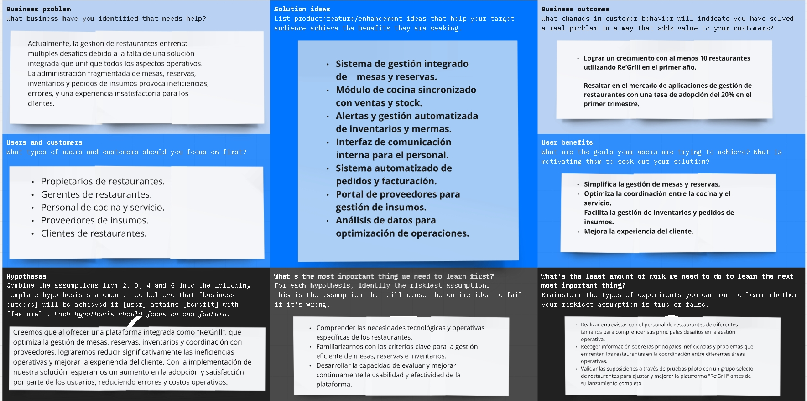

<h4 id="target-segments">1.3. Segmentos objetivo.</h4>

1. **Propietarios y Gerentes de Restaurantes Pequeños y Medianos:**

 Edad: Personas mayores de 25 años.

Sexo: Femenino o masculino.

Ubicación: Generalmente localizados en áreas urbanas o semi-urbanas.

Formación Educativa: No es un requisito específico, aunque muchos cuentan con experiencia o estudios en administración de negocios, gastronomía o áreas afines.

Poder adquisitivo: Mediano o superior al promedio, interesados en invertir en tecnología que optimice la administración del restaurante.

Clase Social: Media y Media-Alta.

Hábitos de Consumo: Enfocados en la búsqueda de soluciones que simplifiquen la gestión diaria de sus restaurantes, desde la reserva de mesas hasta la administración de inventarios.

2. **Proveedor de Insumos para Restaurantes:**

Edad: Adultos mayores de 30 años.

Sexo: Femenino o masculino.

Ubicación: Generalmente distribuidos en áreas comerciales o industriales.

Formación Educativa: Personal con conocimientos en comercio, logística o administración de empresas.

Poder adquisitivo: Medio-Alto, con capacidad para invertir en plataformas que optimicen la relación y gestión de pedidos con sus clientes restauranteros.

Clase Social: Media-Alta y Alta.

Hábitos de Consumo: Orientados a la optimización de procesos de distribución, reducción de errores en pedidos y mejora de las relaciones con clientes.

<h3 id="chapter-2">Capítulo II: Requirements Elicitation & Analysis</h3>
<h4 id="competitors">2.1. Competidores.</h4>

En esta sección se identifican los principales competidores que ofrecen productos digitales similares o parcialmente equivalentes. Entre ellos se destacan soluciones como Toast, TouchBistro e Inforest, cada uno con enfoques específicos en la gestión y la automatización en restaurantes.

<h4 id="competitive-analysis">2.1.1. Análisis competitivo.</h4>

# Competitive Analysis Landscape

<table>
  <tr>
    <th colspan="6"><b>Competitive Analysis Landscape</b></th>
  </tr>
  <tr>
    <td>¿Por qué llevar a cabo este análisis?</td>
    <td colspan="5">Evaluar a fondo el entorno competitivo, identificando competidores, sus fortalezas y debilidades, y entender sus estrategias.</td>
  </tr>
  <tr>
    <th colspan="2"></th>
    <th>NoNocleus</th>
    <th>Toast</th>
    <th>TouchBistro</th>
    <th>Inforest</th>
  </tr>
  <tr>
    <td rowspan="2">Perfil</td>
    <td>Overview</td>
    <td>Plataforma integral para la gestión de restaurantes que optimiza procesos clave como stock, mesas, cocina, y proveedores, mejorando la eficiencia operativa.</td>
    <td>Software de gestión de restaurantes basado en la nube que ayuda a los negocios a optimizar operaciones como pedidos, pagos, inventario y análisis de ventas, mejorando así su eficiencia y rentabilidad.</td>
    <td>TouchBistro es una empresa canadiense con sede en Toronto que se especializa en el desarrollo de sistemas de punto de venta (POS) para restaurantes.</td>
    <td>Inforest es un software modular diseñado para automatizar la gestión y operación de negocios gastronómicos y afines. Ofrece una variedad de funcionalidades para optimizar procesos, generar reportes y estadísticas, gestionar ventas y unificar operaciones. Además, proporciona servicio técnico 24/7.</td>
  </tr>
  <tr>
    <td>Ventaja competitiva</td>
    <td>Integración modular adaptable a diferentes necesidades y conexión automatizada entre módulos clave para reducir desperdicios y maximizar la rentabilidad.</td>
    <td>Alta personalización y hardware especializado.</td>
    <td>Simplicidad, uso sin conexión, enfoque en pequeñas empresas.</td>
    <td>Flexibilidad y menor costo.</td>
  </tr>
  <tr>
    <td rowspan="2">Perfil de marketing</td>
    <td>Mercado objetivo</td>
    <td>Pequeños y medianos restaurantes, así como cadenas que buscan digitalizar y escalar sus operaciones.</td>
    <td>Restaurantes medianos y grandes.</td>
    <td>Pequeños y medianos restaurantes, cafeterías.</td>
    <td>Restaurantes pequeños en mercados específicos.</td>
  </tr>
  <tr>
    <td>Estrategias de marketing</td>
    <td>Marketing digital, demostraciones gratuitas, y presencia en ferias del sector gastronómico y tecnológico.</td>
    <td>Enfoque en tecnología avanzada y grandes cadenas.</td>
    <td>Marketing centrado en facilidad de uso y pequeños negocios.</td>
    <td>Enfoque en soluciones económicas para nichos específicos.</td>
  </tr>
  <tr>
    <td rowspan="3">Perfil de producto</td>
    <td>Productos & Servicios</td>
    <td>Módulos de gestión de stock, mesas, reservas, pedidos a proveedores, y reportes financieros, con integración a sistemas POS.</td>
    <td>Sistema POS, gestión de pedidos y empleados, informes.</td>
    <td>Sistema POS para iPad, gestión de mesas y reservas.</td>
    <td>Sistema POS básico, ajustado a las necesidades locales.</td>
  </tr>
  <tr>
    <td>Precios y costos</td>
    <td>Modelo de suscripción mensual desde $50 para pequeñas operaciones y planes personalizables para cadenas.</td>
    <td>Moderados a altos, dependiendo de las funciones y hardware.</td>
    <td>Costos accesibles para PYMEs.</td>
    <td>Costos bajos, enfocado en pequeñas empresas.</td>
  </tr>
  <tr>
    <td>Canales de distribución</td>
    <td>Distribución en línea a través del sitio web oficial y servicios de implementación in situ.</td>
    <td>Web, aplicaciones móviles, integraciones con plataformas de entrega.</td>
    <td>iPad, soporte web.</td>
    <td>Web, opciones móviles limitadas.</td>
  </tr>
  <tr>
    <td rowspan="4">Análisis SWOT</td>
    <td>Fortalezas</td>
    <td>Adaptabilidad modular y soporte técnico dedicado.</td>
    <td>Personalización, integraciones avanzadas.</td>
    <td>Facilidad de uso, independencia de internet.</td>
    <td>Costo bajo, flexibilidad en implementación.</td>
  </tr>
  <tr>
    <td>Debilidades</td>
    <td>Dependencia de internet y necesidad de personal capacitado para la configuración inicial.</td>
    <td>Costos relativamente altos, curva de aprendizaje.</td>
    <td>Funciones avanzadas limitadas.</td>
    <td>Reconocimiento de marca bajo, funcionalidad limitada.</td>
  </tr>
  <tr>
    <td>Oportunidades</td>
    <td>Dependencia de internet y necesidad de personal capacitado para la configuración inicial.</td>
    <td>Expansión internacional, nuevas tecnologías.</td>
    <td>Mercados con internet limitado, desarrollo de nichos.</td>
    <td>Mercados emergentes, alianzas locales.</td>
  </tr>
  <tr>
    <td>Amenazas</td>
    <td>Competencia creciente y posibles cambios regulatorios.</td>
    <td>Competencia creciente, cambios regulatorios.</td>
    <td>Aumento de competidores con funciones más avanzadas.</td>
    <td>Competencia de POS más conocidos, cambios en demanda.</td>
  </tr>
</table>

<h4 id="strategy-tactics">2.1.2. Estrategias y tácticas frente a competidores.</h4>

#### Estrategias:

- Experiencia de usuario superior: Enfócate en crear una interfaz intuitiva, fácil de usar y visualmente atractiva. La facilidad de adopción y uso puede ser un factor clave para atraer a nuevos clientes.
- Prueba gratuita o demostración: Permite a los clientes potenciales probar tu software antes de comprometerse, lo que puede reducir la barrera de entrada.
- Precio competitivo: Si es posible, ofrece un precio más bajo que tus competidores, especialmente para atraer a pequeñas y medianas empresas.

#### Tacticas:
- Redes sociales: Utiliza las redes sociales para interactuar con tu audiencia, compartir contenido, promocionar tu software y generar conversaciones.
- Comparte historias de clientes satisfechos que hayan logrado resultados positivos con tu software. Esto puede ser muy persuasivo para los clientes potenciales.

<h4 id="interviews">2.2. Entrevistas.</h4>
<h4 id="interviews-design">2.2.1. Diseño de entrevistas.</h4>

#### Preguntas generales:

- ¿Cuáles considera que son los factores clave para el éxito de un restaurante en el mercado actual?
- ¿Qué características o funcionalidades considera esenciales en un software de gestión de restaurantes?
- ¿Qué papel juega la tecnología en la gestión y operación de un restaurante moderno?

#### Segmento objetivo: Administrador

- Cómo describiría el flujo típico de trabajo en su restaurante, desde la toma de pedidos hasta el servicio al cliente?
- ¿Cuáles son los mayores desafíos que enfrenta en la gestión diaria de su restaurante (ej: control de inventario, gestión de personal, satisfacción del cliente)?
- ¿Qué procesos o tareas le gustaría optimizar o automatizar en su restaurante?
- ¿Qué sistemas o herramientas tecnológicas utiliza actualmente en su restaurante (ej: punto de venta, sistema de reservas, software de contabilidad)? 
- ¿Está satisfecho con las herramientas tecnológicas que utiliza actualmente? ¿Por qué o por qué no?

#### Segmento objetivo: Proveedor

- ¿Qué tipo de productos o servicios ofrece a los restaurantes?
- ¿A qué tipo de restaurantes suministra principalmente (ej: tamaño, tipo de cocina, ubicación)?
- ¿Qué sistemas o herramientas utiliza actualmente para gestionar sus pedidos y la comunicación con los restaurantes?
- ¿Está satisfecho con las herramientas que utiliza actualmente? ¿Por qué o por qué no?
- ¿Cuáles son los principales desafíos que enfrenta en su negocio como proveedor de restaurantes?

<h4 id="interviews-registry">2.2.2. Registro de entrevistas.</h4>

- Entrevista 1: Darla

* Sexo: Femenino
* Edad: 25 años
* Distrito donde vive: Lima

* Momento en el que inicia: 0:00
* Duracion: 2:25
* Entrevistador: David Bryan Rodriguez Santos
* Resumen:

Darla es una mujer de 25 años que vive en Lima. Destaca como factores clave para el éxito de un restaurante la buena calidad de la comida y el control del inventario. Considera esencial en un software de gestión la integración de los módulos, la automatización de procesos y el acceso móvil. El flujo típico en su restaurante incluye tomar pedidos, transmitirlos a la cocina, servir la comida y revisar las ventas. Los mayores desafíos que enfrenta son el control del inventario y la coordinación del personal. Le gustaría optimizar la gestión del inventario y automatizar el seguimiento del personal. Actualmente, usan un sistema POS, software de reservas y contabilidad, pero siente que la falta de integración entre ellos es un problema. Es soltera con ingresos medios y trabaja como gerente de restaurante. Utiliza principalmente smartphone y laptop, y se comunica a través de WhatsApp, correo electrónico y redes sociales profesionales. Es proactiva, orientada a la eficiencia, con habilidades en gestión de personal y operaciones. Está interesada en tecnologías innovadoras para la industria de la restauración. Sus objetivos son mejorar la eficiencia operativa del restaurante e implementar sistemas integrados de gestión. Sus frustraciones incluyen sistemas desconectados que dificultan el control total del negocio y la pérdida de tiempo en procesos manuales. Tiene cinco años de experiencia en la industria y busca constantemente maneras de innovar y mejorar la experiencia tanto para el personal como para los clientes.

- Entrevista 2: Vanfic Gustavok

 

* Sexo: Masculino
* Edad: 49 años
* Distrito donde vive: Lima

* Link: https://upcedupe-my.sharepoint.com/:v:/g/personal/u202220250_upc_edu_pe/ET0b7nkH9IZDviA0pdi0o9QBh9uleEn3GtrOeE16Mgkniw?e=d3Er84&nav=eyJyZWZlcnJhbEluZm8iOnsicmVmZXJyYWxBcHAiOiJTdHJlYW1XZWJBcHAiLCJyZWZlcnJhbFZpZXciOiJTaGFyZURpYWxvZy1MaW5rIiwicmVmZXJyYWxBcHBQbGF0Zm9ybSI6IldlYiIsInJlZmVycmFsTW9kZSI6InZpZXcifX0%3D

* Momento en el que inicia: 4:24
* Duracion: 2:20
* Entrevistador: Mateo Loechle

* Resumen:

Vanfic Gustavok es un hombre de 49 años que vive en Lima. Durante una entrevista con Mateo Loechle que comenzó en el minuto 4:24 y duró 2 minutos y 20 segundos, compartió su visión sobre las funcionalidades esenciales de un software de gestión de restaurantes. Vanfic cree que dicho software debe incluir gestión de mesas y reservas, control de inventario, seguimiento de ventas, gestión de pedidos en cocina, integración con proveedores y capacidades de análisis y reportes financieros. Considera que estas funciones son cruciales para automatizar procesos y optimizar las operaciones diarias.
Como propietario de un restaurante desde hace más de diez años, ha experimentado las dificultades de manejar múltiples sistemas no integrados. Utiliza dispositivos como smartphones y laptops para sus tareas diarias y se comunica principalmente a través de correo electrónico y aplicaciones de mensajería instantánea. Valora la eficiencia y está en constante búsqueda de tecnologías que le permitan mejorar la gestión de su negocio.
Vanfic se siente frustrado por la falta de integración entre los diferentes sistemas que utiliza actualmente, como el POS, el software de reservas y las herramientas de contabilidad. Su objetivo es encontrar una solución unificada que le facilite el control total de su negocio, reduciendo la carga de trabajo manual y minimizando errores. Es una persona detallista y orientada a la mejora continua, siempre buscando innovar y ofrecer una mejor experiencia tanto para su equipo como para sus clientes.

- Entrevista 1: Anghelo Basauri

* Sexo: Masculino
* Edad: 27 años
* Distrito donde vive: Rimac

* Link: https://upcedupe-my.sharepoint.com/:v:/g/personal/u202220250_upc_edu_pe/ET0b7nkH9IZDviA0pdi0o9QBh9uleEn3GtrOeE16Mgkniw?e=d3Er84&nav=eyJyZWZlcnJhbEluZm8iOnsicmVmZXJyYWxBcHAiOiJTdHJlYW1XZWJBcHAiLCJyZWZlcnJhbFZpZXciOiJTaGFyZURpYWxvZy1MaW5rIiwicmVmZXJyYWxBcHBQbGF0Zm9ybSI6IldlYiIsInJlZmVycmFsTW9kZSI6InZpZXcifX0%3D

* Momento en el que inicia: 4:24
* Duracion: 3:12
* Entrevistador: Hardie Holguín

* Resumen:

Anghelo Basauri es un hombre de 27 años que vive en el distrito de Rímac. La entrevista, realizada por Hardie Holguín, comenzó a las 4:24 y tuvo una duración de 3 minutos y 12 segundos. Entre los mayores desafíos que menciona se encuentran el control preciso del inventario, garantizar la calidad constante de los platos, gestionar eficazmente al personal y proporcionar una excelente experiencia al cliente. También encuentra complicado manejar la logística de los proveedores y las fluctuaciones en la demanda.
Anghelo desea optimizar la gestión de inventario y pedidos para asegurar que siempre haya suficientes insumos sin sobrecargar el stock. Le gustaría automatizar la comunicación con los proveedores para reducir tiempos de respuesta y minimizar errores. Es gerente de un restaurante y utiliza dispositivos como smartphones y laptops para sus tareas diarias. Se comunica principalmente a través de correo electrónico y aplicaciones de mensajería instantánea. Valora la tecnología como una herramienta para mejorar la eficiencia operativa y está interesado en soluciones que le ayuden a superar los desafíos mencionados.

- Entrevista 1: Keyner Hancco

* Sexo: Masculino
* Edad: 25 años
* Distrito donde vive: Santa Anita

* Link: https://upcedupe-my.sharepoint.com/:v:/g/personal/u202220250_upc_edu_pe/ET0b7nkH9IZDviA0pdi0o9QBh9uleEn3GtrOeE16Mgkniw?e=d3Er84&nav=eyJyZWZlcnJhbEluZm8iOnsicmVmZXJyYWxBcHAiOiJTdHJlYW1XZWJBcHAiLCJyZWZlcnJhbFZpZXciOiJTaGFyZURpYWxvZy1MaW5rIiwicmVmZXJyYWxBcHBQbGF0Zm9ybSI6IldlYiIsInJlZmVycmFsTW9kZSI6InZpZXcifX0%3D

* Momento en el que inicia: 7:10
* Duracion: 5:32
* Resumen: Hardie Holguín

* Analisis:

Keyner Hancco es un hombre de 25 años que vive en Santa Anita. Fue entrevistado por Hardie Holguín, comenzando a las 7:10 y con una duración de 5 minutos y 32 segundos. Para él, la rapidez y precisión en el servicio son aspectos críticos, junto con la facilidad para realizar reservas y pedidos. Considera fundamental mejorar la comunicación entre el personal y los clientes para garantizar que sus necesidades sean atendidas eficientemente. En general, está satisfecho con las herramientas que utiliza, aunque cree que siempre hay margen de mejora. Le gustaría que algunas funciones fueran más intuitivas y que la integración con los proveedores fuera más fluida. También menciona que la personalización de ciertos reportes sería una mejora importante. Es soltero, supervisor en un restaurante de comida rápida, con ingresos medios. Utiliza smartphone y tablet, y se comunica a través de WhatsApp, correo electrónico y aplicaciones de gestión de restaurantes. Es proactivo, orientado al cliente, con habilidades en gestión de equipos y resolución de problemas. Está interesado en tecnología móvil y aplicaciones que mejoren la eficiencia operativa. Sus objetivos son mejorar la experiencia del cliente mediante servicios más rápidos y precisos e implementar sistemas que faciliten las reservas y pedidos en línea. Sus frustraciones incluyen herramientas poco intuitivas que dificultan el flujo de trabajo e integración deficiente con proveedores que causa demoras. Tiene cinco años de experiencia en la industria de la restauración y siempre busca formas de implementar soluciones digitales que mejoren tanto la eficiencia operativa como la satisfacción del cliente.

- Entrevista 1: Elismar Sarmiento

* Sexo: Femenino
* Edad: 25 años
* Distrito donde vive: Callao

* Link: https://upcedupe-my.sharepoint.com/:v:/g/personal/u202220250_upc_edu_pe/ET0b7nkH9IZDviA0pdi0o9QBh9uleEn3GtrOeE16Mgkniw?e=d3Er84&nav=eyJyZWZlcnJhbEluZm8iOnsicmVmZXJyYWxBcHAiOiJTdHJlYW1XZWJBcHAiLCJyZWZlcnJhbFZpZXciOiJTaGFyZURpYWxvZy1MaW5rIiwicmVmZXJyYWxBcHBQbGF0Zm9ybSI6IldlYiIsInJlZmVycmFsTW9kZSI6InZpZXcifX0%3D

* Momento en el que inicia: 12:57
* Duracion: 4:10
* Entrevistador: Gabriel Braihuate
* Resumen:

Elismar Sarmiento es una mujer de 25 años que vive en Pueblo Libre, Lima, Perú. Está casada y tiene ingresos medios. Utiliza Google Chrome como buscador principal y LinkedIn es su canal principal de interacción digital. Trabaja en el área de proveedores, donde sus funciones incluyen el contacto directo con clientes, organizar pedidos y entregas, y gestionar la información relacionada. Cree que la calidad de los alimentos utilizados en los restaurantes es clave para su éxito y que la tecnología es importante para la gestión y comunicación con los clientes. Ofrece productos de alta calidad como verduras, frutas, lácteos y especias, principalmente a restaurantes, casinos y hoteles. Utiliza WhatsApp y Outlook para comunicarse y Excel para gestionar los pedidos, pero no está completamente satisfecha con estas herramientas porque le resulta tedioso transferir datos del correo a Excel y a veces los pedidos se pierden en WhatsApp o correo debido al gran volumen de mensajes. Su principal dificultad es la comunicación con sus clientes.

<h4 id="interviews-analysis">2.2.3. Análisis de entrevistas.</h4>

#### Administrador de Restaurante:

Durante las entrevistas con los administradores de restaurante, se identificaron varios puntos clave que destacan sus principales necesidades y desafíos. En primer lugar, enfatizaron la importancia de contar con un sistema eficiente para gestionar las reservas y la asignación de mesas, ya que una mala organización en este aspecto puede afectar negativamente la experiencia del cliente. Asimismo, señalaron la necesidad de una herramienta integral que permita un control exhaustivo del inventario y de los proveedores, lo cual impacta directamente en la reducción de costos y en la optimización del proceso de abastecimiento.
Un tema recurrente fue la importancia de generar reportes y estadísticas en tiempo real, especialmente en relación con las ventas, el desperdicio de alimentos y el uso de ingredientes. Los administradores valoran la capacidad de tener un cierre de caja detallado y preciso, así como una visión clara de la rentabilidad de cada plato para mejorar la toma de decisiones estratégicas. También destacaron desafíos como garantizar la calidad constante de los platos, gestionar eficazmente al personal y mejorar la comunicación entre el equipo y los clientes para atender sus necesidades de manera eficiente.
Además, manifestaron que la falta de integración entre los sistemas actuales (como POS, software de reservas y contabilidad) es un problema común. Desean herramientas más intuitivas que permitan una mejor integración con los proveedores y la personalización de reportes. La automatización de procesos, como el seguimiento del personal y la gestión de pedidos en cocina, fue mencionada como una mejora importante para optimizar las operaciones diarias.

#### Proveedor:

En cuanto a los proveedores, las entrevistas revelaron que su principal interés radica en la simplificación y mejora de la comunicación con los restaurantes. Mencionaron la importancia de contar con un sistema que les permita gestionar pedidos de manera más ágil y estructurada, evitando errores y reduciendo el tiempo de espera entre la orden y la entrega. La comunicación a través de herramientas como WhatsApp y correo electrónico a veces resulta ineficiente, llevando a la pérdida de pedidos y a procesos tediosos como la transferencia manual de datos.
Los proveedores expresaron la necesidad de tener visibilidad sobre las previsiones de demanda y el historial de compras de los restaurantes, lo que les ayudaría a planificar mejor su producción y entrega. También valoran los sistemas que permiten una integración directa con los inventarios de los restaurantes, de modo que puedan ajustar sus ofertas y volúmenes de productos según las necesidades reales del cliente, mejorando así la eficiencia en toda la cadena de suministro. Consideran que la tecnología juega un rol crucial en modernizar estas interacciones y en facilitar una gestión más eficiente y efectiva de los pedidos y comunicaciones.

<h4 id="needfinding">2.3. Needfinding.</h4>
<h4 id="user-personas">2.3.1. User Personas.</h4>

#### Segmento: Administrador de restaurantes

Martín es un proveedor de insumos gastronómicos de 42 años. Su principal objetivo es establecer relaciones comerciales duraderas con restaurantes, automatizar pedidos y ofrecer un servicio confiable. Tiene buena organización, pero nivel medio en tecnología. Está frustrado por la falta de sistemas centralizados y la competencia que ofrece precios bajos. Prefiere canales como LinkedIn y las interacciones cara a cara.

#### Segmento: Proveedor

Laura es administradora de un restaurante de 45 años. Busca optimizar la gestión, reducir desperdicios y mejorar la satisfacción del cliente. Tiene experiencia en organización y se maneja bien con la tecnología. Sus principales frustraciones son la falta de integración de sistemas y el desperdicio de insumos. Sus canales favoritos son Facebook, LinkedIn y las interacciones cara a cara.

<h4 id="user-task-matrix">2.3.2. User Task Matrix.</h4>

| **Tareas**                                        | **Frecuencia** | **Usuario Principal** | **Objetivo del Usuario**                                                                 | **Frustraciones del Usuario**                                                                 | **Oportunidades de la Plataforma**                                                                                           |
|---------------------------------------------------|----------------|-----------------------|-----------------------------------------------------------------------------------------|-----------------------------------------------------------------------------------------------|------------------------------------------------------------------------------------------------------------------------------|
| **Gestionar pedidos de insumos**                  | Diaria          | Ambos                 | Laura solicita insumos y Martín los procesa y gestiona                                  | Laura: Dificultad para controlar el inventario   Martín: Errores manuales en los pedidos    | Automatización en tiempo real de los pedidos y gestión del inventario para reducir errores y mejorar tiempos de entrega.      |
| **Coordinar entregas y logística**                | Diaria          | Ambos                 | Martín organiza el envío y Laura recibe los insumos puntualmente                        | Laura: Entregas retrasadas   Martín: Mala coordinación logística                           | Sistema de seguimiento en tiempo real que notifique a ambos usuarios del estado de las entregas.                              |
| **Monitorear niveles de stock**                   | Semanal         | Laura                 | Mantener el stock en niveles óptimos para evitar escasez o sobreabastecimiento           | Laura: Desperdicio de insumos o escasez de productos                                          | Plataforma que automatice la actualización de stock, basada en los pedidos y las ventas del restaurante.                      |
| **Actualizar catálogo de productos**              | Semanal         | Martín                | Asegurar que sus clientes vean los productos disponibles y ofertas                      | Martín: Falta de visibilidad de su catálogo de productos                                      | Sección centralizada donde Martín pueda actualizar su catálogo y Laura acceda a él en tiempo real, incluyendo ofertas.        |
| **Negociar condiciones de compra y precios**      | Mensual         | Ambos                 | Laura busca precios competitivos y Martín quiere establecer relaciones comerciales sólidas | Martín: Competencia con precios bajos   Laura: Falta de opciones competitivas            | Funcionalidad para negociar directamente desde la plataforma, agilizando acuerdos y condiciones comerciales.                   |
| **Generar y enviar facturas**                     | Semanal         | Ambos                 | Martín necesita facturar y Laura debe controlar los gastos del restaurante               | Martín: Falta de automatización en la facturación   Laura: Problemas para controlar costos | Facturación automática vinculada a los pedidos, con reportes que faciliten la administración y el control financiero.         |
| **Revisar informes de pedidos y consumo**         | Mensual         | Ambos                 | Evaluar el rendimiento de los productos, las ventas y los pedidos                        | Laura: Falta de información clara sobre el uso de insumos   Martín: Poca visibilidad de ventas | Informes detallados que incluyan estadísticas de pedidos, ventas y stock, para tomar mejores decisiones estratégicas.        |
| **Ofrecer descuentos y promociones**              | Ocasional       | Martín                | Atraer nuevos clientes y fidelizar a los actuales                                        | Martín: Poca visibilidad de sus ofertas                                                       | Plataforma que permita la creación y promoción de descuentos y ofertas, visibles para clientes como Laura.                    |
| **Gestionar devoluciones y reclamos**             | Ocasional       | Ambos                 | Resolver incidencias relacionadas con la calidad o entrega de los insumos                | Laura: Mala calidad o entregas tardías   Martín: Reclamos que afectan la relación comercial | Integrar una funcionalidad para gestionar devoluciones y reclamos, facilitando la comunicación y resolución rápida.            |
| **Capacitar al equipo en nuevas herramientas**    | Ocasional       | Laura                 | Asegurar que su equipo use eficientemente la plataforma para optimizar operaciones       | Laura: Dificultad de su equipo para adaptarse a nuevas tecnologías                            | Tutoriales integrados en la plataforma y soporte técnico para facilitar el aprendizaje del equipo de Laura.                   |
| **Solicitar informes de disponibilidad de productos** | Ocasional    | Laura                 | Verificar la disponibilidad de productos antes de hacer pedidos                         | Laura: Falta de información actualizada sobre la disponibilidad                               | Sistema en tiempo real que muestre la disponibilidad de insumos, facilitando la planificación de pedidos.                    |

| **Tarea**                             | **Persona**                                                                                             | **Frecuencia** | **Importancia** |
|---------------------------------------|---------------------------------------------------------------------------------------------------------|----------------|-----------------|
| 1. Revisar pedidos de insumos         | Martin, Proveedor                                                                                       | Diaria         | Alta            |
| 2. Ofertar productos                  | Martín, Proveedor                                                                                       | Diaria         | Alta            |
| 3. Confirmar recepción de pagos       | Martín, Proveedor                                                                                       | Semanal        | Media           |
| 4. Actualizar catálogo de productos   | Martín, Proveedor                                                                                       | Mensual        | Alta            |
| 5. Coordinar entregas                 | Martín, Proveedor                                                                                       | Diaria         | Alta            |

<h4 id="user-journey-mapping">2.3.3. User Journey Mapping.</h4>

#### Segmento: Administrador de restaurantes

Los usuarios sienten ansiedad por la curva de aprendizaje del equipo, lo que destaca la necesidad de mejorar la accesibilidad del producto y ofrecer tutoriales más fáciles de seguir.
A pesar de la satisfacción con la reducción de desperdicios, los usuarios expresan frustraciones con la interfaz, lo que sugiere oportunidades para recibir retroalimentación constante y mejorar la usabilidad del sistema.

#### Segmento: Proveedor

Los usuarios buscan automatizar la gestión de pedidos, pero tienen preocupaciones sobre la compatibilidad con sus sistemas actuales, lo que indica la importancia de resaltar la facilidad de integración en los materiales promocionales.
Aunque se muestra satisfacción con la reducción de errores, los usuarios aún experimentan frustraciones con algunos aspectos de la interfaz, lo que señala la necesidad de mejorar y personalizarla, especialmente para proveedores.

<h4 id="empathy-mapping">2.3.4. Empathy Mapping.</h4>

#### Segmento: Administrador de restaurantes

Los usuarios sienten ansiedad por posibles fallas del sistema y buscan mejorar la eficiencia del personal, sintiendo alivio cuando las operaciones fluyen sin problemas.
Escuchan quejas de clientes sobre demoras en pedidos, sugerencias del personal para mejorar procesos y notificaciones del sistema sobre inventarios bajos.
Suelen ver informes de stock y ventas, menús, listas de precios, reservas y pedidos en línea, además de los movimientos del personal.

#### Segmento: Proveedor

Los usuarios se preocupan por la exactitud y puntualidad de los pedidos, con ansiedad sobre la compatibilidad de NoNucleus con sus sistemas actuales, aunque sienten alivio cuando las entregas son sin complicaciones.
Escuchan comentarios sobre la puntualidad de los pedidos, sugerencias de clientes para mejorar la entrega y notificaciones del sistema sobre nuevos pedidos.
Observan detalles de pedidos recibidos y pendientes en NoNucleus, notificaciones de cambios en las solicitudes y reportes sobre cantidad y tiempos de entrega.

<h4 id="as-is-scenario-mapping">2.3.5. As-is Scenario Mapping.</h4>

#### Segmento: Administrador de restaurantes

Pasos y acciones: Llega temprano, revisa inventario y stock, asigna tareas al personal, supervisa las operaciones, resuelve problemas del día y cierra revisando ventas e inventario.
Pensamientos: Preocupación por el stock y las responsabilidades del personal, buscando asegurar eficiencia en el servicio y resolver problemas rápidamente. Al final del día, reflexiona sobre posibles mejoras para mañana.
Sentimientos: Preocupación, ansiedad al inicio del día, satisfacción tras una buena jornada, frustración ante problemas y alivio al cerrar el día.

#### Segmento: Proveedor

Pasos y acciones: Inicia revisando pedidos, verifica que estén organizados, coordina las rutas de entrega, supervisa las entregas, recibe feedback y actualiza NoNucleus.
Pensamientos: Preocupación por el stock y la organización de los pedidos, buscando que las entregas sean puntuales y sin errores. Reflexiona sobre problemas potenciales y cómo mejorar la próxima vez.
Sentimientos: Preocupación y ansiedad al inicio, determinación durante el proceso, frustración si surgen problemas y alivio tras recibir feedback y cerrar el día.

<h4 id="ubiquitous-language">2.4. Ubiquitous Language.</h4>

Definición del lenguaje común para el equipo de NoNucleus:

- Mesas: Áreas asignadas para los comensales en el restaurante, gestionadas por el módulo de mesas. 
- Reservas: Solicitudes de los clientes para asegurar una mesa en una fecha y hora específica, gestionadas por el módulo de reservas.
- Stock: Cantidad de insumos disponibles para preparar platos, gestionado por el módulo de stock.
- Merma: Pérdida de insumos por vencimiento o accidentes, registrada en el módulo de merma.
- Pedidos: Órdenes de insumos solicitadas a proveedores, gestionadas por el módulo de pedidos.

Este lenguaje será usado consistentemente en la documentación, comunicación y desarrollo del software para asegurar claridad y evitar malentendidos.

<h3 id="chapter-3">Capítulo III: Requirements Specification</h3>
<h4 id="to-be-scenario-mapping">3.1. To-Be Scenario Mapping.</h4>

</img> 
</img> 
 
<h4 id="user-stories">3.2. User Stories.</h4>

| Epic / Story ID 	    | Título 	                                                | Descripción 	                                                                                                                                                                                                                                                 | Criterios de Aceptación 	                                                                                                                                                                                                                                                                                                                                                                                                                                                                                                                                                                        | Relacionado con Epic ID 	                                                                            |
|----------------------|---------------------------------------------------------|---------------------------------------------------------------------------------------------------------------------------------------------------------------------------------------------------------------------------------------------------------------|--------------------------------------------------------------------------------------------------------------------------------------------------------------------------------------------------------------------------------------------------------------------------------------------------------------------------------------------------------------------------------------------------------------------------------------------------------------------------------------------------------------------------------------------------------------------------------------------------|------------------------------------------------------------------------------------------------------|
| EP01               	 | Gestión de Inventario y Stock	                          | *Como* administrador *Quiero* gestionar eficientemente el inventario y stock del restaurante *Para* asegurar que los ingredientes estén siempre disponibles y reducir el desperdicio.                                                                         | No Corresponde                                                                                                                                                                                                                                                                                                                                                                                                                                                                                                                                                                                   | No Corresponde                                                                                       |
| EP02               	 | Optimización del Costo de Producción y Facturación	     | *Como* administrador *Quiero* calcular y optimizar el costo de producción y gestionar la facturación *Para* asegurar la rentabilidad del restaurante.                                                                                                         | No Corresponde                                                                                                                                                                                                                                                                                                                                                                                                                                                                                                                                                                                   | No Corresponde                                                                                       |
| EP03               	 | Control y Reporte de Uso de Ingredientes  	             | *Como* administrador *Quiero* llevar un control detallado de la merma y generar reportes sobre el uso de ingredientes *Para* optimizar la gestión del inventario.                                                                                             | No Corresponde                                                                                                                                                                                                                                                                                                                                                                                                                                                                                                                                                                                   | No Corresponde                                                                                       |
| EP04               	 | Operaciones Eficientes en la Caja 	                     | *Como* administrador *Quiero* realizar operaciones de cierre de caja detallado y gestionar las transacciones de manera precisa *Para* asegurar una contabilidad clara.                                                                                        | No Corresponde                                                                                                                                                                                                                                                                                                                                                                                                                                                                                                                                                                                   | No Corresponde                                                                                       |
| EP06               	 | Landing Page Optimizada	                                | *Como* usuario interesado, *Quiero* una página de destino fácil de usar y optimizada que ofrezca información clara y accesible sobre la aplicación *Para* facilitar la toma de decisiones informadas y mejorar la interacción con el equipo de la aplicación. | No Corresponde                                                                                                                                                                                                                                                                                                                                                                                                                                                                                                                                                                                   | No Corresponde                                                                                       |
| EP07               	 | Gestión de Reservas	                                    | *Como* administrador *Quiero* gestionar las reservas de mesas de manera eficiente *Para* asegurar un servicio rápido y eficiente.                                                                                                                             | No Corresponde                                                                                                                                                                                                                                                                                                                                                                                                                                                                                                                                                                                   | No Corresponde                                                                                       |
| EP08              	  | Contactar restaurante                                   | Como proveedor  Quiero contactar al restaurante en el que estoy interesado Para llegar a un acuerdo y establecer una alianza                                                                                                                                  | No Corresponde                                                                                                                                                                                                                                                                                                                                                                                                                                                                                                                                                                                   | No Corresponde                                                                                       |
| EP09              	  | Gestion de mesas y sillas                               | Como cliente Quiero reservar una mesa en el restaurante Para asegurarme de tener un lugar disponible en el restaurante                                                                                                                                        | No Corresponde                                                                                                                                                                                                                                                                                                                                                                                                                                                                                                                                                                                   | No Corresponde                                                                                       |
| EP10                 | Gestión de Proveedores                                  | Como proveedor, quiero gestionar mis datos para mantener un registro actualizado con el restaurante.                                                                                                                                                          | No Corresponde                                                                                                                                                                                                                                                                                                                                                                                                                                                                                                                                                                                   | No Corresponde                                                                                       |
| EP11                 | Evaluación de Proveedores                               | Como administrador, quiero evaluar a los proveedores para asegurar la calidad de los productos.                                                                                                                                                               | No Corresponde                                                                                                                                                                                                                                                                                                                                                                                                                                                                                                                                                                                   | No Corresponde          |
| US-01             	  | Acceso a Cantidades de Stock                            | Como administrador, quiero acceder a las cantidades actuales de stock para planificar la producción y las compras.                                                                                                                                            | <b>Scenario 01:</b> Ver Cantidades Disponibles Dado</b> que soy administrador Cuando</b> acceda al sistema de gestión de inventario Entonces</b>  podré ver las cantidades actuales de cada ingrediente en stock, y el sistema mostrará alertas cuando el stock esté por debajo de un nivel predefinido.   Scenario 02:</b> Recibir Notificación de Bajo Stock Dado</b>  que el stock de un ingrediente está bajo, Cuando</b>  acceda al sistema de gestión de inventario, Entonces</b> recibiré una notificación de bajo stock para que pueda tomar medidas inmediatas.    | EP01                                                                                                 |
| US-02             	  | Ingreso de Stock                                        | Como proveedor, quiero registrar nuevas entradas de inventario para mantener un registro actualizado de los ingredientes que ingrese.                                                                                                                         | <b>Scenario 01:</b> Registrar Nuevas Entradas Dado que soy administradorCuando</b> reciba un nuevo lote de ingredientes, Entonces</b>puedo registrar esta entrada en el sistema con la cantidad y la fecha de ingreso, y el sistema actualizará automáticamente el stock disponible.  Scenario 02:</b> Verificar Registro de Entrada Dado</b> que he registrado una nueva entrada de stock, Cuando</b> revise el registro Entonces</b>  podré ver la nueva entrada registrada con todos los detalles correspondientes.                                                | EP01                                                                                                 |
| US-03             	  | Tomar Pedidos desde la Mesa                             | Como administrador, quiero introducir pedidos directamente en la aplicación desde la mesa para que estos se envíen automáticamente a la cocina.                                                                                                               | <b>Scenario 01:</b>Tomar Pedidos desde la Mesa <b>Dado</b> que estoy tomando un pedido, <b>Cuando</b> introduzca los ítems en la aplicación, <b>Entonces</b> estos deben enviarse automáticamente al sistema de cocina.  <b>Scenario 02:</b> Modificar Pedido Antes de Enviar  <b>Dado</b>  que he tomado un pedido, <b>Cuando</b>  el cliente haga una modificación, <b>Entonces</b>  el sistema debe permitir la modificación del pedido antes de enviarlo a la cocina.                                                                                          | EP07                                                                                                 |
| US-04             	  | Cálculo del Costo de Producción                         | Como administrador, quiero consultar el costo de los ingredientes por plato para ajustar precios o recetas según sea necesario.                                                                                                                               | <b>Scenario 01:</b> Consultar Costos de Producción Dado</b> que soy administrador, Cuando</b> acceda a un plato específico Entonces</b>el sistema debe mostrar el costo detallado de cada ingrediente y el costo total de producción del plato.  Scenario 02:</b> Modificar Receta y Recalcular Costos Dado</b>  que quiero ajustar una receta, Cuando</b> modifique los ingredientes en el sistema, Entonces</b>  el sistema debe recalcular automáticamente el costo de producción del plato y actualizarlo en la base de datos.                                 | EP02                                                                                                 |
| US-05             	  | Reporte de Uso de Ingredientes                          | Como administrador, quiero ver estadísticas sobre el uso de ingredientes para ajustar los pedidos y optimizar la producción.                                                                                                                                  | Scenario 01:</b> Generar Reporte de Uso de Ingredientes Dado</b> que soy administrador, Cuando</b>  acceda a los reportes de uso de ingredientes, Entonces</b> el sistema debe mostrar gráficos y estadísticas detalladas del uso de cada ingrediente durante un período específico.  Scenario 02:</b>  Ajustar Pedidos Basado en el Reporte Dado</b>  que he revisado el reporte de uso de ingredientes, Cuando</b> note un aumento en el uso de ciertos ingredientes, Entonces</b> podré ajustar los pedidos para evitar la escasez y optimizar la producción.   | EP03                                                                                                 |
| US-06             	  | Landing page - Estructuración                           | Como visitante de la landing page, quiero encontrar una navegación intuitiva que me permita acceder fácilmente a la información sobre sus características.                                                                                                    | Escenario 1: "Landing page estructurada" Dado que el visitante está en la landing page, cuando el visitante accede a la página principal, entonces la landing page ofrece los medios necesarios para una navegación fácil y clara. Escenario 2: "Organización no intuitiva"Dado que el visitante está en la landing page, cuando el visitante accede a la página principal, entonces la landing page no proporciona formas de navegación amigables para el usuario.                                                                                                                              | EP06                                                                                                 |
| US-07             	  | Landing page – Contenido informativo                    | Como visitante de la landing page, quiero encontrar contenido detallado y fácil de entender sobre las funcionalidades y beneficios de la aplicación para poder tomar una decisión informada sobre su uso.                                                     | Escenario 1: "Contenido landing page"Dado que el visitante está en la landing page, cuando el visitante navega por la landing page, entonces la página presenta información clara, fácil de entender y accesible para cualquier visitante.Escenario 2: "Contenido confuso o insuficiente" Dado que el visitante está en la landing page, cuando el visitante navega por la landing page, entonces la página no ofrece información clara, lo que la hace inaccesible para diferentes visitantes.                                                                                                  | EP06                                                                                                 |
| US-08             	  | Landing page - Compatibilidad móvil                     | Como visitante de la landing page, quiero que sea responsiva para poder utilizarla en cualquier dispositivo.                                                                                                                                                  | Escenario 1: "Compatibilidad con dispositivos móviles"Dado que el visitante está en la landing page, cuando el visitante accede a la landing page desde su dispositivo móvil, entonces puede navegar por la página sin problemas.Escenario 2: "Problemas de visualización o navegación"Dado que el visitante está en la landing page, cuando el visitante accede a la landing page desde su dispositivo móvil, entonces encuentra problemas de visualización o navegación.                                                                                                                       | EP06                                                                                                 |
| US-09             	  | Landing page - Formulario de contacto                   | Como visitante de la landing page, quiero encontrar un formulario de contacto para poder comunicarme con el equipo de la aplicación.                                                                                                                          | Escenario 1: "Acceso al formulario de contacto"Dado que el visitante está en la sección de contacto, cuando el visitante llena el formulario con los datos solicitados por la landing page, entonces la página envía los datos al equipo de la aplicación.Escenario 2: "Falta de formulario de contacto"Dado que el visitante está en la sección de contacto, cuando el visitante intenta enviar el formulario sin completar los campos obligatorios, entonces la landing page muestra un mensaje de error solicitando que se complete el formulario.                                            | EP06                                                                                                 |
| US-10             	  | Landing page - Contenido multimedia                     | Como visitante de la landing page, quiero encontrar contenido multimedia para obtener información de manera más dinámica.                                                                                                                                     | Escenario 1: "Contenido multimedia disponible"Dado que el visitante está en la landing page, cuando el visitante navega por la página y sus diferentes secciones, entonces la landing page carga todos los recursos multimedia y los muestra al visitante.Escenario 2: "Falta de contenido multimedia"Dado que el visitante está en la landing page, cuando el visitante navega por la página y sus diferentes secciones, entonces la landing page no carga los recursos multimedia, resultando en una página monótona y vacía.                                                                  | EP06                                                                                                 |
| US-11             	  | Landing page - Call-to-action                           | Como visitante de la landing page, quiero encontrar call-to-actions para solicitar una demo.                                                                                                                                                                  | Escenario 1: "Call-to-action funcional"Dado que el visitante está en la sección de inicio de la landing page, cuando el visitante navega por la sección y presiona el botón de call-to-action para pedir una demo, entonces la landing page lo redirige a la sección de contacto.Escenario 2: "Falla del call-to-action"Dado que el visitante está en la sección de inicio de la landing page, cuando el visitante navega por la sección y presiona el botón de call-to-action para pedir una demo, entonces la landing page no realiza ninguna acción.                                          | EP06                                                                                                 |
| US-12             	  | Landing page - Testimonios                              | Como visitante de la landing page, quiero encontrar testimonios de usuarios para conocer sus experiencias con la aplicación.                                                                                                                                  | Escenario 1: "Testimonios disponibles"Dado que el visitante está en la landing page, cuando el visitante navega por la página y sus diferentes secciones, entonces la landing page muestra testimonios de usuarios satisfechos con la aplicación.Escenario 2: "Falta de testimonios"Dado que el visitante está en la landing page, cuando el visitante navega por la página y sus diferentes secciones, entonces la landing page no muestra testimonios de usuarios, lo que dificulta la toma de decisiones del visitante.                                                                       | EP06                                                                                                 |
| US-13             	  | Asignación de Mesas                                     | Como adminnistrador, quiero tener acceso a la cantidad de mesas y sillas para organizar los pedidos y las reservas.                                                                                                                                           | Scenario 01: Gestionar Asignación de MesasDado que soy mesero,Cuando un cliente es asignado a una mesa, Entonces puedo actualizar el estado de la mesa a "ocupada" en el sistema.   Scenario 02: Visualizar Estado de MesasDado que soy mesero,Cuando quiera ver el estado del restaurante,Entonces el sistema debe mostrar un mapa visual del restaurante con el estado actualizado de cada mesa (ocupada, disponible, reservada, etc.).                                                                                                                                                        | EP09                                                                                                 |
| US-14             	  | Ingreso y modificiacion Pedidos                         | Como administrador, quiero agregar los pedidos de los clientes para asegurar un servicio rápido y eficiente.                                                                                                                                                  | Scenario 01: Tomar Pedidos de ClientesDado que soy mesero,Cuando un cliente haga un pedido,Entonces puedo registrar los ítems en el sistema y enviarlos a la cocina.   Scenario 02: Modificar PedidoDado que soy mesero,Cuando un cliente solicite una modificación en su pedido,Entonces puedo realizar los cambios en el sistema antes de enviarlo a la cocina.     Scenarario 02: </b>                                                                                                                                                                                                     | EP07                                                                                                 |
| US-15             	  | Ingreso y confirmación de Reservas                      | Como administrador, quiero agregar las reservas de mesas para asegurar un servicio rápido y eficiente.                                                                                                                                                        | Scenario 01: Tomar Reservas de MesasDado que soy mesero,Cuando un cliente solicite una reserva,Entonces puedo registrar la reserva en el sistema y asignar una mesa disponible.   Scenario 02: Confirmar ReservaDado que soy mesero,Cuando un cliente llegue al restaurante,Entonces puedo confirmar la reserva y asignar una mesa disponible.                                                                                                                                                                                                                                                   | EP09                                                                                                 |
| US-16             	  | Generación de Facturas                                  | Como administrador, quiero generar facturas para los clientes para asegurar un servicio rápido y eficiente.                                                                                                                                                   | Scenario 01: Generar Facturas para ClientesDado que soy cajero,Cuando un cliente finaliza su comida,Entonces puedo generar una factura detallada que incluya todos los ítems consumidos.   Scenario 02: Enviar Factura ElectrónicaDado que el cliente ha solicitado una factura electrónica,Cuando la factura se genere,Entonces el sistema debe permitir la emisión de la factura electrónica y su envío por correo electrónico al cliente.                                                                                                                                                     | EP04                                                                                                 |
| US-17             	  | Reporte de Ventas                                       | Como administrador, quiero ver estadísticas sobre las ventas para tomar decisiones informadas sobre la gestión del restaurante.                                                                                                                               | Scenario 01: Generar Reporte de VentasDado que soy administrador,Cuando acceda a los reportes de ventas,Entonces el sistema debe mostrar gráficos y estadísticas detalladas de las ventas durante un período específico.   Scenario 02: Analizar Datos de VentasDado que soy administrador,Cuando revise los reportes de ventas,Entonces podré analizar los datos y tomar decisiones informadas sobre la gestión del restaurante.                                                                                                                                                                | EP04                                                                                                 |
| US-18             	  | Reporte de Caja                                         | Como administrador, quiero ver estadísticas sobre las transacciones de caja para asegurar una contabilidad clara.                                                                                                                                             | Scenario 01: Generar Reporte de CajaDado que soy cajero,Cuando acceda a los reportes de caja,Entonces el sistema debe mostrar gráficos y estadísticas                                                                                                                                                                                                                                                                                                                                                                                                                                            | EP04                                                                                                 |                                       
| US-19             	  | Acceso a cantidad de Uso de Ingredientes                | Como administrador, quiero ver estadísticas sobre el uso de ingredientes para ajustar los pedidos y optimizar la producción.                                                                                                                                  | Scenario 01: Generar Reporte de Uso de IngredientesDado que soy administrador,Cuando acceda a los reportes de uso de ingredientes,Entonces el sistema debe mostrar gráficos y estadísticas detalladas del uso de cada ingrediente durante un período específico.   Scenario 02: Ajustar Pedidos Basado en el ReporteDado que he revisado el reporte de uso de ingredientes,Cuando note un aumento en el uso de ciertos ingredientes,Entonces podré ajustar los pedidos para evitar la escasez y optimizar la producción.                                                                         | EP03                                                                                                 | 
| US-20             	  | Reporte de Uso de Ingredientes                          | Como administrador, quiero ver estadísticas sobre el uso de ingredientes para ajustar los pedidos y optimizar la producción.                                                                                                                                  | Scenario 01: Generar Reporte de Uso de IngredientesDado que soy administrador,Cuando acceda a los reportes de uso de ingredientes,Entonces el sistema debe mostrar gráficos y estadísticas detalladas del uso de cada ingrediente durante un período específico.   Scenario 02: Ajustar Pedidos Basado en el ReporteDado que he revisado el reporte de uso de ingredientes,Cuando note un aumento en el uso de ciertos ingredientes,Entonces podré ajustar los pedidos para evitar la escasez y optimizar la producción.                                                                         | EP03                                                                                                 |
| US-21                | Registrar nuevo proveedor                               | Como proveedor, quiero registrar mis datos para mantener un registro actualizado con el restaurante.                                                                                                                                                          | **Scenario 01:** Registrar proveedor exitosamente **Dado** que soy proveedor, **Cuando** complete el formulario de registro de proveedor y lo envíe, **Entonces** el sistema debe guardar la información del proveedor y mostrar una confirmación de registro.  **Scenario 02:** Error al registrar proveedor **Dado** que soy proveedor, **Cuando** complete el formulario de registro de proveedor y lo envíe, **Entonces** el sistema debe mostrar un mensaje de error si ocurre algún problema durante el registro.                                                  | EP10                                                                                                 |
| US-22                | Evaluar proveedor                                       | Como proveedor, quiero ser evaluado por el restaurante para asegurar la calidad de mis productos.                                                                                                                                                             | **Scenario 01:** Evaluar proveedor exitosamente **Dado** que soy proveedor, **Cuando** el restaurante complete el formulario de evaluación de proveedor y lo envíe, **Entonces** el sistema debe guardar la evaluación y mostrar una confirmación de envío.  **Scenario 02:** Error al evaluar proveedor **Dado** que soy proveedor, **Cuando** el restaurante complete el formulario de evaluación de proveedor y lo envíe, **Entonces** el sistema debe mostrar un mensaje de error si ocurre algún problema durante la evaluación.                                    | EP11                                                                                                 |
| US-23                | Actualizar datos del proveedor                          | Como proveedor, quiero actualizar mis datos para mantener la información actualizada con el restaurante.                                                                                                                                                      | **Scenario 01:** Actualizar datos exitosamente **Dado** que soy proveedor, **Cuando** complete el formulario de actualización de datos y lo envíe, **Entonces** el sistema debe guardar la información actualizada y mostrar una confirmación de actualización.  **Scenario 02:** Error al actualizar datos **Dado** que soy proveedor, **Cuando** complete el formulario de actualización de datos y lo envíe, **Entonces** el sistema debe mostrar un mensaje de error si ocurre algún problema durante la actualización.                                              | EP10                                                                                                 |
| US-24                | Ver resultados de evaluación                            | Como proveedor, quiero ver los resultados de mi evaluación para conocer mi desempeño.                                                                                                                                                                         | **Scenario 01:** Ver resultados exitosamente **Dado** que soy proveedor, **Cuando** acceda a la sección de resultados de evaluación, **Entonces** podré ver los resultados de mi evaluación.  **Scenario 02:** Error al ver resultados **Dado** que soy proveedor, **Cuando** acceda a la sección de resultados de evaluación, **Entonces** el sistema debe mostrar un mensaje de error si ocurre algún problema al cargar los resultados.                                                                                                                               | EP11                                                                                                 | 
| US-25                | Solicitar información sobre productos                   | Como proveedor, quiero solicitar información sobre los productos del restaurante para evaluar posibles colaboraciones.                                                                                                                                        | **Scenario 01:** Solicitar información exitosamente **Dado** que soy proveedor, **Cuando** complete el formulario de solicitud de información y lo envíe, **Entonces** el sistema debe enviar la solicitud al restaurante y mostrar una confirmación de envío.  **Scenario 02:** Error al solicitar información **Dado** que soy proveedor, **Cuando** complete el formulario de solicitud de información y lo envíe, **Entonces** el sistema debe mostrar un mensaje de error si ocurre algún problema durante el envío.                                                | EP08                                                                                                 |
| US-26                | Programar una reunión con el restaurante                | Como proveedor, quiero programar una reunión con el restaurante para discutir posibles acuerdos de colaboración.                                                                                                                                              | **Scenario 01:** Programar reunión exitosamente **Dado** que soy proveedor, **Cuando** complete el formulario de programación de reunión y lo envíe, **Entonces** el sistema debe enviar la solicitud de reunión al restaurante y mostrar una confirmación de envío.  **Scenario 02:** Error al programar reunión **Dado** que soy proveedor, **Cuando** complete el formulario de programación de reunión y lo envíe, **Entonces** el sistema debe mostrar un mensaje de error si ocurre algún problema durante el envío.                                               | EP08                                                                                                 |
| US-27                | Ver disponibilidad de mesas                             | Como cliente, quiero ver la disponibilidad de mesas en tiempo real para planificar mi visita al restaurante.                                                                                                                                                  | **Scenario 01:** Ver disponibilidad exitosamente **Dado** que soy cliente, **Cuando** acceda a la sección de disponibilidad de mesas, **Entonces** el sistema debe mostrar la disponibilidad de mesas en tiempo real.  **Scenario 02:** Error al ver disponibilidad **Dado** que soy cliente, **Cuando** acceda a la sección de disponibilidad de mesas, **Entonces** el sistema debe mostrar un mensaje de error si ocurre algún problema al cargar la disponibilidad.                                                                                                  | EP09                                                                                                 |
| US-28                | Reservar mesa específica                                | Como cliente, quiero reservar una mesa específica para asegurarme de tener el lugar que prefiero en el restaurante.                                                                                                                                           | **Scenario 01:** Reservar mesa exitosamente **Dado** que soy cliente, **Cuando** complete el formulario de reserva de mesa específica y lo envíe, **Entonces** el sistema debe registrar la reserva y mostrar una confirmación de reserva.  **Scenario 02:** Error al reservar mesa **Dado** que soy cliente, **Cuando** complete el formulario de reserva de mesa específica y lo envíe, **Entonces** el sistema debe mostrar un mensaje de error si ocurre algún problema durante la reserva.                                                                          | EP09                                                                                                 |
| US-29                | Probar la velocidad de carga de la página               | Como visitante de la landing page, quiero que la página cargue rápidamente para tener una mejor experiencia de usuario.                                                                                                                                       | **Scenario 01:** Carga rápida **Dado** que soy visitante, **Cuando** acceda a la landing page, **Entonces** la página debe cargar en menos de 3 segundos.  **Scenario 02:** Carga lenta **Dado** que soy visitante, **Cuando** acceda a la landing page, **Entonces** la página debe mostrar un mensaje de error si la carga tarda más de 3 segundos.                                                                                                                                                                                                                    | EP06                                                                                                 |
| US-30                | Acceder a la landing page desde diferentes dispositivos | Como visitante de la landing page, quiero que la página sea accesible desde cualquier dispositivo para poder navegarla fácilmente.                                                                                                                            | **Scenario 01:** Acceso desde dispositivos móviles **Dado** que soy visitante, **Cuando** acceda a la landing page desde un dispositivo móvil, **Entonces** la página debe ser completamente funcional y fácil de navegar.  **Scenario 02:** Acceso desde dispositivos de escritorio **Dado** que soy visitante, **Cuando** acceda a la landing page desde un dispositivo de escritorio, **Entonces** la página debe ser completamente funcional y fácil de navegar.                                                                                                     | EP06                                                                                                 |

<h4 id="impact-mapping">3.3. Impact Mapping.</h4>
</img> 
</img> 
<h4 id="product-backlog">3.4. Product Backlog.</h4>
</img> 

<h3 id="chapter-4">Capítulo IV: Product Design</h3>

    En este capítulo se desarrollará las bases para contar con un repositorio central y organizado de uso común que incluye assets, fonts. Esto con el fin de mantener una presentación consistente y enfocada
    

    
Dentro de las dimensiones que adoptaremos en le tono de comunicación y lenguaje aplicado tendremos que será serio, formal, respetuoso y sereno ya que se trata del manejo de inventario de una empresa del rubro de restaurantes lo cual requiere todo lo mencionado.

<h4 id="style-guidelines">4.1. Style Guidelines.</h4>

  En este capítulo se desarrollará las bases para contar con un repositorio central y organizado de uso común que incluye assets, fonts. Esto con el fin de mantener una presentación consistente y enfocada.

<h4 id="general-style-guidelines">4.1.1. General Style Guidelines.</h4>

El diseño de la página de destino de RE-GRILL encarna los principios de eficiencia, innovación y apoyo en la gestión de operaciones para restaurantes. Los elementos visuales se eligen para respaldar estos valores fundamentales y ofrecer una experiencia amigable para el usuario.

- **Branding**:  
  RE-GRILL refleja una marca comprometida con proporcionar soluciones integrales que optimizan la gestión de restaurantes. La esencia de la marca es la innovación y la eficiencia, orientadas a mejorar la experiencia del cliente.

- **Logo**:  
  El logotipo de  combina mantiene un único color que refleja confiabilidad y estabilidad. Su simpleza lo hace facil de reconocer y recordar. Además su figura da a entender hasta cierto punto qué es RE-GRILL.

- **Colors**:
  - **Azul Oscuro (#004080)**: Utilizado para el encabezado, pie de página y elementos de navegación para transmitir confianza y profesionalismo.
  - **Azul Oscuro 2(003060)**: De igual manera que el anterior, utilizado para el encabezado, pie de página y elementos de navegación para resaltar aún más diferentes segmentos.
  - **Naranja (#ff7300)**: Utilizado en los botones de llamada a la acción y elementos destacados, este color añade dinamismo y dirige la atención del usuario hacia las acciones esenciales.
  - **Blanco (#FFFFFF)**: Empleado como color de fondo predominante para garantizar claridad y un diseño limpio y organizado.
  - **Gris (#333, #555)**: Utilizado para texto secundario y detalles menores, proporcionando buena legibilidad mientras mantiene una presencia visual sutil.

- **Typography**:
  - **Fuentes Usadas**: 'Roboto' y 'Varela Round' se emplean para proporcionar una estética moderna y accesible. Estas fuentes son adecuadas para una amplia audiencia y aseguran consistencia visual a través de diferentes dispositivos.
  - **Estilos y Tamaños**:
    - **Títulos**: Grandes y en negrita para captar la atención.
    - **Texto del Cuerpo**: Tamaños moderados para asegurar legibilidad y una experiencia de usuario cómoda.

- **Communication Tones**

  - **Formal/Approachable**: El estilo de comunicación es profesional pero accesible, entregando la información de manera clara y atractiva.
  - **Respectful/Enthusiastic**: El tono mantiene una postura respetuosa y empática mientras combina entusiasmo para promover la plataforma y sus beneficios.

### 4.1.2. Web Style Guidelines. <a name ="4.1.2.">

- **Fonts**:
  - **Roboto** y **Varela Round**: Estas fuentes son elegidas por su apariencia moderna y limpia, mejorando la legibilidad y manteniendo un estilo consistente en todo el sitio web. 'Roboto' se utiliza principalmente para el texto del cuerpo debido a su claridad, mientras que 'Varela Round' añade un toque de amabilidad a los títulos y subtítulos.

- **Colors**:
  - **Azul Oscuro (#004080)**: Utilizado para el encabezado, pie de página y elementos de navegación, este color transmite confianza y profesionalismo, proporcionando un fondo estable que complementa los acentos dinámicos.
  - **Azul Oscuro 2(003060)**: De igual manera que el anterior, utilizado para el encabezado, pie de página y elementos de navegación para resaltar aún más diferentes segmentos.
  - **Naranja (#ff7300)**: Este color vibrante se utiliza para los botones de llamada a la acción y los aspectos destacados importantes. Llama la atención y guía a los usuarios hacia acciones deseadas, como "Solicitar una Demo" o "Comprar Ahora."
  - **Blanco (#FFFFFF)**: Predominantemente usado como color de fondo para mantener una interfaz limpia y despejada, mejorando la legibilidad del texto y el confort visual.
  - **Gris (#333, #555)**: Empleado para elementos de texto secundarios y algunas casillas, este color mantiene la legibilidad mientras contrasta sutilmente con el fondo blanco.

- **Graphics**:
  - **Logo**: Posicionado de manera prominente en el encabezado, el logo refuerza la identidad de la marca. El diseño limpio y sencillo se alinea con la estética general del sitio.
  - **Background Images**: Diferentes secciones, como Hero, Features, y Contact Us en la landing page, utilizan imágenes de fondo temáticas que se alinean con su contenido respectivo, añadiendo interés visual y contexto.
  - **Icons**: Los iconos de redes sociales y otros elementos gráficos se utilizan para facilitar la participación del usuario y la navegación. Los iconos de Facebook, Twitter e Instagram se muestran claramente en el pie de página.

- **Components**:
  - **Buttons**: Los botones de llamada a la acción (CTA) son audaces y claramente definidos, con bordes redondeados y un color naranja brillante para asegurar que se destaquen contra los colores de fondo más oscuros. Se aplican efectos hover para mejorar la interactividad.
  - **Sliders and Carousels**: Utilizados para mostrar múltiples características o testimonios de clientes de manera dinámica, proporcionando una forma más atractiva de presentar la información.
  - **Text Fields and Forms**: Los formularios de contacto son sencillos y fáciles de usar, con etiquetas claras y suficiente espacio para facilitar la entrada del usuario.
  - **Plan Cards**: Los planes de precios se presentan en formato de tarjetas con bordes distintos y efectos hover, facilitando a los usuarios la comparación de opciones y la toma de decisiones.

## 4.2. Information Architecture. <a name ="4.2.">

### 4.2.1. Organization Systems. <a name ="4.2.1.">

| **Página/Sección**                 | **Descripción**                                                                                                                                                     |
|------------------------------------|---------------------------------------------------------------------------------------------------------------------------------------------------------------------|
| **Gestión de Inventario**          | Permite a los usuarios agregar y revisar el stock actual, registrar la merma y revisar el historial de inventario. Accesible para el rol de **Administrador**.          |
| **Costos de Producción**           | Consultar y modificar costos de producción, ajustando recetas y monitorizando el gasto en ingredientes. Solo disponible para el **Administrador de Cocina**.           |
| **Facturación y Pedidos**          | Sección destinada a roles como **Caja** para la generación de facturas, registro de pedidos y su historial.                                                          |
| **Reportes y Estadísticas**        | Los **Administradores** pueden acceder a reportes detallados sobre la gestión de ingredientes, mermas y ventas, proporcionando insights para la optimización operativa.|
| **Pedidos y Mesas**                | Gestión de asignación de mesas y control de pedidos, disponible para el rol de **Mesero**.                                                                           |
| **Perfil de Usuario**              | Cada usuario puede gestionar su perfil, cambiar contraseñas y modificar su información personal.                                                                     |

### 4.2.2. Labeling Systems. <a name ="4.2.2.">

| **Etiqueta**                | **Descripción**                                                                                      |
|-----------------------------|------------------------------------------------------------------------------------------------------|
| **Inventory**               | Sección para agregar y visualizar stock de productos y registrar la merma.                           |
| **Production Costs**        | Consultar y modificar costos de producción, disponible solo para roles administrativos.               |
| **Orders and Billing**      | Generar y revisar facturas, además de gestionar pedidos.                                              |
| **Reports**                 | Reportes de ventas, uso de ingredientes, y mermas. Accesible a **Administradores**.                   |
| **Tables Management**       | Asignar mesas y gestionar pedidos, accesible para el rol de **Mesero**.                               |

### 4.2.3. SEO Tags and Meta Tags <a name ="4.2.3.">

Para mejorar la visibilidad de la aplicación web de RE-Grill en motores de búsqueda y facilitar su descubrimiento, se han implementado las siguientes etiquetas SEO y meta:

- **Title**: RE-Grill | Gestión Integral para Restaurantes
- **Description**: Plataforma de RE-Grill - Solución avanzada para la gestión eficiente de reservas, inventarios, pedidos, y proveedores en restaurantes.
- **Keywords**: Gestión de restaurantes, reservas online, control de inventarios, pedidos automatizados, análisis de datos, software para restaurantes.
- **Author**: Equipo de RE-Grill
- **Canonical**: https://app.regrill.com/

### 4.2.4. Searching Systems. <a name ="4.2.4.">

| **Sistema de Búsqueda**     | **Descripción**                                                                                      |
|-----------------------------|------------------------------------------------------------------------------------------------------|
| **Búsqueda Global**         | Permite buscar información clave en diferentes áreas de la aplicación, ajustada según el rol del usuario.|
| **Filtros Avanzados**       | Opciones para filtrar resultados por categorías específicas como inventario, costos, o pedidos.       |

### 4.2.5. Navigation Systems. <a name ="4.2.5.">

| **Sistema de Navegación**   | **Descripción**                                                                                      |
|-----------------------------|------------------------------------------------------------------------------------------------------|
| **Navbar**                  | Menú principal que ofrece acceso rápido a todas las secciones clave, con opciones de menú desplegable según el rol.|
| **Menú de Subsecciones**     | Para áreas más complejas como inventario o reportes, se ofrecen menús adicionales que detallan acciones específicas.|
| **Panel de Administración de Usuarios** | Accesible solo por administradores para gestionar roles y permisos.                                 |

## 4.3. Landing Page UI Design. <a name ="4.3.">

En esta sección se mostrará el desarrollo visual del Landing Page. Para ello, se usuará la herramienta de diseño web Figma, debido a sus funciones y plugins que nos permite desarrollar el prototipo sin dificultades. Asimismo se evidenciará el uso de los Style Guidelines e Information architecture.

### 4.3.1. Landing Page Wireframe. <a name ="4.3.1.">

Trabajando con los wireframes anteriormente mostrados, luego se aplicó los Style Guidelines para el uso de los colores. Como se aprecia, estos tienen un contraste llamativo en cada sección de la landing page.

- Desktop:
  
  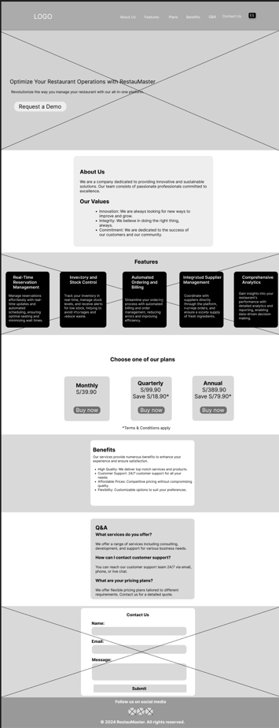

- Mobile:

  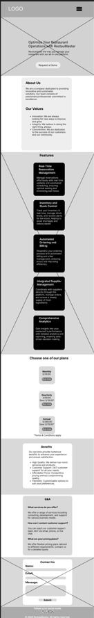

### 4.3.2. Landing Page Mock-up. <a name ="4.3.2.">

Después de haber trabajado con los wireframes previamente diseñados, se procedió a aplicar los Style Guidelines para definir la paleta de colores a utilizar. Se puede observar que estos colores presentan un contraste llamativo en cada sección de la landing page, lo que contribuye a destacar visualmente los distintos elementos y mejorar la legibilidad y la estética general del diseño.

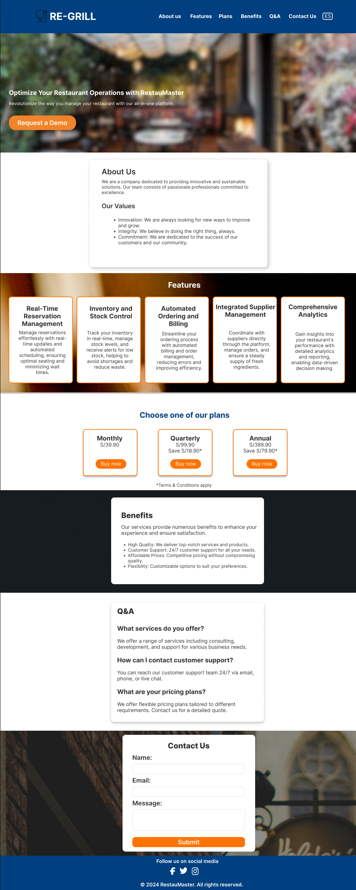

#### Enlace para ver el Figma:

[Link Figma](https://www.figma.com/design/wFyfD3jahh7mqHvwN2Vgst/Landing-Page-Wireframe-re-gril?node-id=0-1&t=Y6wxyMupDN9tDuuE-1)

## 4.4. Web Applications UX/UI Design. <a name ="4.4.">
### 4.4.1. Web Applications Wireframes. <a name ="4.4.1.">
- **Wireframe Vista de platos** 
  En este wireframe vemos la vista de los platos que hay en el restaurante, donde al momento de seleccionar una de las imágenes mostrará más detalles sobre las recetas.
  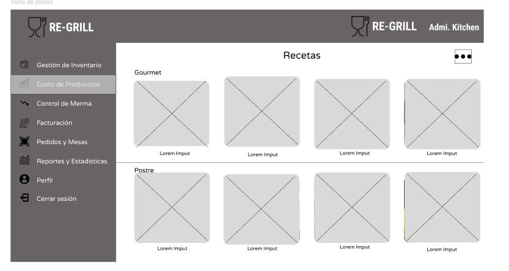
- **Wireframe Registro de Mermas** 
  En este wireframe vemos el registro de las mermas que se realiza al momento de registrar una merma dealizada por un plato.
  
- **Wireframe Información de la receta** 
  En este wireframe vemos la información que tiene cada receta del restaurante, mostrando sus ingredientes y el costo de cada uno de ellos.
  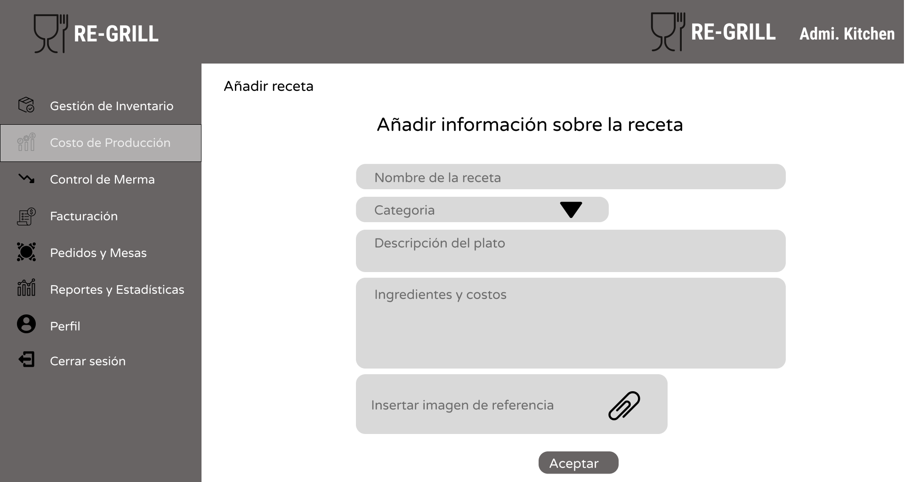
- **Wireframe Buscar receta para eliminar o modificar** 
  En este wireframe vemos la lista de recetas donde el administrador busca una de ellas para modificar o eliminarla de la plataforma.
  
- **Wireframe Receta eliminada** 
  En este wireframe vemos la confirmación sobre una eliminación de una receta. 
  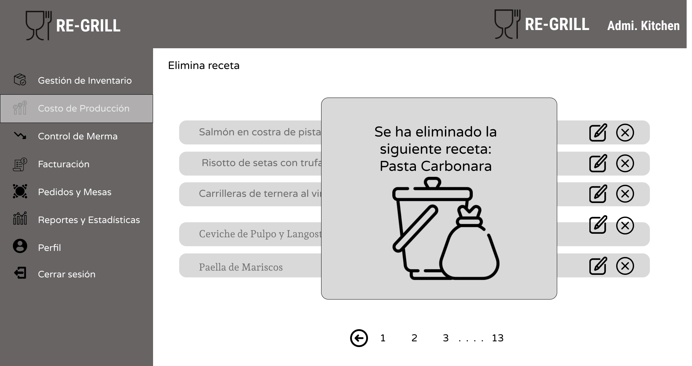

### 4.4.2. Web Applications Wireflow Diagrams. <a name ="4.4.2.">
**Wireflow Pedidos y Mesas** 
Para este wireflow se tomó el funcionamiento de las mesas, donde se podrá reservar una mesa y las órdenes que pidió el cliente, observando el pedido y los detalles de este.
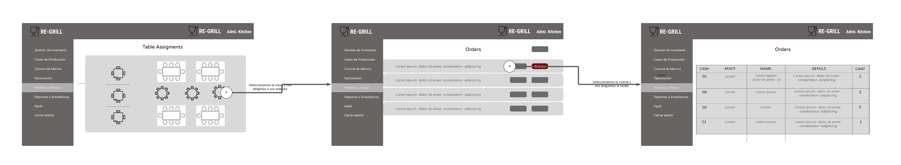
 

**Wireflow Costo de Produccion** 
En este wireflow se tomó el proceso que se realiza al momento de ver el costo de producción de un restaurante, mostrando las recetas de los platos que cocina, el ingreso de los distintos ingredientes que lleva dicho plato, entre otros detalles adicionales.
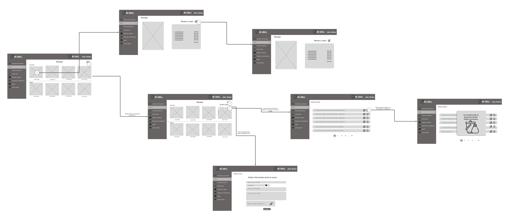

### 4.4.3. Web Applications Mock-ups. <a name ="4.4.3.">

Para este mock-upc se muestra las recetas disponibles al administrador de la cocina en el cual él tiene la opcion de añadir recetas, ver la receta y eliminar la receta

  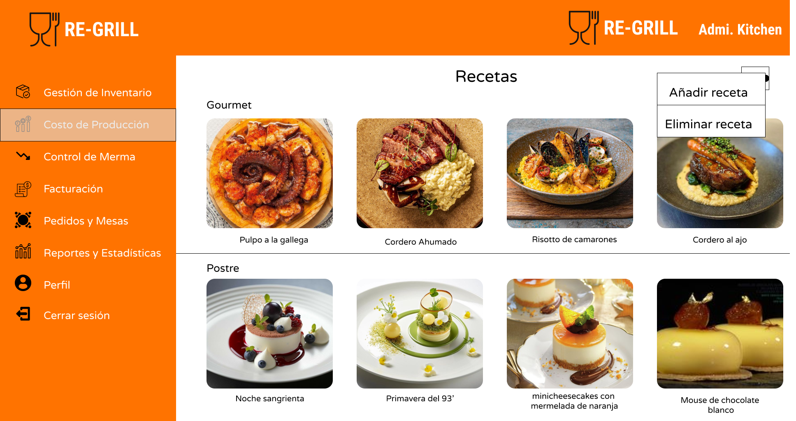

Para este mock-upc se muestra el registro de perdida de insumos del restaurante para que puede tener un buen control de caja

Para este mock-upc se muestra la receta ya editada por el chef y el aumento de precio respectivo

Para este mock-upc se muestra el area del restaurante al mesero para que pueda seleccinar los pedidos

Para este mock-upc se muestra las ordenes que tiene los proveedores con los restaurantes

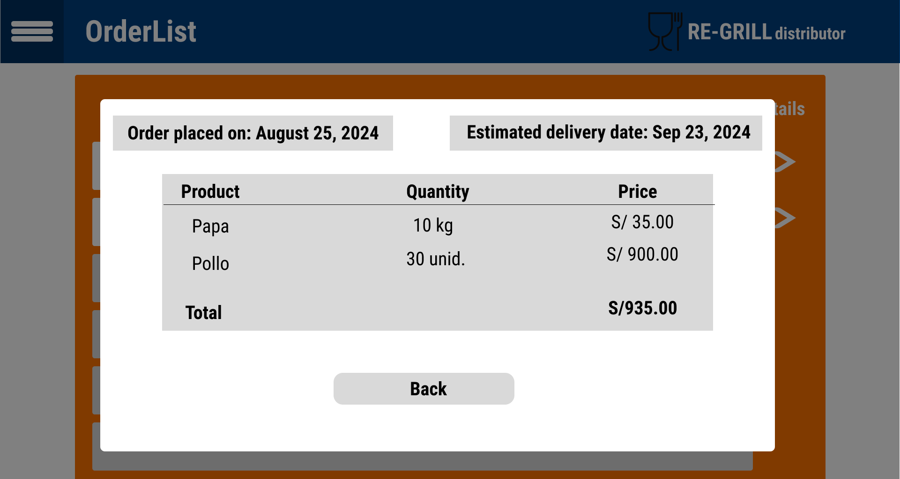

Para este mock-upc el registro de facturas del restaurante

### 4.4.4. Web Applications User Flow Diagrams. <a name ="4.4.4.">
**User Flow Registro en la plataforma** 
En esta User Flow se mostrará como el usuario se registrará en la plataforma, ya sea si es la primera vez que lo usa o ya uso con anterioridad la plataforma, donde irá a la opción de Inicio de Sesión. Además, al momento de registrarse se verificará si el usuario quiere tener un plan premium o usar un plan gratuito.
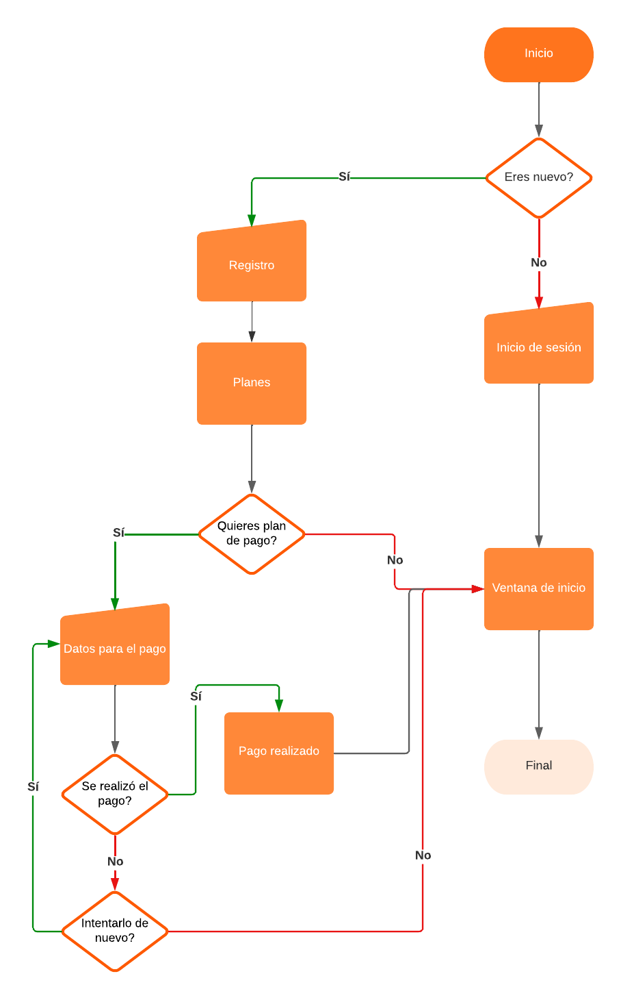

## 4.5. Web Applications Prototyping. <a name ="4.5.">
Para esta parte, se realizó un prototipo sobre como funcionaría nuestro proyecto en general, mostrando paso a paso las secciones enlazadas y como es el punto de vista del proveedor y del administrador de cocina del restaurante. A continuación se presentará una captura sobre este prototipo y como se uso.

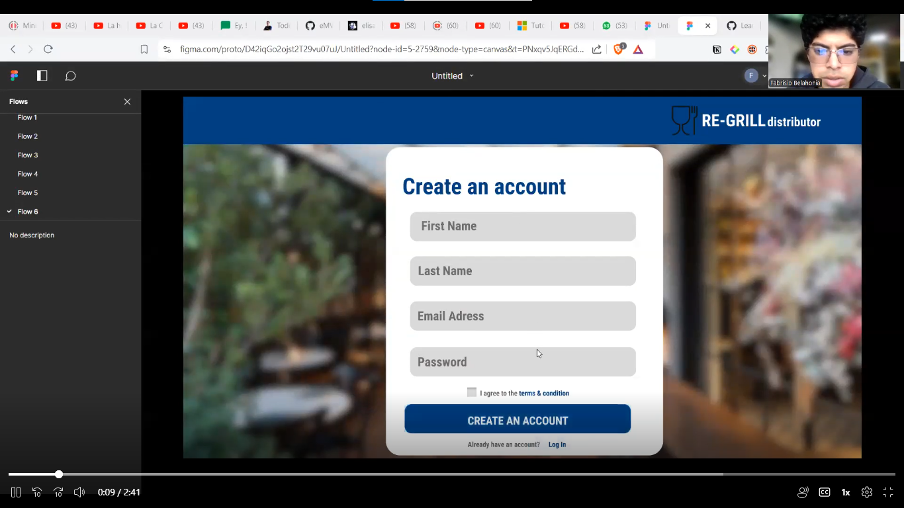

## 4.6. Domain-Driven Software Architecture. <a name ="4.6.">
### 4.6.1. Software Architecture Context Diagram. <a name ="4.6.1.">

### 4.6.2. Software Architecture Container Diagrams. <a name ="4.6.2.">

### 4.6.3. Software Architecture Components Diagrams. <a name ="4.6.3.">
<ul>
  <li>
    
Usuarios

    
  </li>
  <li>
    
Ventas

    
  </li>
  <li>
    
Reservas

    
  </li>
  <li>
    
Rendimiento

    
  </li>
  <li>
    
Inventario

    
  </li>
  <li>
    
Gestor de proveedores

    
  </li>
  <li>
    
Ajustes

    
  </li>
</ul>

## 4.7. Software Object-Oriented Design. <a name ="4.7.">
### 4.7.1. Class Diagrams. <a name ="4.7.1.">

<tr><tr>

### 4.7.2. Class Dictionary. <a name ="4.7.2.">

#### User

Representa a cualquier usuario que interactúa con el sistema (clientes, administradores o camareros). Gestiona las credenciales y el acceso al sistema.
#### Administrator

Extiende la clase User y representa a los administradores del sistema, quienes tienen permisos especiales para gestionar reportes de ventas, inventario y usuarios.
#### Waiter

Extiende la clase User y representa a los camareros, quienes pueden registrar pedidos y gestionar el estado de las mesas.
#### Reservation

Representa las reservas de mesas hechas por los clientes. Permite la creación, cancelación y verificación de las reservas.
#### Table

Representa una mesa en el restaurante. Permite la gestión del estado de las mesas (disponible, ocupada, reservada).
#### Order

Representa los pedidos que hacen los clientes. Incluye la lista de productos pedidos y su estado.
#### Product

Representa los productos o platos disponibles en el restaurante. Permite la gestión de su precio y disponibilidad en el inventario.
#### Stock

Representa el inventario del restaurante, incluyendo la cantidad de productos disponibles y su gestión.
#### Invoice

Representa las facturas generadas por los pedidos. Permite la creación y visualización de facturas para los clientes.
#### Supplier

Representa a los proveedores que suministran productos al restaurante. Gestiona los productos suministrados y el contacto con el proveedor.
#### KitchenOrder

Representa los pedidos enviados a la cocina para su preparación. Permite la gestión y seguimiento de los pedidos dentro de la cocina.
#### SalesReport

Genera reportes de ventas dentro de un periodo específico. Ayuda a analizar el rendimiento de ventas del restaurante.
#### StockReport

Genera reportes del inventario, proporcionando información sobre los niveles actuales de stock y productos disponibles.
#### OrderReport

Genera reportes sobre los pedidos realizados, detallando los productos pedidos y otros datos relevantes.

## 4.8. Database Design. <a name ="4.8.">
### 4.8.1. Database Diagram. <a name ="4.8.1.">

<tr><tr>

<h3 id="chapter-5">Capítulo V: Product Implementation, Validation & Deployment</h3>

En este capítulo se detallará la implementación del producto, la validación y la 
configuración de despliegue del software.

<h4 id="software-configuration">5.1. Software Configuration Management.</h4>

    En este apartado, se detallan las herramientas y configuraciones empleadas para mantener la consistencia y organización del entorno de desarrollo durante el ciclo de vida del proyecto. La gestión de la configuración del software es crucial para asegurar que todos los miembros del equipo trabajan de manera coordinada, utilizando las mismas versiones de herramientas y respetando las convenciones establecidas. Esta sección abarca desde la configuración del entorno de desarrollo hasta la gestión del código fuente y el despliegue de la solución.

<h4>5.1.1 Software Development Environment Configuration</h4>

<h4>Project Management</h4>

<strong>Discord:</strong> 
Discord ha sido la herramienta principal de comunicación y coordinación del equipo. Se ha utilizado para realizar reuniones virtuales, mantener discusiones continuas sobre el progreso del proyecto, y para compartir recursos y actualizaciones de forma eficiente. 
<strong>Ruta de referencia:</strong> <a href="https://discord.com/">discord.com/</a>

<strong>Trello:</strong> 
Trello se ha para la gestión del proyecto, permitiendo la visualización y actualización del estado de tareas y sprints en los que trabaja el equipo. Aunque su uso ha sido ocasional, ha proporcionado una estructura básica para el seguimiento de actividades. 
<strong>Ruta de referencia:</strong> <a href="https://trello.com/">trello.com/</a>

<h4>Product UX/UI Design</h4>

Para la elaboración de la interfaz de usuario y la experiencia de usuario, se emplearán las siguientes herramientas:

<ul>
    <li><strong>Figma:</strong> Una plataforma colaborativa de diseño que permite la creación de wireframes, mock-ups y prototipos interactivos. Será utilizada para diseñar tanto las interfaces de usuario como los flujos de interacción de la aplicación.</li>
    <li><strong>LucidChart:</strong> Herramienta de diagramación en línea que será utilizada para la elaboración de wireflows y user flows, facilitando la visualización y planificación de las interacciones y navegaciones dentro de la aplicación.</li>
</ul>

<strong>Rutas de referencia:</strong>

<ul>
    <li><a href="https://www.figma.com/login" target="_blank">www.figma.com/login</a></li>
    <li><a href="https://www.lucidchart.com/" target="_blank">www.lucidchart.com/</a></li>
</ul>

<h4>Software Development</h4>

Para el desarrollo del software, se han seleccionado las siguientes herramientas y tecnologías, con el fin de proporcionar un entorno robusto y eficiente para el desarrollo del proyecto:

<ul>
    <li><strong>WebStorm</strong> Un entorno de desarrollo integrado (IDE) potente y completo, que ofrece herramientas avanzadas para el desarrollo de aplicaciones. Será utilizado para escribir, depurar y gestionar el código del proyecto, aprovechando sus características de soporte para múltiples lenguajes y sistemas de control de versiones.</li>
    <li><strong>HTML5:</strong> El lenguaje estándar de marcado para la creación de páginas web. Será empleado en el desarrollo del frontend de la aplicación, estructurando el contenido de manera semántica y accesible.</li>
    <li><strong>CSS:</strong> Hojas de estilo en cascada utilizadas para diseñar y estilizar la presentación visual de la aplicación web. Permitirá definir el diseño responsivo y adaptativo del frontend.</li>
</ul>

<strong>Rutas de referencia:</strong>

<ul>
    <li><a href="https://www.jetbrains.com/webstorm/" target="_blank">www.jetbrains.com/webstorm/</a></li>
    <li><a href="https://lenguajehtml.com/html/" target="_blank">lenguajehtml.com/html/</a></li>
    <li><a href="https://google.github.io/styleguide/htmlcssguide.html" target="_blank">google.github.io/styleguide/htmlcssguide.html</a></li>
</ul>

<h4>Software Deployment</h4>

En esta sección, se detallan las herramientas y plataformas utilizadas para el despliegue de las aplicaciones desarrolladas, garantizando que estén accesibles y operativas en el entorno de producción.

<ul>
    <li><strong>GitHub Pages:</strong> Un servicio de alojamiento web estático que se integra con los repositorios de GitHub. Será utilizado para desplegar la landing page del proyecto, proporcionando un enlace accesible para los usuarios finales.
    
</ul>

<strong>Rutas de referencia:</strong>

<ul>
    <li><a href="https://github.com/" target="_blank">github.com/</a></li>
</ul>

<h4>Software Documentation</h4>

En esta sección, se especifican las herramientas utilizadas para la documentación del software, proporcionando un registro detallado de los aspectos técnicos y funcionales del proyecto.

<ul>
    <li><strong>GitHub:</strong> Además de servir como plataforma para el control de versiones y la colaboración en el código, GitHub también se utiliza para alojar la documentación del proyecto. Los miembros del equipo pueden acceder y actualizar la documentación a través de los repositorios del proyecto.</li>
</ul>

<strong>Ruta de referencia:</strong>

<ul>
    <li><a href="https://github.com/" target="_blank">github.com</a></li>
</ul>

<h4 id="source-code">5.1.2. Source Code Management.</h4>

El equipo utilizará GitHub como plataforma principal para el control de versiones, implementando el modelo <strong>GitFlow</strong>. A continuación, se describen los medios y el esquema de organización que se aplicarán para el seguimiento de modificaciones:

<h4>Repositorios de GitHub</h4>
<ul>
    <li><strong>Landing Page</strong>: <a href="https://github.com/grupo3-upc202402-wx55/landing-page">github.com/grupo3-upc202402-wx55/landing-page</a></li>
    <li><strong>Project Report</strong>: <a href="https://github.com/grupo3-upc202402-wx55/project_report">github.com/grupo3-upc202402-wx55/project_report</a></li>
    
</ul>

Cada repositorio alojará el código fuente correspondiente a su respectivo producto, además de incluir archivos de pruebas unitarias e integración en el caso de los Web Services.

<h4>Implementación de GitFlow</h4>

Se implementará el modelo <strong>GitFlow</strong> para el control de versiones, siguiendo las convenciones establecidas por Vincent Driessen en su artículo "A successful Git branching model". El esquema de ramas incluirá:

<ul>
    <li><strong>Main branch</strong>: La rama principal donde se alojarán las versiones estables del proyecto.</li>
    <li><strong>Develop branch</strong>: Rama de desarrollo donde se integran las nuevas funcionalidades antes de pasar a la rama principal.</li>
    <li><strong>Feature branches</strong>: Cada nueva característica o capítulo desarrollado por el equipo se trabajará en una rama específica. Las convenciones para nombrar estas ramas seguirán un patrón descriptivo, por ejemplo, <code>feat/chapter-5</code>.</li>
    <li><strong>Release branches</strong>: Ramas destinadas a preparar una nueva versión para el lanzamiento, siguiendo el esquema de versionado semántico.</li>
    <li><strong>Hotfix branches</strong>: Ramas para corregir errores críticos en versiones ya lanzadas, aplicando convenciones similares a las usadas en las Release branches.</li>
</ul>
<h4>Conventional Commits</h4>

El equipo aplicará las convenciones de <strong>Conventional Commits</strong> para los mensajes de commit, asegurando que cada cambio en el código sea fácilmente comprensible y rastreable. Los mensajes seguirán la estructura:

<ul>
    <li><code>tipo(scope): mensaje</code></li>
    <li><strong>Tipo:</strong> indica la naturaleza del cambio (e.g., feat, fix, chore).</li>
    <li><strong>Scope:</strong> define la sección del código afectada (e.g., ui, backend).</li>
    <li><strong>Mensaje:</strong> descripción concisa del cambio realizado.</li>
</ul>

<h4 id="source-code-style-guide-and-conventions">5.1.3. Source Code Style Guide & Conventions.</h4>

<h4>HTML</h4>
<ul>
    <li><strong>Estructura del Documento:</strong> Declara el tipo de documento en la primera línea: &lt;!DOCTYPE html&gt;. Usa una estructura de etiqueta HTML válida: &lt;html&gt;, &lt;head&gt;, &lt;body&gt;. Cierra todos los elementos HTML: &lt;p&gt;Texto&lt;/p&gt;.</li>
    <li><strong>Comentarios:</strong> Escribe comentarios en una sola línea cuando sean cortos. Usa comentarios para secciones importantes: &lt;!-- Inicio de la sección de navegación --&gt;.</li>
    <li><strong>Atributos:</strong> Usa comillas dobles para los valores de los atributos: &lt;img src="imagen.jpg" alt="Descripción"&gt;. Especifica siempre los atributos alt y las dimensiones width y height en las imágenes.</li>
    <li><strong>Indentación y Espaciado:</strong> Usa dos espacios para la indentación. No uses espacios alrededor de los signos de igual en los atributos.</li>
</ul>

<a href="https://html.spec.whatwg.org/">html.spec.whatwg.org</a>

<h4>CSS</h4>
<ul>
    <li><strong>Indentación y Espaciado:</strong> Usa dos espacios para la indentación; no uses tabulaciones. El código CSS debe estar en minúsculas.</li>
    <li><strong>Comentarios:</strong> Usa comentarios para explicar secciones complejas del código.</li>
    <li><strong>Nombres de Clases:</strong> Utiliza nombres de clase significativos que reflejen el propósito del elemento. Evita los nombres de clases genéricos como .box o .container.</li>
    <li><strong>Organización:</strong> Agrupa las reglas CSS relacionadas en un solo bloque.</li>
</ul>

<a href="https://google.github.io/styleguide/htmlcssguide.html">google.github.io/styleguide/htmlcssguide.html</a>

<h4>JavaScript</h4>
<ul>
    <li><strong>Indentación y Espaciado:</strong> Usa dos espacios para la indentación. Mantén un espacio después de las comas y antes de los corchetes de apertura.</li>
    <li><strong>Comentarios:</strong> Usa comentarios para explicar la lógica del código, especialmente en bloques complejos.</li>
    <li><strong>Nombres de Variables y Funciones:</strong> Usa nombres descriptivos y en camelCase para variables y funciones. Por ejemplo, getUserInfo en lugar de getuserinfo.</li>
    <li><strong>Estructura del Código:</strong> Usa funciones y módulos para mantener el código organizado y reutilizable. Evita el uso de código no utilizado y realiza limpieza regularmente.</li>
</ul>

<a href="https://google.github.io/styleguide/jsguide.html">google.github.io/styleguide/jsguide.html</a>

<h4>TypeScript</h4>
<ul>
    <li><strong>Indentación y Espaciado:</strong> Usa dos espacios para la indentación. Sigue el formato recomendado por el estándar TypeScript.</li>
    <li><strong>Comentarios:</strong> Usa comentarios para describir el propósito de las funciones y las interfaces.</li>
    <li><strong>Nombres de Variables y Funciones:</strong> Usa camelCase para variables y funciones. Usa PascalCase para nombres de clases e interfaces.</li>
    <li><strong>Tipos:</strong> Especifica tipos explícitos en las variables y las funciones para mayor claridad y seguridad de tipo.</li>
</ul>

<a href="https://google.github.io/styleguide/tsguide.html">google.github.io/styleguide/tsguide.html</a>

<h4>Java</h4>
<ul>
    <li><strong>Indentación y Espaciado:</strong> Usa cuatro espacios para la indentación. Sigue las convenciones de espaciado estándar en el código Java.</li>
    <li><strong>Comentarios:</strong> Usa comentarios Javadoc para documentar clases y métodos.</li>
    <li><strong>Nombres de Variables y Funciones:</strong> Usa camelCase para nombres de variables y métodos. Usa PascalCase para nombres de clases.</li>
    <li><strong>Organización del Código:</strong> Sigue la estructura de paquetes recomendada y organiza el código en clases y métodos claros.</li>
</ul>

<a href="https://google.github.io/styleguide/javaguide.html">google.github.io/styleguide/javaguide.html</a>

<h4>Gherkin (para archivos .feature)</h4>
<ul>
    <li><strong>Estructura de las Características:</strong> Usa Feature, Scenario, Given, When, Then para estructurar los archivos .feature.</li>
    <li><strong>Nombres y Descripciones:</strong> Usa descripciones claras y concisas en inglés. Usa un formato de verbo en presente para los pasos del escenario.</li>
</ul>

<a href="https://cucumber.io/docs/gherkin/reference/">cucumber.io/docs/gherkin/reference/</a>

<h4 id="software-deployment-configuration">5.1.4. Software Deployment Configuration.</h4>

<h4>Landing Page Deployment</h4>

Para desplegar la landing page del proyecto, se utilizará GitHub Pages. A continuación se detallan los pasos necesarios para configurar y realizar el despliegue:

   <ol>
      <li><strong>Crear una carpeta para el despliegue:</strong> Creamos una carpeta llamada <code>"docs"</code> en el repositorio. Esta carpeta alojará todos los archivos necesarios para la landing page.</li>
      <li><strong>Organizar los archivos:</strong> Aseguramos que los archivos de la landing page sigan las siguientes nomenclaturas:
          <ul>
              <li><code>"index.html"</code> para la página principal.</li>
              <li><code>"styles.css"</code> para los estilos de la página.</li>
              <li>Una carpeta llamada <code>"img"</code> que contenga todas las imágenes utilizadas.</li>
          </ul>
      </li>
      <li><strong>Subir los archivos al repositorio:</strong> Cargamos los archivos en la carpeta <code>"docs"</code> mediante un commit al repositorio en GitHub.</li>
      <li><strong>Configurar GitHub Pages:</strong> En GitHub, nos dirigimos a la pestaña <code>Settings</code> del repositorio, luego a <code>Pages</code>. Seleccionamos el branch <code>"main"</code> y especificamos la carpeta <code>"docs"</code> como la fuente de la página.</li>
      <li><strong>Esperar la publicación:</strong> Esperamos a que GitHub realice las comprobaciones necesarias. Una vez finalizado el proceso, obtendremos un enlace que llevará a la landing page desplegada.</li>
   </ol>

<h4>Frontend Web Application Deployment</h4>

  Para el despliegue de la aplicación frontend desarrollada en Angular, se utilizó
  GitHub Pages como plataforma de hosting estático. Los pasos seguidos para desplegar
  fueron los siguientes:

<ol>
  <li>
    <strong>Construcción del Proyecto</strong>: Se utilizó el comando
    <code>ng build --prod</code> para generar los archivos de producción del
    proyecto Angular. Este proceso optimiza los archivos estáticos y genera la
    carpeta <code>dist/</code>.
  </li>

  <li>
    <strong>Configuración de GitHub Pages</strong>: Se empleó la herramienta
    <code>angular-cli-ghpages</code> para realizar el despliegue en la rama
    <code>gh-pages</code> del repositorio. El comando <code>ng deploy</code>
    ejecuta el proceso de construcción y despliegue de manera automática.
  </li>
</ol>

<h4>Web Services Deployment</h4>

Se ha utilizado una <em>FakeAPI</em> para simular los Web Services que interactúan con nuestra aplicación. Esto nos ha permitido avanzar con el desarrollo y las pruebas de las funcionalidades del Frontend, sin necesidad de implementar servicios en tiempo real. Sin embargo, para futuros Sprints, se tiene planificada la implementación de Web Services reales, y su configuración será detallada en los siguientes ciclos de desarrollo.

A medida que los Web Services sean desarrollados e implementados, se incluirá la documentación relacionada con los endpoints y su despliegue, así como la configuración necesaria para integrarlos en el entorno de producción.

<h4 id="landing-page-services-applications-implementation">5.2. Landing Page, Services & Applications Implementation.</h4>

    En esta sección, explicamos y documentamos el proceso de implementación, pruebas, documentación y despliegue de la Landing Page, Web Services y Frontend Web Applications. A medida que avanzamos en el desarrollo, desglosamos el trabajo en secciones específicas para cada Sprint, comenzando con el Sprint 1, donde detallamos la planificación y ejecución de las tareas.

<h4 id="sprint-x">5.2.1. Sprint 1</h4>

Es fundamental que el equipo dedique especial atención a la identificación del Sprint Goal, siguiendo las guías establecidas por el Scrum Guide. El Sprint Goal debe enfocarse en el negocio o en la perspectiva de los usuarios, buscando la entrega de un nuevo feature o un set de features.

Para nuestro Sprint, utilizamos la estructura sugerida por Scrum.org para redactar el Sprint Goal:

<h4 id="sprint-planning-x">5.2.1.1. Sprint Planning 1.</h4>

En el Sprint #1, que comienza el 29/08/2024, nos enfocaremos en desarrollar una landing page  para Re-Grill. El objetivo es crear una página que no solo capte la atención de los visitantes, sino que también transmita claramente los beneficios de nuestro producto. Este sprint estará dedicado al diseño y desarrollo de la landing page para cumplir con nuestros objetivos estratégicos.

<table>
    <tr>
        <td>Sprint #</td>
        <td>Sprint 1</td>
    </tr>
    <tr>
        <td>Sprint Planning Background  </td>
    </tr>
    <tr>
        <td>Date</td>
        <td>2024-08-29</td>
    </tr>
    <tr>
        <td>Time</td>
        <td>16:00 PM</td>
    </tr>
    <tr>
        <td>Location</td>
        <td>Virtual via discord</td>
    </tr>
    <tr>
        <td>Prepared By </td>
        <td>Gabriel Anthony Braithuaite Toledo, Hardie Alfonso Holguín Gamarra</td>
    </tr>
    <tr>
        <td>Attendees (to planning  meeting) </td>
        <td>Gabriel Anthony Braithuaite Toledo, Adrian Alonso Calle Huayanca, Hardie Alfonso Holguín Gamarra, Mateo Italo Loechle Arias, David Bryan Rodriguez Santos</td>
    </tr>
    <tr>
        <td>Sprint Goal &amp; User Stories </td>
    </tr>
    <tr>
        <td>Sprint 1 Goal </td>
        <td>Our focus is on developing an attractive landing page for Re-Grill. We believe it delivers increased engagement and awareness of the product to potential customers. This will be confirmed when the landing page is live and visitor analytics show an increase in page interactions.</td>
    </tr>
    <tr>
        <td>Sprint 1 Velocity </td>
        <td>El equipo ha establecido una capacidad de 30 Story Points para el Sprint 1, enfocándose en completar todas las tareas necesarias para el desarrollo de la landing page de Re-Grill.  </td>
    </tr>
    <tr>
        <td>Sum of Story Points </td>
        <td>30</td>
    </tr>
</table>
<h4 id="spring-backlog-x">5.2.1.2. Sprint Backlog 1.</h4>

El Sprint Backlog para el Sprint #1 tiene como objetivo principal el desarrollo de una landing page para Re-Grill. Este sprint se centrará en la creación y despliegue de una página web atractiva que comunique de manera efectiva los beneficios del producto. La lista de tareas y user stories asociadas a este sprint se ha diseñado para garantizar que se cumpla este objetivo de manera eficiente.

<a href="https://trello.com/b/LSbTHu4A/open-source">trello.com/b/LSbTHu4A/open-source</a>

<table>
    <tr>
        <td>Sprint # </td>
        <td>Sprint 1 </td>
    </tr>
    <tr>
        <td>User Story  </td>
        <td></td>        
        <td>Work-Item / Task </td>
        <td></td>
    </tr>
    <tr>
        <td>Id</td>
        <td>Title</td>
        <td>Id</td>
        <td>Title</td>
        <td>Description</td>
        <td>Estimation (Hours) </td>
        <td>Assigned To</td>
        <td>Status (To-do/In Process / To Review / Done)</td>
    </tr>
<!--US06 -->  
    <tr>
        <td>US06</td>
        <td>Landing page - Estructuración</td>
        <td>WI01</td>
        <td>Implementar navegación entre secciones de la landing page</td>
        <td>Implementar mecanismos de navegación (enlaces, menús) que permitan al visitante moverse fácilmente entre las diferentes secciones de la landing page.</td>
        <td>5</td>
        <td>Adrian Alonso Calle Huayanca</td>
        <td>Done</td>
    </tr>
<!--US07 --> 
    <tr>
        <td>US07</td>
        <td>Landing page – Contenido informativo</td>
        <td>WI02</td>
        <td>Desarrollar contenido informativo claro y accesible</td>
        <td>Redactar y estructurar el contenido informativo sobre las funcionalidades y beneficios de la aplicación para garantizar que los visitantes puedan tomar decisiones informadas.</td>
        <td>13</td>
        <td>Mateo Italo Loechle Arias </td>
        <td>Done</td>
    </tr>
<!--US08 --> 
    <tr>
        <td>US08</td>
        <td>Landing page - Compatibilidad móvil</td>
        <td>WI03</td>
        <td>Implementar diseño responsivo en la landing page</td>
        <td>Desarrollar y probar el diseño responsivo de la landing page para garantizar que se visualice y funcione correctamente en dispositivos móviles.</td>
        <td>8</td>
        <td>Gabriel Anthony Braithuaite Toledo </td>
        <td>Done</td>
    </tr> 
<!--US09 -->
    <tr>
        <td>US09</td>
        <td>Landing page - Formulario de contacto</td>
        <td>WI04</td>
        <td>Desarrollar formulario de contacto en la landing pagee</td>
        <td>Implementar un formulario de contacto que permita a los visitantes enviar sus consultas y comentarios.</td>
        <td>8</td>
        <td>Hardie Alfonso Holguín Gamarra </td>
        <td>Done</td>
    </tr>
<!--US10 -->
    <tr>
        <td>US10</td>
        <td>Landing page - Contenido multimedia</td>
        <td>WI05</td>
        <td>Incluir contenido multimedia en la landing page</td>
        <td> Implementar imágenes y videos relevantes en la landing page para enriquecer la experiencia del visitante.</td>
        <td>3</td>
        <td>David Bryan Rodriguez Santos</td>
        <td>Done</td>
    </tr>
<!--US11 -->
    <tr>
        <td>US11</td>
        <td>Landing page - Call-to-action</td>
        <td>WI06</td>
        <td>Implementar botones de call-to-action en la landing page.</td>
        <td>Crear botones claros y visibles para solicitar una demo en la landing page.</td>
        <td>5</td>
        <td>Hardie Alfonso Holguín Gamarra</td>
        <td>Done</td>
    </tr>
<!--US12 -->
    <tr>
        <td>US12</td>
        <td>Landing page - Testimonios</td>
        <td>WI07</td>
        <td>Implementar sección de testimonios en la landing page</td>
        <td>Crear una sección dedicada para mostrar testimonios de usuarios satisfechos.</td>
        <td>3</td>
        <td>Mateo Italo Loechle Arias</td>
        <td>Done</td>
    </tr>
</table>
<h4 id="development-evidence-for-sprint-review-x">5.2.1.3. Development Evidence for Sprint Review.</h4>

Durante el Sprint #1, se lograron avances significativos en la implementación de los componentes clave del proyecto Re-Grill, centrados principalmente en el desarrollo de la Landing Page. Estos avances se alinean con el objetivo principal del sprint, que es diseñar y desplegar una página web atractiva y funcional para captar la atención de los usuarios y comunicar los beneficios del producto de manera efectiva.

<table>
    <tr>
        <td>Repository</td>
        <td>Branch</td>
        <td>Commit Id </td>
        <td>Commit Message </td>
        <td>Commit Message Body</td>
        <td>Commited on (Date) </td>
    </tr>
    <tr>
        <td>Gaboo04/landing-page </td>
        <td>feature/landing-page</td>
        <td>557bf8a</td>
        <td>feat: add links to the head, header, main section, about us section and features section.</td>
        <td>Add images for landing page, add html file for english page.</td>
        <td>05/09/2024</td>
    </tr>
    <tr>
        <td>HOLGUINUPC/landing-page </td>
        <td>main</td>
        <td>e2a6afe</td>
        <td>feat: css 50% completed</td>
        <td>add benefits style, hero style, added logo img nav nav ul styles, added .container adn section style</td>
        <td>05/09/2024</td>
    </tr>
    <tr>
        <td>LowMathzzz/landing-page </td>
        <td>main</td>
        <td>6d41e03</td>
        <td>feat(styles): added features and footer on styles layer.</td>
        <td>added mobile responsive config on styles layer,  added tables responsive config on styles layer.</td>
        <td>05/09/2024</td>
    </tr>
    <tr>
        <td>DavidBryanRodriguezSantos/landing-page </td>
        <td>main</td>
        <td>f778cda</td>
        <td>feat(es-page): create spanish page</td>
        <td>create spanish page</td>
        <td>05/09/2024</td>
    </tr>    
    <tr>
        <td>U202011657/landing-page </td>
        <td>main</td>
        <td>bdf0608</td>
        <td>feat:Update index.html</td>
        <td>report-1</td>
        <td>05/09/2024</td>
    </tr>
    <tr><td>https://github.com/grupo3-upc202402-wx55/landing-page</td></tr>
    

</table>
<h4 id="testing-suite-evidence-for-sprint-review">5.2.1.4. Testing Suite Evidence for Sprint Review.</h4>

En esta sección, presentamos las evidencias relacionadas con las pruebas de aceptación automatizadas realizadas para la landing page de Re-Grill, desarrollada en el Sprint 1. A lo largo de este sprint, se lograron los objetivos planteados: planificación, desarrollo y despliegue de la landing page. Las pruebas de aceptación se diseñaron para garantizar que la landing page cumpla con los requisitos y expectativas definidos en los User Stories correspondientes. 

<table>
    <tr>
        <td>Repository</td>
        <td>Branch</td>
        <td>Commit Id </td>
        <td>Commit Message </td>
        <td>Commit Message Body</td>
        <td>Commited on (Date) </td>
    </tr>
    <tr>
        <td>Gaboo04/landing-page</td>
        <td>feat/testing</td>
        <td>ee1b2de</td>
        <td>feat:Update landing_page_acceptance_tests.feature.</td>
        <td>acceptance tests based on user stories designed for landing page development</td>
        <td>18/09/2024</td>
    </tr>
</table>
<h4 id="execution-evidence-for-sprint-review">5.2.1.5. Execution Evidence for Sprint Review.</h4>

En este Sprint, se logró desarrollar y desplegar exitosamente la landing page para Re-Grill. Se completaron todas las tareas planificadas, incluyendo la creación del wireframe, el desarrollo de la página, su revisión y ajuste, así como el despliegue en el entorno de producción. La landing page refleja fielmente el diseño y la funcionalidad esperados, proporcionando una interfaz atractiva y funcional para los usuarios.  

<h5>Screenshots de las Principales Vistas Implementadas</h5>

Se adjuntan capturas de pantalla de las principales vistas de la landing page desarrollada en el Sprint 1, mostrando el diseño y la estructura de la página.

<h5>Se implementó el Header</h5>

En esta sección se pueden observar las principales opciones de la página, un call to action y una descripción sobre nuestra compañía y nuestros valores. 

<h5>Se implementó la sección de features y plans.</h5>

En estas secciones se describen las principales características que tiene Re-grill, así como los diferentes planes de suscripción ques se ofrece.

<h5>Se implementó la sección de Benefits y Questions & Answers </h5>

En esta sección se describen los beneficios de Re-Grill y se resuelven las preguntas más frecuentes que los usuarios puedan tener.

<h5>Se implementó el footer con la opción de contacto</h5>

En esta sección se muestra la información de contacto de la empresa, así como un formulario para que los usuarios puedan enviar sus consultas.

<h4 id="services-documentation-evidence-for-sprint-review">5.2.1.6. Services Documentation Evidence for Sprint Review.</h4>

En este Sprint, el enfoque principal fue el desarrollo y despliegue de la landing page de Re-Grill. No se implementaron Web Services en esta etapa, por lo que no se incluye documentación relacionada con endpoints o servicios web. La implementación y documentación de Web Services será abordada en Sprints futuros, conforme se expanda la funcionalidad del producto.

<h4 id="software-deployment-evidence-for-sprint-review">5.2.1.7. Software Deployment Evidence for Sprint Review.</h4>

    Durante el Sprint 1, nos enfocamos en el despliegue de la landing page de Re-Grill. El objetivo fue asegurar que la página esté accesible para los usuarios finales a través de un entorno de producción confiable. A continuación, se detalla el proceso de despliegue, incluyendo la creación de cuentas necesarias, la configuración de recursos en GitHub Pages, y la automatización de ciertas tareas para facilitar futuros despliegues.

<h5>Creación y Configuración de Repositorio en GitHub</h5>
        <ul>
            <li>Se creó un repositorio en GitHub dentro de la organización, donde se alojó el código fuente de la landing page.</li>
            <li>Se configuró la rama <code>main</code> como la principal para el despliegue, y la rama <code>feat/testing</code> para pruebas de aceptación.</li>
            <li>Se habilitó GitHub Pages en la rama <code>main</code> para facilitar el despliegue automático de la landing page.</li>
        </ul>
<h5>Evidencias Gráficas del Despliegue</h5>

A continuación, se muestran capturas de pantalla que ilustran el proceso despliegue:

<h4 id="team-collaboration-insights-during-sprint">5.2.1.8. Team Collaboration Insights during Sprint.</h4>

    Durante el Sprint 1, nos aseguramos de que todas las actividades de implementación fueran realizadas con la colaboración de todos los miembros del equipo. Cada integrante contribuyó a la creación y desarrollo de la landing page de Re-Grill, utilizando diversas herramientas de colaboración. A continuación, se presentan los detalles sobre las actividades del equipo y las evidencias gráficas que reflejan la colaboración y los commits en GitHub.

<table>
    <tr>
        <td>Team Member</td>
        <td>Activity </td>
    </tr>
    <tr>
        <td>Gabriel Anthony Braithuaite Toledo</td>
        <td>Implementación de las secciones header, implementación de parte del main section en el index.html.</td>
    </tr>
    <tr>
        <td>Adrian Alonso Calle Huayanca</td>
        <td>Desarrollo del wireframe, mock up y completar sección del main en el index.html.</td>
    </tr>
    <tr>
        <td>Hardie Alfonso Holguín Gamarra	</td>
        <td>Implementación de los estilos para parte del body y containers en el styles.css</td>
    </tr>
    <tr>
        <td>Mateo Italo Loechle Arias</td>
        <td>Implementación de los estilos para completar el body y configuración del responsive en el styles.css</td>
    </tr>
    <tr>
        <td>David Bryan Rodriguez Santos</td>
        <td>Implementación del switching de idioma realizando una versión en español del landing page en el index-es.html.</td>
    </tr>
</table>

<!-- 5.2.2. Sprint 2 -->

<h4 id="sprint-2">5.2.2. Sprint 2</h4>

<h4 id="sprint-planning-x">5.2.2.1. Sprint Planning 2.</h4>

En el Sprint #2, que comienza el 17/09/2024, nos enfocaremos en el desarrollo de la parte frontend de la aplicación web de Re-Grill. El objetivo es crear una interfaz interactiva y amigable para los usuarios, que les permita acceder a las funcionalidades del producto de manera intuitiva y eficiente. Este sprint estará dedicado al diseño y desarrollo de las páginas y componentes necesarios para cumplir con nuestros objetivos estratégicos.

<table>
    <tr>
        <td>Sprint #</td>
        <td>Sprint 2</td>
    </tr>
    <tr>
        <td>Sprint Planning Background  </td>
    </tr>
    <tr>
        <td>Date</td>
        <td>2024-09-17</td>
    </tr>
    <tr>
        <td>Time</td>
        <td>16:00 PM</td>
    </tr>
    <tr>
        <td>Location</td>
        <td>Virtual via discord</td>
    </tr>
    <tr>
        <td>Prepared By </td>
        <td>Gabriel Anthony Braithuaite Toledo, Hardie Alfonso Holguín Gamarra</td>
    </tr>
    <tr>
        <td>Attendees (to planning  meeting) </td>
        <td>Gabriel Anthony Braithuaite Toledo, Adrian Alonso Calle Huayanca, Hardie Alfonso Holguín Gamarra, Mateo Italo Loechle Arias, David Bryan Rodriguez Santos</td>
    </tr>
    <tr>
        <td>Sprint Goal &amp; User Stories </td>
    </tr>
    <tr>
        <td>Sprint 2 Goal </td>
        <td>Our focus is on developing an interactive and user-friendly frontend interface for Re-Grill. We believe it delivers a seamless experience and improved accessibility to product features for our users. This will be confirmed when the frontend components are live and user feedback indicates increased satisfaction and ease of use.</td>
    </tr>
    <tr>
        <td>Sprint 1 Velocity </td>
        <td>El equipo ha establecido una capacidad de 50 Story Points para el Sprint 2, enfocándose en completar todas las tareas necesarias para el desarrollo de la interfaz frontend de Re-Grill.  </td>
    </tr>
    <tr>
        <td>Sum of Story Points </td>
        <td>50</td>
    </tr>
</table>

<h4 id="spring-backlog-x">5.2.2.2. Sprint Backlog 2.</h4>

El Sprint Backlog para el Sprint #2 tiene como objetivo principal el desarrollo de la parte frontend de la aplicación web de Re-Grill. Este sprint se centrará en la creación de las páginas y componentes necesarios para permitir a los usuarios acceder a las funcionalidades del producto de manera intuitiva y eficiente. La lista de tareas y user stories asociadas a este sprint se ha diseñado para garantizar que se cumpla este objetivo de manera eficiente.

<a href="https://trello.com/b/LSbTHu4A/open-source">trello.com/b/LSbTHu4A/open-source</a>

<table>
    <tr>
        <td>Sprint # </td>
        <td>Sprint 2 </td>
    </tr>
    <tr>
        <td>User Story  </td>
        <td></td>        
        <td>Work-Item / Task </td>
        <td></td>
    </tr>
    <tr>
        <td>Id</td>
        <td>Title</td>
        <td>Id</td>
        <td>Title</td>
        <td>Description</td>
        <td>Estimation (Hours) </td>
        <td>Assigned To</td>
        <td>Status (To-do/In Process / To Review / Done)</td>
    </tr>
<!--US01 -->  
    <tr>
        <td>USX</td>
        <td>x</td>
        <td>WI01</td>
        <td>x</td>
        <td>X</td>
        <td>4</td>
        <td>X</td>
        <td>In Process</td>
    </tr>
<!--US02 --> 
    <tr>
        <td>USX</td>
        <td>X</td>
        <td>WI02</td>
        <td>X</td>
        <td>X</td>
        <td>12</td>
        <td>X</td>
        <td>In Process</td>
    </tr>
<!--US03 --> 
    <tr>
        <td>USX</td>
        <td>X</td>
        <td>WI03</td>
        <td>X</td>
        <td>X</td>
        <td>6</td>
        <td>X</td>
        <td>In Process</td>
    </tr> 
<!--US04 -->
    <tr>
        <td>USX</td>
        <td>X</td>
        <td>WI04</td>
        <td>X</td>
        <td>X</td>
        <td>8</td>
        <td>X</td>
        <td>In Process</td>
    </tr>
</table>
<h4 id="development-evidence-for-sprint-review-x">5.2.2.3. Development Evidence for Sprint Review.</h4>

Durante el Sprint #2, se lograron avances significativos en el desarrollo de la parte frontend de la aplicación web de Re-Grill. Estos avances se alinean con el objetivo principal del sprint, que es diseñar e implementar una interfaz interactiva y amigable para los usuarios, que les permita acceder a las funcionalidades del producto de manera intuitiva y eficiente.

<table>
    <tr>
        <td>Repository</td>
        <td>Branch</td>
        <td>Commit Id </td>
        <td>Commit Message </td>
        <td>Commit Message Body</td>
        <td>Commited on (Date) </td>
    </tr>
    <tr>
        <td>Gaboo04/frontend </td>
        <td>x</td>
        <td>x</td>
        <td>x</td>
        <td>x</td>
        <td>x</td>
    </tr>
    <tr>
        <td>HOLGUINUPC/frontend </td>
        <td>x</td>
        <td>x</td>
        <td>x</td>
        <td>x</td>
        <td>x</td>
    </tr>
    <tr>
        <td>LowMathzzz/frontend </td>
        <td>x</td>
        <td>x</td>
        <td>x</td>
        <td>x</td>
        <td>x</td>
    </tr>
    <tr>
        <td>DavidBryanRodriguezSantos/frontend </td>
        <td>x</td>
        <td>x</td>
        <td>x</td>
        <td>x</td>
        <td>x</td>
    </tr>    
    <tr>
        <td>U202011657/frontend </td>
        <td>x</td>
        <td>x</td>
        <td>x</td>
        <td>x</td>
        <td>x</td>
    </tr>
    <tr><td>https://github.com/grupo3-upc202402-wx55/frontend</td></tr>

</table>
<h4 id="testing-suite-evidence-for-sprint-review">5.2.2.4. Testing Suite Evidence for Sprint Review.</h4>

En esta sección, presentamos las evidencias relacionadas con las pruebas de aceptación automatizadas para la parte frontend de la aplicación web de Re-Grill, desarrollada en el Sprint 2. A lo largo de este sprint, se lograron los objetivos planteados: planificación, desarrollo y despliegue de la interfaz frontend. Las pruebas de aceptación se diseñaron para garantizar que la interfaz cumpla con los requisitos y expectativas definidos en los User Stories correspondientes. 

<table>
    <tr>
        <td>Repository</td>
        <td>Branch</td>
        <td>Commit Id </td>
        <td>Commit Message </td>
        <td>Commit Message Body</td>
        <td>Commited on (Date) </td>
    </tr>
    <tr>
        <td>x</td>
        <td>x</td>
        <td>x</td>
        <td>X</td>
        <td>X</td>
        <td>X</td>
    </tr>
</table>
<h4 id="validation-interviews">5.3. Validation Interviews.</h4>
<h4 id="interview-design-2">5.3.1. Diseño de Entrevistas.</h4>
<h4 id="interview-registry-2">5.3.2. Registro de Entrevistas.</h4>
<h4 id="heuristic-exam">5.3.3. Evaluaciones según heurísticas.</h4> 
<h4 id="about-the-productions">5.4. Video About-the-Product.</h4>
<h4 id="conclusions">Conclusiones</h4>
<h4 id="recomendations">Conclusiones y recomendaciones.</h4>
<h4 id="about-the-team">Video About-the-Team.</h4>
<h4 id="bibliography">Bibliografía</h4>
<h4 id="links">Anexos</h4>

<h2>Anexo A: Tabla Comparativa de Competencia</h2>
Esta tabla muestra una comparación entre Re'Grill y otras soluciones tecnológicas disponibles en el mercado para la gestión de restaurantes. Se detallan las principales características de cada plataforma, así como su nivel de integración y accesibilidad económica.

| **Característica**              | **Re'Grill**         | Competidor A   | Competidor B   | Competidor C   |
|----------------------------------|----------------------|----------------|----------------|----------------|
| **Integración total (mesas, cocina, inventario, proveedores)** | ✔️                   | ❌              | ✔️              | ❌              |
| **Precio (modelo asequible)**    | Bajo                 | Alto            | Medio           | Alto            |
| **Facilidad de uso (UI/UX)**     | Alta                 | Media           | Media           | Baja            |
| **Escalabilidad**                | Alta                 | Media           | Alta            | Media           |
| **Soporte técnico**              | ✔️                   | ✔️              | ❌              | ✔️              |
| **Actualizaciones automáticas**  | ✔️                   | ✔️              | ❌              | ✔️              |

<h2>Anexo B: Gráfico de Resultados Operativos</h2>
En este anexo, se incluye un gráfico que ilustra la mejora en la eficiencia operativa de los restaurantes que han implementado Re'Grill. Los datos representan una comparación del rendimiento antes y después de utilizar la plataforma, con un enfoque en la reducción de errores y el aumento de la velocidad de servicio.

| **Indicador**                    | **Antes de Re'Grill** | **Después de Re'Grill** |
|----------------------------------|----------------------|-------------------------|
| **Errores en Pedidos (%)**       | 15%                  | 5%                      |
| **Tiempo Medio de Servicio (min)** | 25                   | 15                      |
| **Satisfacción del Cliente (%)** | 60%                  | 85%                     |
| **Tiempos de Coordinación Interna (min)** | 20            | 12                      |

Gráfico: Comparación del Rendimiento Operativo (Antes y Después de Re'Grill)

<h2>Anexo C: Mapa del Proceso de Pedido a Cocina</h2>
Este mapa detalla los pasos y flujos que sigue un pedido desde el momento en que el cliente lo solicita hasta su preparación y entrega por la cocina. Se destaca cómo Re'Grill automatiza varios pasos, optimizando tiempos y reduciendo errores en la gestión.

1.-Cliente hace una reserva o pedido

2.-Pedido es recibido por la administración y la cocina

Verificación automática de stock disponible.
Notificación a la cocina y proveedores en caso de falta de ingredientes.
3.-Cocina recibe el pedido

Información detallada y visual del platillo (ingredientes, tiempos de cocción, cantidad solicitada).
Monitoreo en tiempo real del estado del pedido.
4.-Plato listo para entrega

Actualización del estado del pedido en la plataforma.
Coordinación con meseros para la entrega.

